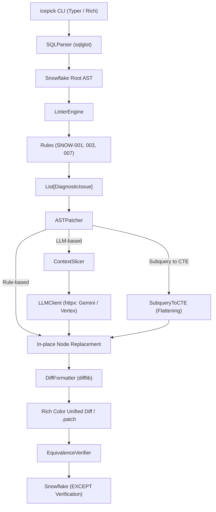

# Icepick for Snowflake 🧊⛏️

**AST Query Optimizer for Snowflake**  
抽象構文木（AST）に基づく決定論的静的診断と外科手術的局所パッチにより、クエリのセマンティクス（結果の等価性）を壊すことなく、Snowflakeの巨大バッチクエリを安全かつ爆速に最適化する開発者向けCLIツール。

[](https://www.python.org/)
[]()
[](https://github.com/astral-sh/ruff)
[](https://mypy-lang.org/)
[](https://opensource.org/licenses/Apache-2.0)

---

## 🌟 なぜ Icepick なのか？ (Why Icepick?)

Snowflake 上で稼働する夜間バッチや dbt モデルなどの複雑な SQL クエリ（数百〜数千行の CTE 連鎖）は、パーティションプルーニングの阻害やメモリ溢れ（Spill）により、膨大なコンピュートコストと実行時間を浪費しがちです。

従来の「クエリ全体をそのまま LLM に丸投げするアプローチ」には、以下のような深刻な課題がありました：

* ❌ **Lost in the Middle**: 長大プロンプトの中間にある重要な JOIN や WHERE 句を LLM が見落とす。
* ❌ **意図しないコード破壊**: 修正すべきでない健全なロジックやインデント、コメントを勝手に改変する。
* ❌ **ハルシネーション**: 存在しない関数やテーブルを捏造し、本番障害・データ不整合を引き起こす。

**Icepick はこの問題を「決定論的 AST 診断 × 外科手術的局所パッチ」で解決します。**  
コード全体の 95% 以上の健全な構文木をそのまま維持し、問題のある患部（20〜30行のノード）だけをミリ単位で置換・削除・平坦化します。

---

## ✨ 主要機能 (Core Features)

1. **決定論的静的診断 (Deterministic SQL Linter)**
   * `sqlglot` を用いて Snowflake 方言の完全な AST を構築し、パフォーマンスを阻害するアンチパターンをミリ秒単位で非破壊検出。
2. **外科手術的 AST In-place 置換 (Targeted In-place Patching)**
   * 健全なコード構造、コメント、インデントを 100% 維持したまま、対象ノードのみを構文木上で機械的に差し替え（`node.replace()`）または安全に切り落とし（`node.pop()`）。
3. **インラインサブクエリの CTE 自動平坦化 (`SubqueryToCTE`)**
   * FROM/JOIN 句に深くネストした派生テーブル（Derived Table）を、**AST ノード深度降順（深さ優先）** で抽出し、依存順序を完全保証しながらトップレベルの `WITH` 句（CTE）へ自動昇格。
4. **超軽量・高速な局所 LLM 連携 (Gemini & Vertex AI REST)**
   * 重厚な外部 SDK（LiteLLM 等）を完全排除し、`httpx` による直接 REST 呼び出しで爆速起動を実現。
   * 患部ノードの周辺文脈のみを最小限スライス（`ContextSlicer`）してプロンプト化し、ハルシネーションを極小化。
   * LLM の返答は必ず `sqlglot.parse_one` で事前検証し、構文不正時は元の AST を一切壊さず安全にフォールバック（Fail-Safe）。
5. **Git 互換の Unified Diff ＆ 対話型適用 (`git add -p` モデル)**
   * AST 正規化により、インデント差異による偽陽性（ノイズ差分）を完全に排除した純粋な意味差分を出力。
   * `--interactive` モードにより、変更箇所（Hunk）ごとに開発者が `[y]/[n]/[q]` で個別承認・適用。
6. **決定論的等価性自動検証 (Equivalence Verification)**
   * 元クエリと最適化クエリの双方向 `EXCEPT` 差分ゼロ検証クエリを動的生成。セマンティクスが 1 行も変化していないことを数学的・集合論的に証明。

---

## 📋 診断ルール一覧 (Diagnostic Rules)

| ルールID | ルール名 | 重要度 | 診断対象と最適化アクション |
| :--- | :--- | :---: | :--- |
| **`SNOW-001`** | **Non-Sargable Predicate** | `HIGH` | `DATE(col) = '2026-09-01'` 等の関数ラップによるプルーニング阻害を検知し、`col >= '...' AND col < DATEADD(...)` の範囲条件へ自動置換。 |
| **`SNOW-003`** | **Redundant Sort in Subquery/CTE** | `MEDIUM` | `LIMIT` / `FETCH` を持たない中間 CTE やサブクエリ内の無意味な `ORDER BY`（Spill や無駄なソートコストの原因）を検知し、安全に削除（`pop()`）。 |
| **`SNOW-007`** | **Inline Subquery in FROM/JOIN** | `LOW` | FROM 句や JOIN 句に直接埋め込まれた派生テーブルを検知し、トップレベル CTE への抽出・平坦化を推奨。 |

*(※ 将来対応予定: `SNOW-002` 相関副クエリの結合化, `SNOW-004` 暗黙クロス結合, `SNOW-005` 重複テーブルスキャン, `SNOW-006` UNION ALL 置換)*

---

## 🏗️ システムアーキテクチャ



---

## 🚀 インストール

### 前提要件
* Python 3.10 以上

### pip でインストール
```bash
# クローン後にパッケージをインストール
pip install -r requirements.txt
pip install -e .

# 開発用（テスト・静的解析ツールを含む）
pip install -r requirements-dev.txt
```

### uv で爆速インストール (推奨)
```bash
uv pip install -e ".[dev]"
```

---

## 💻 使い方 (Usage)

### 1. クエリのアンチパターン診断 (`check`)
クエリ内のパフォーマンス阻害要因をスキャンし、リッチなカラーテーブルで一覧表示します。

```bash
icepick check models/batch_mart.sql
```

```text
                      Diagnostic Report: batch_mart.sql                      
+-----------------------------------------------------------------------------+
| Rule ID  | Rule Name              | Severity | Line | Description           |
|----------+------------------------+----------+------+-----------------------|
| SNOW-001 | Non-Sargable Predicate | HIGH     | -    | Column                |
|          |                        |          |      | 'event_timestamp' is  |
|          |                        |          |      | wrapped in a          |
|          |                        |          |      | date/cast function... |
| SNOW-003 | Redundant Sort in CTE  | MEDIUM   | -    | Redundant ORDER BY    |
|          |                        |          |      | without LIMIT...      |
+-----------------------------------------------------------------------------+
```
*(※ CI パイプラインでの使用に適しており、問題検出時は終了コード `1`、問題なし時は `0` を返します)*

---

### 2. クエリの最適化 ＆ 差分プレビュー (`fix`)

#### 差分のみをターミナルで確認する (`--diff`)
```bash
icepick fix models/batch_mart.sql --diff
```
```diff
--- a/models/batch_mart.sql
+++ b/models/batch_mart.sql
@@ -16,7 +16,8 @@
     MAX(event_timestamp) AS last_active
   FROM raw_events
   WHERE
-    TO_DATE(event_timestamp) = '2026-09-01'
+    event_timestamp >= '2026-09-01'
+    AND event_timestamp < DATEADD(DAY, 1, '2026-09-01')
   GROUP BY
     user_id
```

#### 対話形式で変更を 1 つずつ確認・適用する (`--interactive`)
`git add -p` と同様のメンタルモデルで、差分ごとに適用（`[y]/[n]/[q]`）を選択できます。
```bash
icepick fix models/batch_mart.sql --interactive
```

#### インラインサブクエリを CTE に平坦化する (`--flatten-subqueries`)
```bash
icepick fix models/batch_mart.sql --flatten-subqueries --write
```

#### 元ファイルを安全に直接上書きする (`--write` / `-w`)
```bash
icepick fix models/batch_mart.sql --write
```

#### パッチファイルを出力する (`--patch` / `-p`)
```bash
icepick fix models/batch_mart.sql --patch patches/batch_mart.patch
```

---

### 3. セマンティクス等価性の検証 (`verify`)
元クエリと最適化クエリが同一の結果セットを返すことを証明する双方向 `EXCEPT` クエリを生成・確認します。

```bash
# 検証用 SQL をターミナルに表示（Snowflake Web UI や SnowSQL で即実行可能）
icepick verify models/batch_mart.sql models/batch_mart_optimized.sql --dry-run
```

```sql
WITH orig AS (
  /* 元のクエリ */
  ...
),
opt AS (
  /* 最適化後のクエリ */
  ...
)
SELECT 'orig_not_in_opt' AS diff_type, COUNT(*) AS cnt FROM (SELECT * FROM orig EXCEPT SELECT * FROM opt)
UNION ALL
SELECT 'opt_not_in_orig' AS diff_type, COUNT(*) AS cnt FROM (SELECT * FROM opt EXCEPT SELECT * FROM orig);
```
*(※ 双方向の `cnt` がともに `0` であれば、結果セットの一致が数学的に保証されます)*

---

### 4. エージェント親和性とフィードバックループ (`Agent-Native DX`)

Icepick は、人間だけでなく AI コーディングエージェント（Claude Code, Cursor, Antigravity 等）が自律的かつ安全に利用できるよう設計されています。

#### Layer 2 イントロスペクション (`agent-context`)
全コマンド体系・引数仕様・最適化ルール一覧（`SNOW-001`〜`007`）・環境変数スキーマを **1 回のコマンド実行で構造化 JSON として把握** できます（`--help` の連打によるトークン浪費を防止）。
```bash
icepick agent-context
```

#### 開発摩擦・バグのローカル記録 (`feedback`)
テスト中や運用中に遭遇した摩擦（フリクション）やバグ、改善アイデアを `.icepick_feedback.jsonl` に安全に追記記録します。
```bash
# 基本的な記録
icepick feedback "JOIN句のサブクエリ平坦化でエイリアスが重複した" --category bug

# 機械可読 JSON 出力
icepick feedback "CTE抽出の順序が直感的でわかりやすい" --category idea --json
```

#### 破壊的操作の明示的境界 (`--dry-run` & `--force`)
* `--dry-run`: 実ファイルやパッチファイルへの書き込みを安全にスキップし、差分プレビューのみを出力。
* `--force` / `-f`: パイプラインや非対話環境（stdin 非 TTY）で `--write`（上書き）を実行する際は、誤爆防止のため `--force` が必須。

#### 構造化出力 (`--json`)
すべての主要コマンドで `--json` をサポート。装飾なしの純粋な JSON が `stdout` に出力され、ログやエラーは `stderr` に分離されます。
```bash
icepick check models/batch_mart.sql --json
icepick fix models/batch_mart.sql --dry-run --json
```

---

## 🔐 セキュアな認証設定 (Authentication)

API キーやパスワードなどの機密情報を安全に保護し、シェル履歴（`ConsoleHost_history.txt`）への平文残存や GitHub への誤コミットを防ぐため、Icepick は **Windows 資格情報マネージャー (Windows Credential Manager: WCM)** を標準の認証ストレージとして採用しています。

> [!IMPORTANT]
> **環境汚染防止のための設計方針**:
> 他のツールや親プロセスからの偶発的なトークン混入・情報漏洩を防ぐため、**一般的な環境変数（`GEMINI_API_KEY` や `SNOWFLAKE_PASSWORD` 等）は意図的に探索対象から除外** されています。

### 認証解決の優先順位 (Priority Pyramid)
1. **一時デバッグ / CI・CD 専用環境変数** (`DEBUG_ICEPICK_<KEY>`)
2. **Windows 資格情報マネージャー** (`icepick:<key>`)
3. **自己修正エラー (Actionable Error)**

---

### 推奨設定手順 (PowerShell マスク入力)
シェル履歴に秘密情報を一切残さないため、PowerShell の対話型マスク入力を推奨します。

#### 1. Gemini API キーの登録 (LLM 局所リライト用)
```powershell
$cred = Get-Credential -UserName "any" -Message "Gemini API Key をパスワード欄に入力してください"
cmdkey /generic:icepick:gemini_api_key /user:any /pass:$($cred.GetNetworkCredential().Password)
```

#### 2. Snowflake パスワードの登録 (verify コマンド用)
```powershell
$cred = Get-Credential -UserName "any" -Message "Snowflake パスワードを入力してください"
cmdkey /generic:icepick:snowflake_password /user:any /pass:$($cred.GetNetworkCredential().Password)
```

---

### 直接登録する場合 (コマンドプロンプト / PowerShell)
```cmd
# Gemini API キー
cmdkey /generic:icepick:gemini_api_key /user:any /pass:<your_gemini_api_key>

# Snowflake パスワード
cmdkey /generic:icepick:snowflake_password /user:any /pass:<your_snowflake_password>
```
*(※ `cmdkey` 特有の UTF-16LE / Null byte トラップは Icepick 内部で自動検知・安全にデコードされます)*

---

### 登録内容の確認・削除
```cmd
# 一覧確認
cmdkey /list:icepick:*

# 削除
cmdkey /delete:icepick:gemini_api_key
cmdkey /delete:icepick:snowflake_password
```

---

### CI / CD または一時デバッグでの利用
CI 環境やローカルでの一時実行に限り、`DEBUG_ICEPICK_` プレフィックス付き環境変数でオーバーライド可能です。

```powershell
# PowerShell
$env:DEBUG_ICEPICK_GEMINI_API_KEY = "your_key"
$env:DEBUG_ICEPICK_SNOWFLAKE_PASSWORD = "your_password"
```

```bash
# Bash / CI
export DEBUG_ICEPICK_GEMINI_API_KEY="your_key"
export DEBUG_ICEPICK_SNOWFLAKE_PASSWORD="your_password"
```

---

## ⚙️ 設定 (Configuration)

環境変数または設定ファイル（JSON / TOML）により、デフォルト動作をカスタマイズできます。

### 📄 設定ファイル (`icepick.json`) の作り方

プロジェクト直下に `icepick.json` を配置することで、チーム全体で共通のルールや動作オプションをコード管理できます。

#### 基本サンプル (`icepick.json`)
```json
{
  "dialect": "snowflake",
  "enabled_rules": [],
  "disabled_rules": ["SNOW-007"],
  "interactive": false,
  "show_diff": true,
  "write_in_place": false,
  "output_patch": "patches/optimizer.patch",
  "llm_enabled": true,
  "llm_provider": "gemini",
  "llm_model": "gemini-3.8-flash"
}
```

> [!CAUTION]
> **API キーやパスワードなどの機密情報を JSON ファイルに書かないでください！**  
> `icepick.json` や `.env` に API キーを平文で記述すると、GitHub への誤コミットや情報漏洩の原因になります。  
> 認証情報は必ず前述の [セキュアな認証設定](#-セキュアな認証設定-authentication) に従って **Windows 資格情報マネージャー (WCM)** に登録してください。Icepick は実行時に自動で WCM から安全に認証情報を解決します。

#### 設定キー一覧
| キー名 | 型 | デフォルト値 | 説明 |
| :--- | :---: | :---: | :--- |
| `dialect` | `string` | `"snowflake"` | 対象 SQL 方言 (`snowflake`, `postgres`, `duckdb`, `bigquery`) |
| `enabled_rules` | `array[string]` | `[]` | 実行するルールIDのホワイトリスト。空の場合は無効化されていない全ルールを実行。 |
| `disabled_rules` | `array[string]` | `[]` | スキップするルールIDのブラックリスト（例: `["SNOW-007"]`）。 |
| `interactive` | `boolean` | `false` | `fix` コマンドで変更箇所（Hunk）ごとに承認プロンプトを出すか。 |
| `show_diff` | `boolean` | `true` | ターミナル上にカラー Unified Diff を出力するか。 |
| `write_in_place` | `boolean` | `false` | 元の SQL ファイルを直接上書き保存するか。 |
| `output_patch` | `string \| null` | `null` | 生成された差分を保存する `.patch` ファイルのパス。 |
| `llm_enabled` | `boolean` | `false` | 局所 LLM リライト機能を有効化するか。 |
| `llm_provider` | `string` | `"gemini"` | LLM サービスプロバイダ (`"gemini"` または `"vertex"`)。 |
| `llm_model` | `string` | `"gemini-3.8-flash"` | 使用する LLM モデル名。 |
| `gcp_project` | `string \| null` | `null` | Vertex AI 利用時の Google Cloud プロジェクト ID。 |
| `gcp_location` | `string \| null` | `"us-central1"` | Vertex AI 利用時の Google Cloud リージョン。 |

#### 設定ファイルを指定して CLI を実行する
`--config`（または `-c`）オプションで設定ファイルを指定して実行します。
```bash
# 診断時
icepick check models/batch_mart.sql --config icepick.json

# 最適化時
icepick fix models/batch_mart.sql -c icepick.json --dry-run
```

---

### 環境変数による上書き
設定ファイルを使わない場合や、CI 環境で一時的に上書きしたい場合は環境変数も利用可能です。
| 設定項目 / 環境変数 | 説明 | 格納先 / デフォルト値 |
| :--- | :--- | :--- |
| `icepick:gemini_api_key` | Google AI Studio の API キー | **Windows 資格情報マネージャー** (推奨) |
| `icepick:snowflake_password` | Snowflake 接続パスワード (verify用) | **Windows 資格情報マネージャー** (推奨) |
| `DEBUG_ICEPICK_GEMINI_API_KEY` | (デバッグ/CI用) Gemini API キー | 環境変数 (未設定) |
| `DEBUG_ICEPICK_SNOWFLAKE_PASSWORD` | (デバッグ/CI用) Snowflake パスワード | 環境変数 (未設定) |
| `ICEPICK_DIALECT` | 対象 SQL 方言 (`snowflake`, `postgres`, `duckdb`, `bigquery`) | `snowflake` |
| `ICEPICK_ENABLED_RULES` | 有効化するルールID（カンマ区切り） | すべて有効 |
| `ICEPICK_DISABLED_RULES` | 無効化するルールID（カンマ区切り） | なし |
| `ICEPICK_LLM_PROVIDER` | LLM プロバイダ (`gemini` または `vertex`) | `gemini` |
| `GCP_PROJECT` | Google Cloud プロジェクト ID (Vertex AI 用) | なし |
| `GCP_LOCATION` | Google Cloud リージョン (Vertex AI 用) | `us-central1` |

---

## 🧪 テストと品質保証

Icepick は厳格なスペック駆動開発（SDD）およびテスト駆動開発（TDD）に基づき、**100% のテストカバレッジ** を維持して開発されています。

```bash
# 全テスト実行 & カバレッジ測定
uv run pytest --cov=icepick

# 高速静的解析
uv run ruff check src tests

# 厳格型チェック
uv run mypy src tests
```

---

## 📄 ライセンス

[Apache License 2.0](LICENSE)
