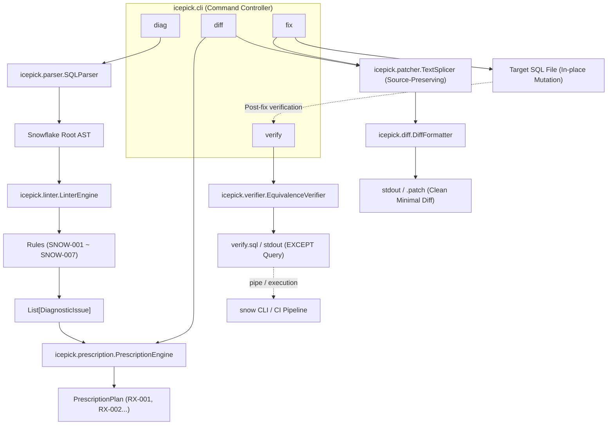

# Icepick for Snowflake 🧊⛏️

**AST Query Optimizer for Snowflake**  
抽象構文木（AST）に基づく決定論的静的診断と外科手術的局所パッチにより、クエリのセマンティクス（結果の等価性）を壊すことなく、Snowflakeの巨大バッチクエリを安全かつ爆速に最適化する開発者向けCLIツール。

[](https://www.python.org/)
[]()
[](https://github.com/astral-sh/ruff)
[](https://mypy-lang.org/)
[](https://opensource.org/licenses/Apache-2.0)

---

## 🌟 なぜ Icepick なのか？ (Why Icepick?)

Snowflake 上で稼働する夜間バッチや dbt モデルなどの複雑な SQL クエリ（数百〜数千行の CTE 連鎖）は、パーティションプルーニングの阻害やメモリ溢れ（Spill）により、膨大なコンピュートコストと実行時間を浪費しがちです。

従来の「クエリ全体をそのまま LLM に丸投げするアプローチ」には、以下のような深刻な課題がありました：

* ❌ **Lost in the Middle**: 長大プロンプトの中間にある重要な JOIN や WHERE 句を LLM が見落とす。
* ❌ **意図しないコード破壊**: 修正すべきでない健全なロジックやインデント、コメントを勝手に改変する。
* ❌ **ハルシネーション**: 存在しない関数やテーブルを捏造し、本番障害・データ不整合を引き起こす。

**Icepick はこの問題を「決定論的 AST 診断 × 外科手術的局所パッチ」で解決します。**  
コード全体の 95% 以上の健全な構文木をそのまま維持し、問題のある患部（20〜30行のノード）だけをミリ単位で置換・削除・平坦化します。

---

## ✨ 主要機能 (Core Features)

1. **決定論的静的診断 (Deterministic SQL Linter)**
   * `sqlglot` を用いて Snowflake 方言の完全な AST を構築し、パフォーマンスを阻害するアンチパターンをミリ秒単位で非破壊検出。
2. **外科手術的 AST In-place 置換 (Targeted In-place Patching)**
   * 健全なコード構造、コメント、インデントを 100% 維持したまま、対象ノードのみを構文木上で機械的に差し替え（`node.replace()`）または安全に切り落とし（`node.pop()`）。
3. **インラインサブクエリの CTE 自動平坦化 (`SubqueryToCTE`)**
   * FROM/JOIN 句に深くネストした派生テーブル（Derived Table）を、**AST ノード深度降順（深さ優先）** で抽出し、依存順序を完全保証しながらトップレベルの `WITH` 句（CTE）へ自動昇格。
4. **超軽量・高速な局所 LLM 連携 (Gemini & Vertex AI REST)**
   * 重厚な外部 SDK（LiteLLM 等）を完全排除し、`httpx` による直接 REST 呼び出しで爆速起動を実現。
   * 患部ノードの周辺文脈のみを最小限スライス（`ContextSlicer`）してプロンプト化し、ハルシネーションを極小化。
   * LLM の返答は必ず `sqlglot.parse_one` で事前検証し、構文不正時は元の AST を一切壊さず安全にフォールバック（Fail-Safe）。
5. **処方箋ID選択型差分生成 ＆ 書式保持直接適用 (`diff` / `fix`)**
   * `TextSplicer` によりコメントやインデントなどの元コード書式を 100% 保持したまま最小限の Unified Diff を生成。
   * 処方箋 ID（`--rx`）による局所狙い撃ち適用や `--dry-run`、非対話環境ガード（`--force`）を完備。
6. **決定論的等価性自動検証 (Equivalence Verification)**
   * 元クエリと最適化クエリの双方向 `EXCEPT` 差分ゼロ検証クエリを動的生成。セマンティクスが 1 行も変化していないことを数学的・集合論的に証明。

---

## 📋 診断ルール一覧 (Diagnostic Rules)

| ルールID | ルール名 | 重要度 | 自動修正 | 診断対象と最適化アクション |
| :--- | :--- | :---: | :---: | :--- |
| **`SNOW-001`** | **Non-Sargable Predicate** | `HIGH` | ✅ | `DATE(col) = '2026-09-01'` 等の関数ラップによるプルーニング阻害を検知し、`col >= '...' AND col < DATEADD(...)` の範囲条件へ自動置換。 |
| **`SNOW-002`** | **Correlated Subquery** | `CRITICAL` | ⚠️ (LLM) | 外側スコープのテーブルやエイリアスを参照する相関副クエリ（反復スキャンやメモリSpill要因）を検知し、局所LLM等による非相関化（JOIN化 / ウィンドウ関数化 / CTE集約）を推奨。 |
| **`SNOW-003`** | **Redundant Sort in Subquery/CTE** | `MEDIUM` | ✅ | `LIMIT` / `FETCH` を持たない中間 CTE やサブクエリ内の無意味な `ORDER BY`（Spill や無駄なソートコストの原因）を検知し、安全に削除（`pop()`）。 |
| **`SNOW-004`** | **Implicit Cross Join** | `HIGH` | ⚠️ (LLM) | カンマ区切り FROM 句（直積結合リスク）を検知し、明示的 JOIN または `CROSS JOIN` への書き換えを警告。※ `TABLE(FLATTEN(...))` 等の相関展開は安全に除外。 |
| **`SNOW-005`** | **Duplicate Table Scan** | `MEDIUM` | ⚠️ (LLM) | 同一クエリ内の複数 CTE 間で同一ベーステーブルが重複スキャンされている箇所を検知し、共通 CTE 集約を推奨。 |
| **`SNOW-006`** | **Union to Union All** | `LOW` | ✅ | 重複排除が不要な `UNION` を検知し、ソート負荷を排除する `UNION ALL` へ自動置換。連鎖 UNION にも完全対応。 |
| **`SNOW-007`** | **Inline Subquery in FROM/JOIN** | `MEDIUM` | ✅ | FROM 句や JOIN 句に直接埋め込まれた派生テーブルを検知し、トップレベル CTE への抽出・平坦化を推奨。 |

---

## 🏗️ システムアーキテクチャ



---

## 🚀 インストール

### 前提要件
* Python 3.10 以上

### pip でインストール
```bash
# クローン後にパッケージをインストール
pip install -r requirements.txt
pip install -e .

# 開発用（テスト・静的解析ツールを含む）
pip install -r requirements-dev.txt
```

### uv で爆速インストール (推奨)
```bash
uv pip install -e ".[dev]"
```

---

## 💻 使い方 (Usage)

### 1. 処方箋駆動の最適化診断 (`diag`)
Snowflake SQL 内の最適化ボトルネックを検出し、独立した**「処方箋（Prescription）」カード**として構造化して提示します（ADR-0005 処方箋ファーストアーキテクチャ）。
各処方箋には一意な ID（`RX-001`, `RX-002`...）、対象 CTE、ノード型、元の SQL、推奨 SQL、修正理由（Rationale）、期待される改善効果（Expected Impact）が含まれます。

#### ターミナルで処方箋カードを確認する (Human-Friendly)
```bash
icepick diag models/batch_mart.sql
```

```text
Prescription Plan: 2 optimization prescriptions found in models/batch_mart.sql

╭─ RX-001 HIGH - Rule: SNOW-001 (Action: REPLACE) ────────────────────────────╮
│ CTE: filtered_events                                                         │
│ Node: Anonymous                                                              │
│ Line: L12                                                                    │
│ Original SQL: TO_DATE(event_timestamp) = '2026-09-01'                        │
│ Suggested SQL: event_timestamp >= '2026-09-01' AND event_timestamp < ...     │
│ Rationale: Column 'event_timestamp' is wrapped in a date/cast function...   │
│ Expected Impact: Enables partition pruning, significantly reducing bytes...  │
╰──────────────────────────────────────────────────────────────────────────────╯
╭─ RX-002 MEDIUM - Rule: SNOW-003 (Action: DELETE) ────────────────────────────╮
│ CTE: sorted_base                                                             │
│ Node: Order                                                                  │
│ Line: L25                                                                    │
│ Original SQL: ORDER BY created_at DESC                                       │
│ Suggested SQL: (Remove node)                                                 │
│ Rationale: Redundant ORDER BY in CTE 'sorted_base' without LIMIT/FETCH...   │
│ Expected Impact: Eliminates sorting overhead and potential spilling...       │
╰──────────────────────────────────────────────────────────────────────────────╯
```

#### 重要度フィルタリング (`--severity` / `-s`)
指定した深刻度しきい値以上の処方箋のみに絞り込んで診断します。
```bash
# HIGH 以上の処方箋（HIGH, CRITICAL）のみを抽出
icepick diag models/batch_mart.sql --severity HIGH
```

#### AI エージェント向け構造化 JSON 出力 (`--format json` / `--json`)
AI コーディングエージェント（Claude Code 等）や自動化パイプライン向けに、`schema_version = "1.0"` に準拠した構造化 JSON を `stdout` に出力します。
```bash
icepick diag models/batch_mart.sql --format json
# または短縮形
icepick diag models/batch_mart.sql --json
```

```json
{
  "schema_version": "1.0",
  "file": "models/batch_mart.sql",
  "issues_count": 2,
  "prescriptions": [
    {
      "id": "RX-001",
      "rule_id": "SNOW-001",
      "severity": "HIGH",
      "target": {
        "cte": "filtered_events",
        "node_type": "Anonymous",
        "line_range": [12, 12]
      },
      "action": "REPLACE",
      "original_sql": "TO_DATE(event_timestamp) = '2026-09-01'",
      "suggested_sql": "event_timestamp >= '2026-09-01' AND event_timestamp < DATEADD(DAY, 1, '2026-09-01')",
      "rationale": "Column 'event_timestamp' is wrapped in a date/cast function in WHERE clause, preventing partition pruning and clustering key usage.",
      "expected_impact": "Enables partition pruning, significantly reducing bytes scanned and warehouse execution time."
    }
  ]
}
```
*(※ 問題検出時は終了コード `1`、問題なし時は `0`、構文エラー時は `2` を返します)*

---

### 2. 処方箋ID選択型差分生成 (`diff`)
`diag` で提示された処方箋（Prescription）から必要なものだけを選択（`--rx`）し、元の書式・コメントを完全に維持したまま最小限の Unified Diff を生成します（ADR-0005 処方箋ファーストアーキテクチャ）。

#### 全処方箋を反映した差分をターミナルで確認する
```bash
icepick diff models/batch_mart.sql
```

#### 特定の処方箋のみを選択して局所差分を生成する (`--rx`)
指定した処方箋 ID（カンマ区切りで複数指定可能）のみを適用し、他の行や構文は 1 文字も改変しません。
```bash
# RX-001 のみを局所適用
icepick diff models/batch_mart.sql --rx RX-001

# RX-001 と RX-003 を同時に適用
icepick diff models/batch_mart.sql --rx RX-001,RX-003
```
*(※ 存在しない処方箋 ID を指定した場合は、利用可能な ID 一覧付きのエラーが表示され終了コード `1` を返します)*

#### 生成した差分をパッチファイルとして保存する (`--output` / `-o`)
```bash
icepick diff models/batch_mart.sql --rx RX-001 -o patches/rx001.patch
```
生成されたパッチは、そのまま `git apply` や `icepick fix` で元ファイルへ安全に適用できます。

---

### 3. 処方箋ID選択型ファイル直接適用 (`fix`)
`diag` で提示された処方箋（Prescription）を、**対象の SQL ファイルへ直接インプレース適用**します（要件 G-3, ADR-0005）。
`TextSplicer` により元のインデント、コメント、改行などの書式を 100% 保持したまま、指定された最適化のみを外科手術的に反映します。

#### 全処方箋を元ファイルに直接適用する
```bash
icepick fix models/batch_mart.sql --force
```

#### 特定の処方箋のみを局所狙い撃ち適用する (`--rx`)
指定した処方箋 ID（カンマ区切りで複数指定可能）のみをファイルに適用し、他の箇所は完全に元のコードを維持します。
```bash
# RX-001 のみを局所適用
icepick fix models/batch_mart.sql --rx RX-001 --force

# RX-001 と RX-003 を同時に適用
icepick fix models/batch_mart.sql --rx RX-001,RX-003 --force
```
*(※ 存在しない処方箋 ID を指定した場合は、利用可能な ID 一覧付きのエラーが表示され終了コード `1` を返します)*

#### 差分シミュレーション (`--dry-run`)
実ファイルを一切改変せずに、適用される Unified Diff と処方箋一覧をターミナルで確認します。
```bash
icepick fix models/batch_mart.sql --rx RX-001 --dry-run
```

#### 🛡️ 破壊的操作ガード (`--force` / `-f`)
ファイル直接更新（インプレース修正）の事故を防ぐため、安全ガード（要件 E-6）を備えています:
* **対話環境 (TTY)**: `--force` がない場合、`Are you sure you want to modify ... in-place? [y/N]` の確認プロンプトが表示されます。
* **非対話環境 / CI / AI エージェント (非 TTY)**: 誤爆防止のため `--force` が必須です。指定がない場合はエラー（終了コード `1`）となりファイルは変更されません。

---

### 4. セマンティクス等価性検証 SQL の生成 (`verify`)
元クエリと最適化クエリが同一の結果セットを返すことを証明するための双方向 `EXCEPT` 検証クエリを決定論的・数学的に生成します（ADR-0004: クレデンシャル不要・純粋 SQL 生成モデル）。

Icepick 自体は Snowflake への直接接続を行わないため、**データベース認証情報・パスワードは一切不要**です。生成された SQL は、開発者が使い慣れた Snowflake CLI (`snow sql`) や `snowsql` にパイプまたはファイル渡しで安全に実行できます。

#### ターミナルへ検証 SQL を出力（パイプライン連携）
```bash
# 標準出力へ検証 SQL を生成し、Snowflake CLI にそのまま流し込む
icepick verify models/batch_mart.sql models/batch_mart_optimized.sql | snow sql -f -
```

#### 検証用 SQL をファイルに保存する (`--output` / `-o`)
```bash
# 検証 SQL ファイルを出力
icepick verify models/batch_mart.sql models/batch_mart_optimized.sql -o verify_query.sql

# 保存した SQL を任意のクライアントで実行
snow sql -f verify_query.sql
```

#### 生成される検証 SQL の例
```sql
-- Icepick Bidirectional Equivalence Verification Query
-- Dialect: snowflake
WITH diff_forward AS (
    (SELECT * FROM original) EXCEPT (SELECT * FROM optimized)
),
diff_backward AS (
    (SELECT * FROM optimized) EXCEPT (SELECT * FROM original)
)
SELECT
    (SELECT COUNT(*) FROM diff_forward) AS missing_in_optimized,
    (SELECT COUNT(*) FROM diff_backward) AS extra_in_optimized;
```
*(※ 両方の差分件数が 0 であれば、結果セットが完全等価であることが数学的・集合論的に証明されます)*


---

### 5. エージェント親和性とフィードバックループ (`Agent-Native DX`)

Icepick は、人間だけでなく AI コーディングエージェント（Claude Code, Cursor, Antigravity 等）が自律的かつ安全に利用できるよう設計されています。

#### Layer 2 イントロスペクション (`agent-context`)
全コマンド体系・引数仕様・最適化ルール一覧（`SNOW-001`〜`007`）・環境変数スキーマを **1 回のコマンド実行で構造化 JSON として把握** できます（`--help` の連打によるトークン浪費を防止）。
```bash
icepick agent-context
```

#### 開発摩擦・バグのローカル記録 (`feedback`)
テスト中や運用中に遭遇した摩擦（フリクション）やバグ、改善アイデアを `.icepick_feedback.jsonl` に安全に追記記録します。
```bash
# 基本的な記録
icepick feedback "JOIN句のサブクエリ平坦化でエイリアスが重複した" --category bug

# 機械可読 JSON 出力
icepick feedback "CTE抽出の順序が直感的でわかりやすい" --category idea --json
```

#### 破壊的操作の明示的境界 (`--dry-run` & `--force`)
* `--dry-run`: 実ファイルへの書き込みを安全にスキップし、差分プレビューのみを出力（`fix`）。
* `--force` / `-f`: パイプラインや非対話環境（stdin 非 TTY）でファイル変更コマンド（`fix`）を実行する際は、誤爆防止のため `--force` が必須。

#### 構造化出力 (`--json`)
すべての主要コマンドで `--json` をサポート。装飾なしの純粋な JSON が `stdout` に出力され、ログやエラーは `stderr` に分離されます。
```bash
icepick diag models/batch_mart.sql --json
icepick config show --json
icepick feedback "CTE抽出の順序が直感的でわかりやすい" --category idea --json
```

---

## 🔒 完全ゼロ・クレデンシャル ＆ ゼロ・ネットワーク設計 (Zero-Credential Architecture)

> [!NOTE]
> **完全ゼロ・クレデンシャル ＆ 完全オフライン動作 (ADR-0007)**:
> Icepick は内部での外部 LLM API 呼び出しやネットワーク通信、Snowflake への直接接続を一切行いません。
> - **外部 API キー不要**: Gemini / Vertex AI 等の API キーや認証情報は一切必要ありません。
> - **Snowflake 認証情報不要**: Snowflake のアカウント・ユーザ名・パスワード等は一切不要です。
> - **ゼロ・ネットワーク依存**: すべての静的診断、Unified Diff 生成、インプレース適用、検証 SQL 生成はローカル環境で 100% 決定論的かつオフラインで完結します。

### 🤝 3 層連携アーキテクチャ (3-Tier Synergy)

Icepick は、コード探索ツール `ast-digger` および外部の AI コーディングエージェント（Claude Code, Antigravity, GitHub Copilot 等）と組み合わせることで最大のパフォーマンスを発揮します。

```text
┌────────────────────────────────────────────────────────────────────────┐
│                        AI コーディングエージェント                      │
│            (高度な推論・プランニング・自然言語プロンプト対話)           │
└──────────────┬──────────────────────────────────────────▲──────────────┘
               │                                          │
    AST 探索・スライシング (構造把握)              処方箋・差分 (検証・適用)
               │                                          │
┌──────────────▼──────────────────────────┐    ┌──────────┴──────────────┐
│             ast-digger                  │    │         icepick         │
│  (outline / symbol / references / locate│    │  (diag / diff / fix /   │
│      トークン効率的な構文・参照探索)    │    │   verify / feedback)    │
└─────────────────────────────────────────┘    └─────────────────────────┘
```

1. **`ast-digger`（探索レイヤー）**: 長大なバッチクエリのアウトライン（`outline`）やシンボル定義・参照（`symbol`, `references`）をトークン消費を抑えて爆速探索。
2. **`icepick`（診断・最適化・検証エンジン）**: 構文木解析に基づく決定論的アンチパターン診断（`diag`）、元コードのインデント・コメントを完全保持する処方箋適用（`diff`, `fix`）、等価性検証 SQL 生成（`verify`）を担当。
3. **AI エージェント（頭脳レイヤー）**: 自身が LLM であるため、外部 API 通信を介さず `icepick` の構造化処方箋（JSON）を直接理解し、安全に最適化リライトを完遂。

---

## ⚙️ 設定 (Configuration)

Icepick は、開発者や AI コーディングエージェントが柔軟に設定を制御できるよう、明確な **設定優先順位ピラミッド（The Configuration Precedence Pyramid）** に基づいて動作します。

### 🏔️ 設定優先順位ピラミッド (The Configuration Precedence Pyramid)

設定値は以下の優先順位に従ってカスケード解決（マージ）されます：

```text
    ┌─────────────────────────────────────────────────────────────┐
    │ 1. CLI オプション (--dialect, --config, etc.)               │  最高優先度
    ├─────────────────────────────────────────────────────────────┤
    │ 2. 環境変数 (ICEPICK_DIALECT, ICEPICK_ENABLED_RULES, etc.)  │
    ├─────────────────────────────────────────────────────────────┤
    │ 3. 設定ファイル (--config 指定, .icepick.toml, icepick.json) │
    ├─────────────────────────────────────────────────────────────┤
    │ 4. 組み込みデフォルト値 (default)                             │  基底
    └─────────────────────────────────────────────────────────────┘
```

1. **CLI オプション (`cli`)**: コマンドライン実行時に直接渡された引数（最優先）。
2. **環境変数 (`env`)**: `ICEPICK_DIALECT`, `ICEPICK_ENABLED_RULES`, `ICEPICK_DISABLED_RULES` 等の環境変数。
3. **設定ファイル (`file`)**: `--config` で指定されたファイル、またはカレントディレクトリの `.icepick.toml` / `icepick.json`。
4. **組み込みデフォルト値 (`default`)**: コードベースに組み込まれた安全なフォールバックデフォルト。

---

### 🔍 設定インスペクション (`icepick config show`)

現在のアクティブな設定一覧と、それぞれの解決元ソース（CLI / ENV / FILE / DEFAULT）をいつでも確認できます。

```bash
icepick config show
```

```text
                Icepick Resolved Configuration               
┏━━━━━━━━━━━━━━━━━━━━━┳━━━━━━━━━━━━━━━━━━━━━┳━━━━━━━━━━━━━━┓
┃ Option              ┃ Resolved Value      ┃ Source       ┃
┡━━━━━━━━━━━━━━━━━━━━━╇━━━━━━━━━━━━━━━━━━━━━╇━━━━━━━━━━━━━━┩
│ dialect             │ snowflake           │ default      │
│ disabled_rules      │ []                  │ default      │
│ enabled_rules       │ []                  │ default      │
│ interactive         │ False               │ default      │
│ output_patch        │ (none)              │ default      │
│ show_diff           │ True                │ default      │
│ write_in_place      │ False               │ default      │
└─────────────────────┴─────────────────────┴──────────────┘
```

機械可読な JSON 出力もサポート：
```bash
icepick config show --json
```

---

### 📄 設定ファイル (`icepick.json` / `.icepick.toml`) の作り方

プロジェクト直下に `icepick.json` または `.icepick.toml` を配置することで、チーム全体で共通のルールや動作オプションをコード管理できます。

#### 基本サンプル (`.icepick.toml` / `icepick.json`)

**TOML形式 (`.icepick.toml` - 推奨)**:
```toml
dialect = "snowflake"
disabled_rules = ["SNOW-007"]
```

**JSON形式 (`icepick.json`)**:
```json
{
  "dialect": "snowflake",
  "enabled_rules": [],
  "disabled_rules": ["SNOW-007"],
  "interactive": false,
  "show_diff": true,
  "write_in_place": false
}
```

#### 設定キー一覧
| キー名 | 型 | デフォルト値 | 説明 |
| :--- | :---: | :---: | :--- |
| `dialect` | `string` | `"snowflake"` | 対象 SQL 方言 (`snowflake`, `postgres`, `duckdb`, `bigquery`) |
| `enabled_rules` | `array[string]` | `[]` | 実行するルールIDのホワイトリスト。空の場合は無効化されていない全ルールを実行。 |
| `disabled_rules` | `array[string]` | `[]` | スキップするルールIDのブラックリスト（例: `["SNOW-007"]`）。 |
| `interactive` | `boolean` | `false` | 対話形式で変更確認プロンプトを出すか。 |
| `show_diff` | `boolean` | `true` | ターミナル上にカラー Unified Diff を出力するか。 |
| `write_in_place` | `boolean` | `false` | 元の SQL ファイルを直接上書き保存するか。 |
| `output_patch` | `string \| null` | `null` | 生成された差分を保存する `.patch` ファイルのパス。 |

#### 設定ファイルを指定して CLI を実行する
`--config`（または `-c`）オプションで設定ファイルを指定して実行します。
```bash
# 診断時
icepick diag models/batch_mart.sql --config .icepick.toml

# 差分生成時
icepick diff models/batch_mart.sql -c .icepick.toml
```

---

### 🌐 環境変数一覧
設定ファイルを使わない場合や、CI 環境で一時的に上書きしたい場合は環境変数も利用可能です。
| 設定項目 / 環境変数 | 説明 | デフォルト値 |
| :--- | :--- | :--- |
| `ICEPICK_DIALECT` | 対象 SQL 方言 (`snowflake`, `postgres`, `duckdb`, `bigquery`) | `snowflake` |
| `ICEPICK_ENABLED_RULES` | 有効化するルールID（カンマ区切り） | すべて有効 |
| `ICEPICK_DISABLED_RULES` | 無効化するルールID（カンマ区切り） | なし |
| `ICEPICK_INTERACTIVE` | 対話形式の確認プロンプト (`true`/`false`) | `false` |
| `ICEPICK_SHOW_DIFF` | カラー Unified Diff 出力 (`true`/`false`) | `true` |
| `ICEPICK_WRITE_IN_PLACE` | ファイル直接上書き (`true`/`false`) | `false` |
| `ICEPICK_OUTPUT_PATCH` | 差分出力先 `.patch` ファイルパス | なし |

---

## 🧪 テストと品質保証

Icepick は厳格なスペック駆動開発（SDD）およびテスト駆動開発（TDD）に基づき、**100% のテストカバレッジ** を維持して開発されています。

```bash
# 全テスト実行 & カバレッジ測定
uv run pytest --cov=icepick

# 高速静的解析
uv run ruff check src tests

# 厳格型チェック
uv run mypy src tests
```

---

## 📄 ライセンス

[Apache License 2.0](LICENSE)
