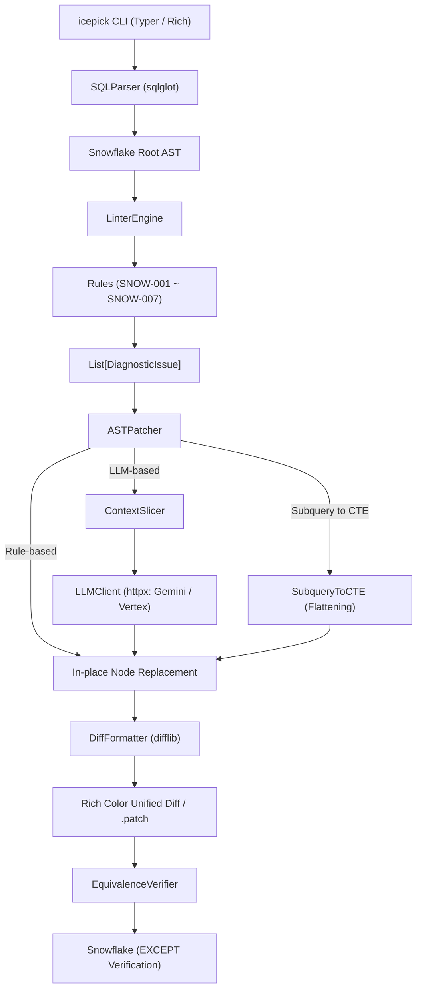

# Icepick for Snowflake 🧊⛏️

**AST Query Optimizer for Snowflake**  
抽象構文木（AST）に基づく決定論的静的診断と外科手術的局所パッチにより、クエリのセマンティクス（結果の等価性）を壊すことなく、Snowflakeの巨大バッチクエリを安全かつ爆速に最適化する開発者向けCLIツール。

[](https://www.python.org/)
[]()
[](https://github.com/astral-sh/ruff)
[](https://mypy-lang.org/)
[](https://opensource.org/licenses/Apache-2.0)

---

## 🌟 なぜ Icepick なのか？ (Why Icepick?)

Snowflake 上で稼働する夜間バッチや dbt モデルなどの複雑な SQL クエリ（数百〜数千行の CTE 連鎖）は、パーティションプルーニングの阻害やメモリ溢れ（Spill）により、膨大なコンピュートコストと実行時間を浪費しがちです。

従来の「クエリ全体をそのまま LLM に丸投げするアプローチ」には、以下のような深刻な課題がありました：

* ❌ **Lost in the Middle**: 長大プロンプトの中間にある重要な JOIN や WHERE 句を LLM が見落とす。
* ❌ **意図しないコード破壊**: 修正すべきでない健全なロジックやインデント、コメントを勝手に改変する。
* ❌ **ハルシネーション**: 存在しない関数やテーブルを捏造し、本番障害・データ不整合を引き起こす。

**Icepick はこの問題を「決定論的 AST 診断 × 外科手術的局所パッチ」で解決します。**  
コード全体の 95% 以上の健全な構文木をそのまま維持し、問題のある患部（20〜30行のノード）だけをミリ単位で置換・削除・平坦化します。

---

## ✨ 主要機能 (Core Features)

1. **決定論的静的診断 (Deterministic SQL Linter)**
   * `sqlglot` を用いて Snowflake 方言の完全な AST を構築し、パフォーマンスを阻害するアンチパターンをミリ秒単位で非破壊検出。
2. **外科手術的 AST In-place 置換 (Targeted In-place Patching)**
   * 健全なコード構造、コメント、インデントを 100% 維持したまま、対象ノードのみを構文木上で機械的に差し替え（`node.replace()`）または安全に切り落とし（`node.pop()`）。
3. **インラインサブクエリの CTE 自動平坦化 (`SubqueryToCTE`)**
   * FROM/JOIN 句に深くネストした派生テーブル（Derived Table）を、**AST ノード深度降順（深さ優先）** で抽出し、依存順序を完全保証しながらトップレベルの `WITH` 句（CTE）へ自動昇格。
4. **超軽量・高速な局所 LLM 連携 (Gemini & Vertex AI REST)**
   * 重厚な外部 SDK（LiteLLM 等）を完全排除し、`httpx` による直接 REST 呼び出しで爆速起動を実現。
   * 患部ノードの周辺文脈のみを最小限スライス（`ContextSlicer`）してプロンプト化し、ハルシネーションを極小化。
   * LLM の返答は必ず `sqlglot.parse_one` で事前検証し、構文不正時は元の AST を一切壊さず安全にフォールバック（Fail-Safe）。
5. **Git 互換の Unified Diff ＆ 対話型適用 (`git add -p` モデル)**
   * AST 正規化により、インデント差異による偽陽性（ノイズ差分）を完全に排除した純粋な意味差分を出力。
   * `--interactive` モードにより、変更箇所（Hunk）ごとに開発者が `[y]/[n]/[q]` で個別承認・適用。
6. **決定論的等価性自動検証 (Equivalence Verification)**
   * 元クエリと最適化クエリの双方向 `EXCEPT` 差分ゼロ検証クエリを動的生成。セマンティクスが 1 行も変化していないことを数学的・集合論的に証明。

---

## 📋 診断ルール一覧 (Diagnostic Rules)

| ルールID | ルール名 | 重要度 | 自動修正 | 診断対象と最適化アクション |
| :--- | :--- | :---: | :---: | :--- |
| **`SNOW-001`** | **Non-Sargable Predicate** | `HIGH` | ✅ | `DATE(col) = '2026-09-01'` 等の関数ラップによるプルーニング阻害を検知し、`col >= '...' AND col < DATEADD(...)` の範囲条件へ自動置換。 |
| **`SNOW-002`** | **Correlated Subquery** | `CRITICAL` | ⚠️ (LLM) | 外側スコープのテーブルやエイリアスを参照する相関副クエリ（反復スキャンやメモリSpill要因）を検知し、局所LLM等による非相関化（JOIN化 / ウィンドウ関数化 / CTE集約）を推奨。 |
| **`SNOW-003`** | **Redundant Sort in Subquery/CTE** | `MEDIUM` | ✅ | `LIMIT` / `FETCH` を持たない中間 CTE やサブクエリ内の無意味な `ORDER BY`（Spill や無駄なソートコストの原因）を検知し、安全に削除（`pop()`）。 |
| **`SNOW-004`** | **Implicit Cross Join** | `HIGH` | ⚠️ (LLM) | カンマ区切り FROM 句（直積結合リスク）を検知し、明示的 JOIN または `CROSS JOIN` への書き換えを警告。※ `TABLE(FLATTEN(...))` 等の相関展開は安全に除外。 |
| **`SNOW-005`** | **Duplicate Table Scan** | `MEDIUM` | ⚠️ (LLM) | 同一クエリ内の複数 CTE 間で同一ベーステーブルが重複スキャンされている箇所を検知し、共通 CTE 集約を推奨。 |
| **`SNOW-006`** | **Union to Union All** | `LOW` | ✅ | 重複排除が不要な `UNION` を検知し、ソート負荷を排除する `UNION ALL` へ自動置換。連鎖 UNION にも完全対応。 |
| **`SNOW-007`** | **Inline Subquery in FROM/JOIN** | `MEDIUM` | ✅ | FROM 句や JOIN 句に直接埋め込まれた派生テーブルを検知し、トップレベル CTE への抽出・平坦化を推奨。 |

---

## 🏗️ システムアーキテクチャ



---

## 🚀 インストール

### 前提要件
* Python 3.10 以上

### pip でインストール
```bash
# クローン後にパッケージをインストール
pip install -r requirements.txt
pip install -e .

# 開発用（テスト・静的解析ツールを含む）
pip install -r requirements-dev.txt
```

### uv で爆速インストール (推奨)
```bash
uv pip install -e ".[dev]"
```

---

## 💻 使い方 (Usage)

### 1. クエリのアンチパターン診断 (`check`)
クエリ内のパフォーマンス阻害要因をスキャンし、リッチなカラーテーブルで一覧表示します。

```bash
icepick check models/batch_mart.sql
```

```text
                      Diagnostic Report: batch_mart.sql                      
+-----------------------------------------------------------------------------+
| Rule ID  | Rule Name              | Severity | Line | Description           |
|----------+------------------------+----------+------+-----------------------|
| SNOW-001 | Non-Sargable Predicate | HIGH     | -    | Column                |
|          |                        |          |      | 'event_timestamp' is  |
|          |                        |          |      | wrapped in a          |
|          |                        |          |      | date/cast function... |
| SNOW-003 | Redundant Sort in CTE  | MEDIUM   | -    | Redundant ORDER BY    |
|          |                        |          |      | without LIMIT...      |
+-----------------------------------------------------------------------------+
```
*(※ CI パイプラインでの使用に適しており、問題検出時は終了コード `1`、問題なし時は `0` を返します)*

---

### 2. クエリの最適化（Unified Diff 出力）(`rewrite`)
元ファイルを一切改変せず、AST に基づく最適化の差分（Unified Diff）を標準出力またはファイルに出力します。

#### ターミナルで差分を確認する (Read-Only)
```bash
icepick rewrite models/batch_mart.sql
```
```diff
--- a/batch_mart.sql
+++ b/batch_mart.sql
@@ -16,7 +16,8 @@
     MAX(event_timestamp) AS last_active
   FROM raw_events
   WHERE
-    TO_DATE(event_timestamp) = '2026-09-01'
+    event_timestamp >= '2026-09-01'
+    AND event_timestamp < DATEADD(DAY, 1, '2026-09-01')
   GROUP BY
     user_id
```

#### 🛡️ 元ソース書式保持（Source-Preserving Rewrite：デフォルト動作）
デフォルトでは `TextSplicer` により、**元の生 SQL（4スペース等の独自インデント、小文字キーワード、コメント、改行）を 100% 維持** したまま、患部のみを外科手術的にピンポイント置換し、ノイズ差分（インデント変更やキーワード大文字化による偽陽性）が一切ない最小限の Unified Diff を生成します。

* **パイプライン・パッチ適用保証**:  
  生成される Diff は元の行コンテキストと完全一致するため、以下のようにパッチを出力して適用する一連の CI/CD やローカルパイプラインにおいて、行不一致エラー（`Hunk rejected`）を起こさずクリーンに適用可能です。
  ```bash
  # 1. 最小限の Unified Diff を安全に出力
  icepick rewrite models/batch_mart.sql -o patches/batch_mart.patch

  # 2. 元ファイルへクリーンに適用（行コンテキスト完全一致）
  icepick patch models/batch_mart.sql patches/batch_mart.patch
  ```

#### 全体再フォーマット (`--reformat`)
チームのコーディング規約や統一フォーマットに合わせて、クエリ全体の AST を再フォーマット（2スペースインデント、大文字キーワード等）したい場合は、`--reformat` フラグを指定します。
```bash
icepick rewrite models/batch_mart.sql --reformat
```
*(※ `--flatten-subqueries` での CTE 平坦化や `--agentic` による大規模構文変換時も、AST 全体の自動再構築が行われます)*

#### パッチファイルとして保存する (`--output` / `-o`)
```bash
icepick rewrite models/batch_mart.sql -o patches/batch_mart.patch
```

#### インラインサブクエリを CTE に平坦化する (`--flatten-subqueries`)
```bash
icepick rewrite models/batch_mart.sql --flatten-subqueries
```

#### 重要度でフィルタリングする (`--category`)
```bash
# HIGH 以上の重要度（CRITICAL, HIGH）のみを適用した Diff を生成
icepick rewrite models/batch_mart.sql --category HIGH
```

#### LLM支援による高度なリライト (`--agentic`)
ルールベースで自動修正できない相関副クエリ（`SNOW-002`）などを、Gemini / Vertex AI による局所スライシングと構文検証を経てリライトします。
```bash
# Gemini (デフォルト: gemini-3.8-flash)
icepick rewrite models/batch_mart.sql --agentic

# Vertex AI プロバイダ & モデル指定
icepick rewrite models/batch_mart.sql --agentic -p vertex -m gemini-1.5-pro
```

---

### 3. パッチの適用 (`patch`)
Unified Diff を指定の SQL ファイルに外科手術的に適用します。

#### パッチファイルから適用する
```bash
icepick patch models/batch_mart.sql patches/batch_mart.patch
```

#### 対話形式で変更を 1 つずつ確認・適用する (`--interactive` / `-i`)
`git add -p` と同様のメンタルモデルで、差分（Hunk）ごとに適用（`[y]/[n]/[q]`）を選択できます。
```bash
icepick patch models/batch_mart.sql patches/batch_mart.patch --interactive
```

#### パイプによるワンライナー即時適用
`rewrite` の出力をパイプで `patch` に流し込み、`--force` で直接適用できます。
```bash
icepick rewrite models/batch_mart.sql | icepick patch models/batch_mart.sql --force
```

#### 適用シミュレーション (`--dry-run`)
実ファイルを変更せずに適用結果をシミュレーションします。
```bash
icepick patch models/batch_mart.sql patches/batch_mart.patch --dry-run
```

---

### 4. セマンティクス等価性の検証 (`verify`)
元クエリと最適化クエリが同一の結果セットを返すことを、Snowflake 上で双方向 `EXCEPT` クエリを実行して決定論的・数学的に証明します。

#### Snowflake 実環境で等価性を検証する
```bash
icepick verify models/batch_mart.sql models/batch_mart_optimized.sql
```
```text
✓ Equivalence Verified! Queries are mathematically equivalent (0 differences in both directions).
```

#### 検証用 SQL のみ確認する (`--dry-run`)
Snowflake に接続せず、生成された双方向 EXCEPT クエリをターミナルに表示します。
```bash
icepick verify models/batch_mart.sql models/batch_mart_optimized.sql --dry-run
```

#### 検証ループによる自己修復リライト (`rewrite --verify-loop`)
LLM によるリライト結果を Snowflake 双方向 EXCEPT で即座に自動検証し、差分が発生した場合はエラーフィードバックをプロンプトに注入して最大 3 回自己修復ループを回します。
```bash
icepick rewrite models/batch_mart.sql --agentic --verify-loop
```
*(※ 双方向の差分がともに `0` となる完全等価性が証明された Diff のみが出力されるため、安心してパッチ適用できます)*


---

### 5. エージェント親和性とフィードバックループ (`Agent-Native DX`)

Icepick は、人間だけでなく AI コーディングエージェント（Claude Code, Cursor, Antigravity 等）が自律的かつ安全に利用できるよう設計されています。

#### Layer 2 イントロスペクション (`agent-context`)
全コマンド体系・引数仕様・最適化ルール一覧（`SNOW-001`〜`007`）・環境変数スキーマを **1 回のコマンド実行で構造化 JSON として把握** できます（`--help` の連打によるトークン浪費を防止）。
```bash
icepick agent-context
```

#### 開発摩擦・バグのローカル記録 (`feedback`)
テスト中や運用中に遭遇した摩擦（フリクション）やバグ、改善アイデアを `.icepick_feedback.jsonl` に安全に追記記録します。
```bash
# 基本的な記録
icepick feedback "JOIN句のサブクエリ平坦化でエイリアスが重複した" --category bug

# 機械可読 JSON 出力
icepick feedback "CTE抽出の順序が直感的でわかりやすい" --category idea --json
```

#### 破壊的操作の明示的境界 (`--dry-run` & `--force`)
* `--dry-run`: 実ファイルへの書き込みを安全にスキップし、差分プレビューのみを出力。
* `--force` / `-f`: パイプラインや非対話環境（stdin 非 TTY）で `patch` を実行する際は、誤爆防止のため `--force` が必須。

#### 構造化出力 (`--json`)
すべての主要コマンドで `--json` をサポート。装飾なしの純粋な JSON が `stdout` に出力され、ログやエラーは `stderr` に分離されます。
```bash
icepick check models/batch_mart.sql --json
icepick rewrite models/batch_mart.sql --json
icepick patch models/batch_mart.sql patches/batch_mart.patch --dry-run --json
```

---

## 🔐 セキュアな認証設定 (Authentication)

API キーやパスワードなどの機密情報を安全に保護し、シェル履歴（`ConsoleHost_history.txt`）への平文残存や GitHub への誤コミットを防ぐため、Icepick は **Windows 資格情報マネージャー (Windows Credential Manager: WCM)** を標準の認証ストレージとして採用しています。

> [!IMPORTANT]
> **環境汚染防止のための設計方針**:
> 他のツールや親プロセスからの偶発的なトークン混入・情報漏洩を防ぐため、**一般的な環境変数（`GEMINI_API_KEY` や `SNOWFLAKE_PASSWORD`、`SNOWFLAKE_USER` 等）は意図的に探索対象から除外** されています。

### 認証解決の優先順位 (Priority Pyramid)
1. **一時デバッグ / CI・CD 専用環境変数** (`DEBUG_ICEPICK_<KEY>`)
2. **Windows 資格情報マネージャー** (`icepick:<key>` / `icepick:snowflake`)
3. **自己修正エラー (Actionable Error)**

---

### 推奨設定手順 (PowerShell マスク入力)
シェル履歴に秘密情報を一切残さないため、PowerShell の対話型マスク入力を推奨します。

#### 1. Gemini API キーの登録 (LLM 局所リライト用)
```powershell
$cred = Get-Credential -UserName "any" -Message "Gemini API Key をパスワード欄に入力してください"
cmdkey /generic:icepick:gemini_api_key /user:any /pass:$($cred.GetNetworkCredential().Password)
```

#### 2. Snowflake 認証情報（ユーザ名・パスワードペア）の登録 (verify コマンド用)
Icepick では、Snowflake のユーザー名とパスワードをペアで安全に管理する **`icepick:snowflake`** を採用しています。
```powershell
# Recommended (safe, masked input without leaving credentials in shell history):
$cred = Get-Credential -Message "Enter Snowflake Credentials"
cmdkey /generic:icepick:snowflake /user:$($cred.UserName) /pass:$($cred.GetNetworkCredential().Password)
```
*(※ ダイアログの「ユーザー名」に Snowflake ユーザー名、「パスワード」に Snowflake パスワードを入力します)*

---

### 直接登録する場合 (コマンドプロンプト / PowerShell)
```cmd
# Gemini API キー
cmdkey /generic:icepick:gemini_api_key /user:any /pass:<your_gemini_api_key>

# Snowflake 認証情報（ユーザ名・パスワードペア）
cmdkey /generic:icepick:snowflake /user:<snowflake_user> /pass:<snowflake_password>
```
*(※ `cmdkey` 特有の UTF-16LE / Null byte トラップは Icepick 内部で自動検知・安全にデコードされます)*

---

### 登録内容の確認・削除
```cmd
# 一覧確認
cmdkey /list:icepick:*

# 削除
cmdkey /delete:icepick:gemini_api_key
cmdkey /delete:icepick:snowflake
```

---

### CI / CD または一時デバッグでの利用
CI 環境やローカルでの一時実行に限り、`DEBUG_ICEPICK_` プレフィックス付き環境変数でオーバーライド可能です。

```powershell
# PowerShell
$env:DEBUG_ICEPICK_GEMINI_API_KEY = "your_key"
$env:DEBUG_ICEPICK_SNOWFLAKE_USER = "<snowflake_user>"
$env:DEBUG_ICEPICK_SNOWFLAKE_PASSWORD = "<snowflake_password>"
```

```bash
# Bash / CI
export DEBUG_ICEPICK_GEMINI_API_KEY="your_key"
export DEBUG_ICEPICK_SNOWFLAKE_USER="<snowflake_user>"
export DEBUG_ICEPICK_SNOWFLAKE_PASSWORD="<snowflake_password>"
```

---

## ⚙️ 設定 (Configuration)

Icepick は、開発者や AI コーディングエージェントが柔軟かつ安全に設定を制御できるよう、明確な **設定優先順位ピラミッド（The Configuration Precedence Pyramid）** に基づいて動作します。

### 🏔️ 設定優先順位ピラミッド (The Configuration Precedence Pyramid)

設定値は以下の優先順位に従ってカスケード解決（マージ）されます：

```text
    ┌─────────────────────────────────────────────────────────────┐
    │ 1. CLI オプション (--provider, --model, --config, etc.)      │  最高優先度
    ├─────────────────────────────────────────────────────────────┤
    │ 2. 環境変数 (ICEPICK_LLM_PROVIDER, GCP_PROJECT, etc.)       │
    ├─────────────────────────────────────────────────────────────┤
    │ 3. 設定ファイル (--config 指定, .icepick.toml, icepick.json) │
    ├─────────────────────────────────────────────────────────────┤
    │ 4. セキュア認証情報 (Windows 資格情報マネージャー: icepick:*)       │
    ├─────────────────────────────────────────────────────────────┤
    │ 5. 組み込みデフォルト値 (default)                             │  基底
    └─────────────────────────────────────────────────────────────┘
```

1. **CLI オプション (`cli`)**: コマンドライン実行時に直接渡された引数（最優先）。
2. **環境変数 (`env`)**: `ICEPICK_LLM_PROVIDER`, `ICEPICK_LLM_MODEL`, `GCP_PROJECT`, `GOOGLE_CLOUD_PROJECT` 等の環境変数。
3. **設定ファイル (`file`)**: `--config` で指定されたファイル、またはカレントディレクトリの `.icepick.toml` / `icepick.json`。
4. **セキュア認証情報 (`keyring`)**: Windows 資格情報マネージャー (WCM) に暗号化保存されたクレデンシャル（`icepick:gemini_api_key`, `icepick:snowflake`）。API キーだけでなく、Snowflake 認証ペア（`snowflake_user`, `snowflake_password`）も機密情報として安全に解決されます。
5. **組み込みデフォルト値 (`default`)**: コードベースに組み込まれた安全なフォールバックデフォルト。

---

### 🔍 実行時アクティブコンフィグ・フィードバック ＆ `icepick config show`

どの設定値がどのソースレイヤーによって決定されたかを可視化するため、Icepick は強力な実行時フィードバック機構を備えています。

#### 1. ターミナルでの Rich バナー表示
`rewrite --agentic` や `--verify-loop` 実行時、適用されている設定とその決定元ソース（CLI / ENV / FILE / KEYRING / DEFAULT）がターミナル上にカラーパネルで表示されます。

```text
╭─ Active LLM Configuration ────────────────────────────────╮
│ Active LLM Configuration:                                 │
│   Provider: vertex (Source: cli)                          │
│   Model:    gemini-1.5-pro (Source: cli)                  │
│   Project:  my-company-gcp-project (Source: env)          │
│   Location: global (Source: file)                         │
│   Auth:     Google ADC / Subprocess Token                 │
╰───────────────────────────────────────────────────────────╯
```

#### 2. 機械可読な `--json` 出力 (`runtime_config`)
`rewrite --json` 出力には、生成差分データに加えて `runtime_config` オブジェクトが含まれ、解決された値とソースレイヤーがすべて記録されます（API キーやパスワード、Snowflake ユーザー名などの機密情報は自動マスキング）。

```json
{
  "file": "models/batch_mart.sql",
  "has_changes": true,
  "diff": "...",
  "runtime_config": {
    "llm_provider": { "value": "vertex", "source": "cli" },
    "llm_model": { "value": "gemini-1.5-pro", "source": "cli" },
    "gcp_project": { "value": "my-company-gcp-project", "source": "env" },
    "gcp_location": { "value": "global", "source": "file" },
    "gemini_api_key": { "value": "***", "source": "keyring" },
    "snowflake_user": { "value": "***", "source": "keyring" }
  }
}
```

#### 3. 設定インスペクション (`icepick config show`)
現在のアクティブな設定一覧、解決元ソース、マスク済みシークレットをいつでも確認できます。`snowflake_user` も機密情報（`SECRET_KEYS`）として管理されているため、パスワードや API キーと同様に安全にマスク表示されます。

```bash
icepick config show
```

```text
               Resolved Icepick Configuration               
┏━━━━━━━━━━━━━━━━━━━━━┳━━━━━━━━━━━━━━━━━━━━━┳━━━━━━━━━━━━━━┓
┃ Configuration Key   ┃ Value               ┃ Source Layer ┃
┡━━━━━━━━━━━━━━━━━━━━━╇━━━━━━━━━━━━━━━━━━━━━╇━━━━━━━━━━━━━━┩
│ dialect             │ snowflake           │ default      │
│ llm_provider        │ vertex              │ cli          │
│ llm_model           │ gemini-1.5-pro      │ cli          │
│ gcp_project         │ my-gcp-proj         │ env          │
│ gcp_location        │ global              │ file         │
│ gemini_api_key      │ ***                 │ keyring      │
│ snowflake_user      │ ***                 │ keyring      │
│ snowflake_password  │ ***                 │ keyring      │
└─────────────────────┴─────────────────────┴──────────────┘
```

機械可読な JSON 出力もサポート：
```bash
icepick config show --json
```

---

### 🩺 接続事前診断 (Connection Health Check: `icepick config test`)

最適化（`rewrite --agentic`）や検証（`verify`）を実行する前に、LLM（Gemini / Vertex AI）や Snowflake の設定・認証・ネットワーク疎通が正常かを一発で確認できるヘルスチェックコマンドです。

```bash
# 1. 一括接続診断（LLM & Snowflake）
icepick config test

# 2. LLM のみ診断
icepick config test --llm

# 3. Vertex AI の接続診断（設定ファイル未作成でも即時確認可能）
icepick config test --provider vertex

# 4. モデルを指定して診断
icepick config test --provider vertex --model gemini-2.5-flash

# 5. Snowflake のみ診断
icepick config test --snowflake

# 6. 機械可読な JSON 出力（CI / エージェント連携）
icepick config test --json
```

> [!TIP]
> **Vertex AI 環境でのベストプラクティス**:  
> デフォルトでは `gemini` プロバイダが選択されるため、Google Cloud Vertex AI（ADC認証 / サービスアカウント偽装）を利用する環境では、CLI オプション `--provider vertex`（または環境変数 `ICEPICK_LLM_PROVIDER=vertex`、設定ファイルの `llm_provider = "vertex"`）を明示的に指定して診断を実行してください。設定ファイルが未作成の状態でも即座に Vertex AI 疎通・認証の健全性を確認できます。

#### 診断結果の Rich Table 表示
各サービスの接続成否、RTT（レイテンシ）、および接続先詳細が美しい表形式で可視化されます。

```text
                  Icepick Connection Health Check                 
┏━━━━━━━━━━━┳━━━━━━━━┳━━━━━━━━━┳━━━━━━━━━━━━━━━━━━━━━━━━━━━━━━━━┓
┃ Service   ┃ Status ┃ Latency ┃ Details                        ┃
┡━━━━━━━━━━━╇━━━━━━━━╇━━━━━━━━━╇━━━━━━━━━━━━━━━━━━━━━━━━━━━━━━━━┩
│ LLM       │  PASS  │ 120.4ms │ provider=vertex, model=gemini- │
│           │        │         │ 1.5-pro, project=my-project    │
│ SNOWFLAKE │  PASS  │ 350.2ms │ account=xy12345.ap-northeast-1 │
│           │        │         │ .aws, database=ANALYTICS       │
└───────────┴────────┴─────────┴────────────────────────────────┘
```

#### 失敗時の Actionable Advice（セルフ修復ガイダンス）
認証や接続に失敗した場合、単にエラーを表示するだけでなく、解決に必要な具体的な修復コマンド（Windows 資格情報マネージャー `cmdkey` の登録手順や `gcloud` 認証コマンド）を **Actionable Advice パネル** として提示します。

```text
╭─ Actionable Advice: LLM ─────────────────────────────────────╮
│ Error: Gemini API key is missing or authentication failed.   │
│                                                              │
│ Actionable Advice:                                           │
│ Register your Gemini API key in Windows Credential Manager:  │
│   $cred = Get-Credential -UserName "any"                     │
│   cmdkey /generic:icepick:gemini_api_key /user:any           │
│     /pass:$($cred.GetNetworkCredential().Password)           │
╰──────────────────────────────────────────────────────────────╯
```

> [!TIP]
> **CI/CD および AI エージェント連携**:
> `--json` オプションを指定すると、装飾なしの構造化 JSON を `stdout` に出力します。全サービスが PASS した場合は終了コード `0`、いずれかが失敗した場合は `1` を返すため、CI パイプラインでの事前ゲートや AI コーディングエージェントの自律トラブルシューティングに最適です。

---

### 🏢 会社環境での Vertex AI 接続ガイド (Enterprise Vertex AI Setup)

エンタープライズ企業環境では、個人の API キー発行が制限され、Google Cloud の IAM 権限管理と **サービスアカウント偽装 (Service Account Impersonation)** によるアクセスが義務付けられているケースが多くあります。  
Icepick はこうした会社環境に完全対応しています。

#### 1. Google Cloud ADC によるキーレス認証
Google Cloud CLI をインストールし、アプリケーションデフォルト認証情報（ADC）を取得します。
```bash
gcloud auth application-default login
```

#### 2. サービスアカウント偽装への自動サブプロセスフォールバック
権限昇格のためにサービスアカウント偽装を設定している場合：
```bash
gcloud config set auth/impersonate_service_account optimizer-runner@<PROJECT_ID>.iam.gserviceaccount.com
```
> [!TIP]
> **自動トークン解決**: Python 標準の `google-auth` ライブラリはサービスアカウント偽装構成の ADC 読み込みでエラー（`Credentials cannot be refreshed`）を起こす場合があります。  
> Icepick はこれを自動検知し、安全に `gcloud auth application-default print-access-token`（Windows 環境では `gcloud.cmd`）をサブプロセスで呼び出して Bearer トークンを透過的に取得・キャッシュします。追加のコード改変や手動設定は不要です。

#### 3. `global` リージョン指定（エンドポイント自動最適化）
Vertex AI の Gemini モデルは、最新のグローバルエンドポイント（`global`）に対応しています。  
Icepick は `gcp_location` に `global` が指定された場合、リージョンプレフィックスなしの `https://aiplatform.googleapis.com` へ自動ルーティングします（`us-central1` 等の特定リージョンの場合は `{location}-aiplatform.googleapis.com`）。

```bash
# 設定ファイルまたは環境変数で指定
export GCP_PROJECT="my-company-gcp-project"
export GCP_LOCATION="global"

# CLI で Vertex AI を使ってリライト
icepick rewrite models/batch.sql --agentic -p vertex -m gemini-1.5-pro
```

---

### 📄 設定ファイル (`icepick.json` / `.icepick.toml`) の作り方

プロジェクト直下に `icepick.json` または `.icepick.toml` を配置することで、チーム全体で共通のルールや Snowflake 接続構成（インフラ設定）、動作オプションをコード管理できます。

#### 基本サンプル (`.icepick.toml` / `icepick.json`)

**TOML形式 (`.icepick.toml` - 推奨)**:
```toml
dialect = "snowflake"
snowflake_account = "xy12345.ap-northeast-1.aws"
snowflake_database = "ANALYTICS"
snowflake_schema = "PUBLIC"
snowflake_warehouse = "COMPUTE_WH"
snowflake_role = "SYSADMIN"
disabled_rules = ["SNOW-007"]

llm_enabled = true
llm_provider = "vertex"
llm_model = "gemini-1.5-pro"

# プラガブル LLM プロバイダ固有オプション
[llm.options]
project = "my-company-gcp-project"
location = "global"
```

**JSON形式 (`icepick.json`)**:
```json
{
  "dialect": "snowflake",
  "snowflake_account": "xy12345.ap-northeast-1.aws",
  "snowflake_database": "ANALYTICS",
  "snowflake_schema": "PUBLIC",
  "snowflake_warehouse": "COMPUTE_WH",
  "snowflake_role": "SYSADMIN",
  "enabled_rules": [],
  "disabled_rules": ["SNOW-007"],
  "interactive": false,
  "show_diff": true,
  "write_in_place": false,
  "output_patch": "patches/optimizer.patch",
  "llm_enabled": true,
  "llm_provider": "vertex",
  "llm_model": "gemini-1.5-pro",
  "gcp_project": "my-company-gcp-project",
  "gcp_location": "global",
  "llm_options": {
    "project": "my-company-gcp-project",
    "location": "global"
  }
}
```

> [!IMPORTANT]
> **Snowflake 接続情報の分離と機密保護ベストプラクティス**:
> 設定ファイル（`icepick.json`, `.icepick.toml`）には、アカウント名・データベース・スキーマ・ウェアハウス・ロールなどの**インフラ接続情報のみ**を記載してください。
> ユーザー名やパスワードなどの認証情報は設定ファイルに混在させず、Windows 資格情報マネージャー（WCM: `icepick:snowflake`）で一元管理します。
> これにより、チーム共有の Git リポジトリに機密情報がコミットされるセキュリティ事故を根本から防止します。
> （※ 安全のため、仮に設定ファイル内に `snowflake_user` や `snowflake_password` を記述しても、Icepick はそれらを意図的に無視し、WCM または一時デバッグ用環境変数からのみ解決します）

> [!CAUTION]
> **API キーやパスワードなどの機密情報を設定ファイルに書かないでください！**  
> `icepick.json` や `.env` に API キーを平文で記述すると、GitHub への誤コミットや情報漏洩の原因になります。  
> 認証情報は必ず前述の [セキュアな認証設定](#-セキュアな認証設定-authentication) に従って **Windows 資格情報マネージャー (WCM)** に登録してください。Icepick は実行時に自動で WCM から安全に認証情報を解決します。

#### 設定キー一覧
| キー名 | 型 | デフォルト値 | 説明 |
| :--- | :---: | :---: | :--- |
| `dialect` | `string` | `"snowflake"` | 対象 SQL 方言 (`snowflake`, `postgres`, `duckdb`, `bigquery`) |
| `snowflake_account` | `string \| null` | `null` | Snowflake アカウント識別子（例: `xy12345.ap-northeast-1.aws`） |
| `snowflake_database` | `string \| null` | `null` | デフォルトの Snowflake データベース名 |
| `snowflake_schema` | `string \| null` | `null` | デフォルトの Snowflake スキーマ名 |
| `snowflake_warehouse` | `string \| null` | `null` | クエリ実行に使用する仮想ウェアハウス名 |
| `snowflake_role` | `string \| null` | `null` | セッションで使用する Snowflake ロール名 |
| `enabled_rules` | `array[string]` | `[]` | 実行するルールIDのホワイトリスト。空の場合は無効化されていない全ルールを実行。 |
| `disabled_rules` | `array[string]` | `[]` | スキップするルールIDのブラックリスト（例: `["SNOW-007"]`）。 |
| `interactive` | `boolean` | `false` | `patch` コマンドで変更箇所（Hunk）ごとに承認プロンプトを出すか。 |
| `show_diff` | `boolean` | `true` | ターミナル上にカラー Unified Diff を出力するか。 |
| `write_in_place` | `boolean` | `false` | 元の SQL ファイルを直接上書き保存するか。 |
| `output_patch` | `string \| null` | `null` | 生成された差分を保存する `.patch` ファイルのパス。 |
| `llm_enabled` | `boolean` | `false` | 局所 LLM リライト機能を有効化するか。 |
| `llm_provider` | `string` | `"gemini"` | LLM サービスプロバイダ (`"gemini"` または `"vertex"`)。 |
| `llm_model` | `string` | `"gemini-3.8-flash"` | 使用する LLM モデル名。 |
| `gcp_project` | `string \| null` | `null` | Vertex AI 利用時の Google Cloud プロジェクト ID。 |
| `gcp_location` | `string \| null` | `"us-central1"` | Vertex AI 利用時の Google Cloud リージョン（`"global"` 推奨）。 |
| `llm_options` | `object (dict)` | `{}` | プラガブル LLM プロバイダへ渡す固有オプション辞書（`.icepick.toml` の `[llm.options]` セクション）。 |

#### 🔌 プラガブル LLM プロバイダ構成と拡張性 (Pluggable Architecture)
Icepick はオープン・クローズドの原則（OCP）に基づき、LLM バックエンドの接続基盤を**プラガブルアーキテクチャ**として設計しています。
- **プロバイダ固有オプションの柔軟な指定**:
  `.icepick.toml` の `[llm.options]` セクション（または JSON の `llm_options` キー）を通じて、各プロバイダ固有のパラメータ（`project`, `location`, 各種エンドポイント設定など）を汎用 Dict として安全に渡すことができます。
- **新規プロバイダの動的登録・差し替え**:
  `icepick.llm.providers.base.BaseLLMProvider` を継承して `name`, `generate_text()`, `health_check()` を実装し、`register_provider()` で登録することで、既存のコアエンジン（`LLMClient` や `ConnectionTester`）に手を加えることなく新しいカスタムプロバイダ（OpenAI, Anthropic, ローカルLLM等）を追加・拡張可能です。

#### 設定ファイルを指定して CLI を実行する
`--config`（または `-c`）オプションで設定ファイルを指定して実行します。
```bash
# 診断時
icepick check models/batch_mart.sql --config .icepick.toml

# 最適化時
icepick rewrite models/batch_mart.sql -c .icepick.toml
```

---

### 🌐 環境変数一覧
設定ファイルを使わない場合や、CI 環境で一時的に上書きしたい場合は環境変数も利用可能です。
| 設定項目 / 環境変数 | 説明 | 格納先 / デフォルト値 |
| :--- | :--- | :--- |
| `icepick:gemini_api_key` | Google AI Studio の API キー | **Windows 資格情報マネージャー** (推奨) |
| `icepick:snowflake` | Snowflake 認証情報（ユーザ名とパスワードのペア） | **Windows 資格情報マネージャー** (推奨) |
| `DEBUG_ICEPICK_GEMINI_API_KEY` | (デバッグ/CI用) Gemini API キー | 環境変数 (未設定) |
| `DEBUG_ICEPICK_SNOWFLAKE_USER` | (デバッグ/CI用) Snowflake ユーザー名 | 環境変数 (未設定) |
| `DEBUG_ICEPICK_SNOWFLAKE_PASSWORD` | (デバッグ/CI用) Snowflake パスワード | 環境変数 (未設定) |
| `SNOWFLAKE_ACCOUNT` | Snowflake アカウント識別子 | 環境変数 (未設定) |
| `SNOWFLAKE_DATABASE` | Snowflake データベース名 | 環境変数 (未設定) |
| `SNOWFLAKE_SCHEMA` | Snowflake スキーマ名 | 環境変数 (未設定) |
| `SNOWFLAKE_WAREHOUSE` | Snowflake ウェアハウス名 | 環境変数 (未設定) |
| `SNOWFLAKE_ROLE` | Snowflake ロール名 | 環境変数 (未設定) |
| `ICEPICK_DIALECT` | 対象 SQL 方言 (`snowflake`, `postgres`, `duckdb`, `bigquery`) | `snowflake` |
| `ICEPICK_ENABLED_RULES` | 有効化するルールID（カンマ区切り） | すべて有効 |
| `ICEPICK_DISABLED_RULES` | 無効化するルールID（カンマ区切り） | なし |
| `ICEPICK_LLM_PROVIDER` | LLM プロバイダ (`gemini` または `vertex`) | `gemini` |
| `ICEPICK_LLM_MODEL` | LLM モデル名 (`gemini-3.8-flash`, `gemini-1.5-pro` 等) | `gemini-3.8-flash` |
| `GCP_PROJECT` / `GOOGLE_CLOUD_PROJECT` | Google Cloud プロジェクト ID (Vertex AI 用) | なし |
| `GCP_LOCATION` / `GOOGLE_CLOUD_REGION` | Google Cloud リージョン (Vertex AI 用) | `us-central1` |

---

## 🧪 テストと品質保証

Icepick は厳格なスペック駆動開発（SDD）およびテスト駆動開発（TDD）に基づき、**100% のテストカバレッジ** を維持して開発されています。

```bash
# 全テスト実行 & カバレッジ測定
uv run pytest --cov=icepick

# 高速静的解析
uv run ruff check src tests

# 厳格型チェック
uv run mypy src tests
```

---

## 📄 ライセンス

[Apache License 2.0](LICENSE)
