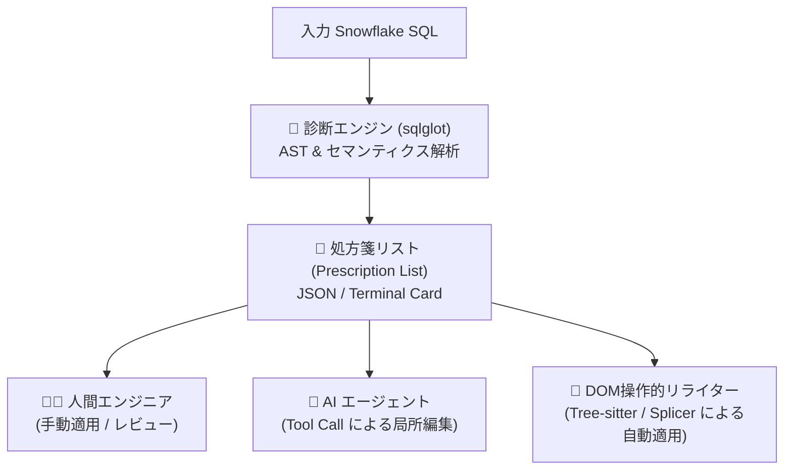

# 0005. 処方箋ファースト（Prescription-First）アーキテクチャの導入と診断・適用の責任分離

* **ステータス**: Accepted
* **決定日**: 2026-09-13

---

## 1. 背景と課題 (Context)

長大かつ複雑な Snowflake SQL（数百〜数千行の CTE 連鎖）の最適化において、ツールのコアバリューと設計上の最大の課題は以下の点にありました：

1. **最適化の本質的価値は「適切な抽出と修正案の提示」にある**:
   - 現場のデータエンジニアや開発者にとって最も困難なのは、「動いているが遅い巨大クエリのどこに無駄（不要な JOIN、重複 CTE、述語プッシュダウンの欠落、SELECT *）が潜んでいるかを特定すること」である。
   - 改善箇所と修正方法さえ明確に示されれば、修正の適用自体を決定論的パッチで行うか、人間が手動で行うか、AI エージェントが適用するかは状況に応じて選択可能であり、必ずしもツールがブラックボックスに全自動上書きする必要はない。
2. **全文再生成に伴う「書式崩れ・コメント消失」のトレードオフ**:
   - AST（抽象構文木）からクエリ全文を再生成（Roundtrip）すると、未変更箇所のインデントや空行、コメント位置が再フォーマットされ、Git Diff が肥大化してレビュー負荷が激増する。
   - ADR-0002 で局所置換（TextSplicer）を導入したものの、「クエリ全体の安全な書き換え」と「高度な意味論的診断」を同一パイプラインで抱え込むことは、パーサーや差分エンジンの設計複雑性を極限まで高めていた。
3. **AI エージェントおよび外部ツールとの協調性**:
   - AI コーディングエージェント（Claude Code, Antigravity 等）が普及した現代において、エージェントが最も扱いやすいのは「ファイル全体の巨大な unified diff」よりも、「どのファイルの、どの CTE の、どの句をどう書き換えるべきか」が構造化された**機械可読な処方箋データ（JSON/YAML）**である。

---

## 2. 決定事項 (Decision)

### ① 処方箋ファースト（Prescription-First）アーキテクチャへの刷新
- Icepick の中核責任を、**「Snowflake AST の深い意味論的診断に基づき、局所的で検証可能な修正指示（Prescription / 処方箋）を生成・提示すること」**と定義します。
- 処方箋（Prescription）は、以下の属性を持つ標準化されたデータ構造として設計します：
  - `id`: 一意な処方箋識別子（例: `RX-001`）
  - `rule_id`: 検出されたルール（例: `PERF_NO_UNUSED_JOIN`）
  - `severity`: 深刻度（`CRITICAL`, `WARNING`, `INFO`）
  - `target`: 対象ノードの位置情報（対象 CTE 名、ノード種別、元の SQL 断片）
  - `action`: 操作種別（`DELETE`, `REPLACE`, `INSERT`）
  - `suggested_fragment`: 推奨される修正後の SQL 断片（オプティマイザまたは局所 LLM 生成）
  - `rationale`: 修正理由（Why）
  - `expected_impact`: 見込まれる改善効果（スキャン量削減、パーティションプルーニング有効化等）

### ② 診断（Diagnosis）と適用（Rewriting / Splicing）の完全な責任分離
- 最適化パイプラインを「診断・処方箋生成（Diagnosis Engine）」と「処方箋の消費・適用（Application Layer）」に明確に分離します：
  1. **診断・処方箋生成エンジン（`sqlglot` 担当）**:
     - Snowflake 方言の完全な理解、CTE 依存関係グラフ解析、カラムリネージュ追跡を行い、高精度な処方箋リストを生成する。
  2. **処方箋の消費・適用レイヤー（プラガブル・利用者が選択）**:
     - **CLI / 人間**: ターミナル上のリッチなカード・チェックリスト表示を見てレビュー・手動修正。
     - **AI エージェント**: `--format json` で出力された処方箋を受け取り、エディタツールで安全に局所編集。
     - **DOM 操作的リライター（将来的な Tree-sitter / Precision Splicer）**: CST のバイト範囲特定を活用し、HTML DOM のように患部ノードのみをピンポイントで置換（Splicing）。

### ③ CLI コマンドの役割整理
- **`icepick check`（または `icepick lint`）**:
  - 処方箋（Prescription）を生成・提示する主軸コマンド。
  - デフォルトは人間が見やすい Rich な処方箋サマリーカードを表示。
  - `--format json` により、AI エージェントや CI 向けに構造化データを出力可能。
- **`icepick fix`（または `icepick patch` / `icepick apply`）**:
  - 生成された処方箋を元に、元のソースコードへ局所適用（Splicing）を試みるオプショナルな適用コマンド。

---

## 3. 影響とメリット・デメリット (Consequences)

### メリット (Positive)
1. **未変更コード・書式の 100% 保持**:
   - 変更しない CTE やクエリ全体の再生成を行わないため、コメント消失やインデント崩れのリスクが根本的に解消される。
2. **AI エージェントとの親和性最大化**:
   - 構造化された処方箋 JSON を提供することで、AI コーディングエージェントが最も安全かつ得意な方法でコードを改修できる。
3. **レビュー体験の飛躍的向上**:
   - 開発者は巨大な diff に圧倒されることなく、「処方箋 1: 不要 JOIN 削除」「処方箋 2: 述語プッシュダウン」といった意味のある単位でレビュー・承認ができる。
4. **Tree-sitter との理想的な役割分担**:
   - 複雑な Snowflake 構文の意味論解析は `sqlglot` に任せ、`tree-sitter` は大枠のノード境界（バイト範囲）を掴む DOM 操作として安全に活用できる道が拓ける。

### デメリット・トレードオフ (Negative / Mitigations)
1. **即座の全自動ファイル上書きを求めるユーザーへの配慮**:
   - ワンコマンドでファイルを書き換えてほしいユーザーのために、処方箋を内部で自動適用する `icepick fix` コマンドを引き続き提供・維持する。
2. **処方箋データスキーマの互換性維持**:
   - 処方箋 JSON のフォーマットを一度公開した後は、後方互換性を保つためのスキーマバージョニング（例: `"schema_version": "1.0"`）が必要となる。

---

## 4. 参照 (References)
- ADR-0001: ワークフローの再構築：`fix` 廃止と `rewrite` / `patch` パイプライン分離
- ADR-0002: 差分生成ロジックの刷新：AST全行再フォーマットから元ソース書式保持型局所置換（TextSplicer）への移行
- ADR-0004: Snowflake 直接接続の廃止と等価性検証 SQL 生成（Verify Generator）への責任分離
