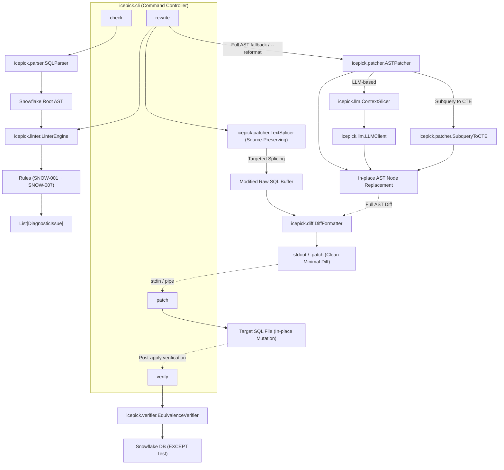
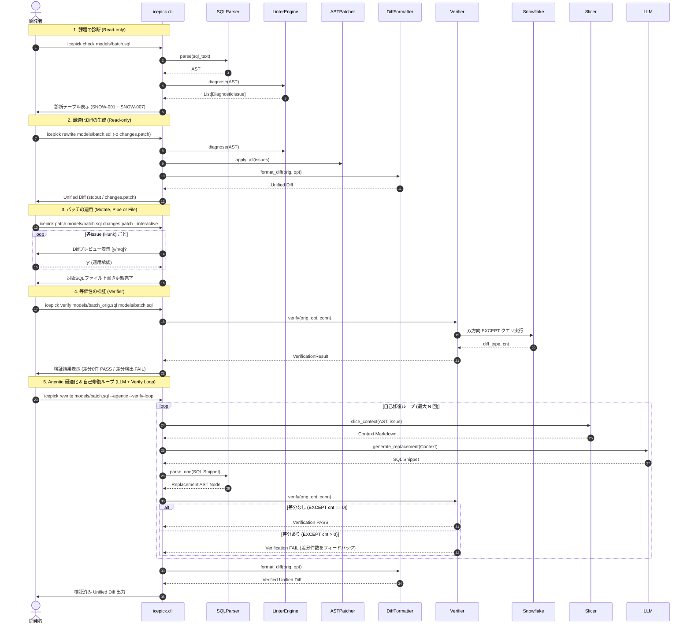

# 詳細設計書 (design.md)

## 1. システムアーキテクチャ概要

本システムは、CLI経由でSnowflake SQLを受け取り、AST解析・診断・局所置換・差分提示・等価性検証のパイプラインを実行する。



## 2. データモデル / 型定義

```python
from dataclasses import dataclass
from enum import Enum
from typing import Optional, List, Dict, Any
import sqlglot
from sqlglot import exp

class Severity(str, Enum):
    INFO = "INFO"
    LOW = "LOW"
    MEDIUM = "MEDIUM"
    HIGH = "HIGH"
    CRITICAL = "CRITICAL"

@dataclass
class DiagnosticIssue:
    rule_id: str                      # 例: "SNOW-001"
    rule_name: str                    # 例: "Non-Sargable Predicate"
    severity: Severity                # 重要度
    description: str                  # 診断理由・影響説明
    target_node: exp.Expression       # AST上の対象ノード
    line_number: Optional[int]        # 発生行番号
    snippet: str                      # 元のSQLコード断片
    suggested_replacement: Optional[exp.Expression] = None  # 置換案ノード
    requires_llm: bool = False        # LLMリライトが必要かどうか

@dataclass
class OptimizationResult:
    original_sql: str                 # 入力元SQL
    base_formatted_sql: str           # 正規化後SQL (Diff基準)
    optimized_sql: str                # 最適化後SQL
    issues: List[DiagnosticIssue]     # 検出された問題リスト
    unified_diff: str                 # 生成されたUnified Diffテキスト
    is_verified: Optional[bool] = None# 等価性検証の合否
```

## 3. コンポーネント詳細設計

### 3.1 `LinterEngine` (`icepick/linter/`)
- 対応要件: A-1, A-2, A-3, A-4, A-5, A-6, A-7, A-8
- `BaseRule` を継承した個別ルールクラスを動的にロードして実行する。
- 各ルールは `check(ast: exp.Expression) -> List[DiagnosticIssue]` を実装する。
- 個別ルール一覧:
  - `NonSargableRule` (`SNOW-001`): `exp.EQ` 等の比較述語で、カラムへの関数適用を検出し、リテラル側変換の範囲条件ノードを `suggested_replacement` にセット。
  - `CorrelatedSubqueryRule` (`SNOW-002`): 外側スコープのテーブル/エイリアスを参照する相関副クエリを検出し、`severity=Severity.CRITICAL`, `requires_llm=True` をセット。
    - **入力 (Input)**: AST (`exp.Expression`)
    - **処理 (Processing)**:
      1. 各 `exp.Select` ノードを外側コンテキストとして走査し、自身が持つ FROM / JOIN のテーブル名およびエイリアス集合（`outer_tables`）を収集。
      2. 当該クエリの WHERE / HAVING / SELECT 句内に含まれるサブクエリノード（`exp.Subquery`, `exp.Exists`, `exp.In` 等）を走査。
      3. サブクエリ内部の FROM / JOIN テーブル名およびエイリアス集合（`inner_tables`）を収集。
      4. サブクエリ内の全 `exp.Column` を走査し、`col.table` が指定されている場合において `col.table.lower()` が `inner_tables` に存在せず、`outer_tables` に一致する外部参照を検出。
      5. 相関参照を持つサブクエリノードを対象に `DiagnosticIssue(rule_id="SNOW-002", severity=Severity.CRITICAL, requires_llm=True)` を生成。
    - **出力 (Output)**: `list[DiagnosticIssue]` (重要度: CRITICAL, 自動置換: なし / LLM推奨)
  - `RedundantSortRule` (`SNOW-003`): `exp.Subquery` / `exp.CTE` 内の `exp.Order` かつ LIMITなしを検出し、`target_node=order_node`, `suggested_replacement=None` (pop削除) をセット。
  - `NestedSubqueryRule` (`SNOW-007`): `exp.From` や `exp.Join` 内の `exp.Subquery` を検出し、CTE外出し対象としてフラグ付け。
  - `UnionToUnionAllRule` (`SNOW-006`): 重複排除不要な結合における `exp.Union`（`distinct=True`）を検出し、`distinct=False`（UNION ALL）の置換ノードを `suggested_replacement` にセット。
  - `ImplicitCrossJoinRule` (`SNOW-004`): `exp.From` 内のカンマ区切り複数テーブル参照を検出し、明示的な `CROSS JOIN` ノードを `suggested_replacement` にセット。
  - `DuplicateTableScanRule` (`SNOW-005`): 同一クエリ内の複数 CTE 間で同一テーブルの重複スキャンを検出し、共通 CTE 集約の警告を発行。

### 3.2 `ASTPatcher` & `SubqueryToCTE` (`icepick/patcher/`)
- 対応要件: B-1, B-2, B-4, B-5
- **In-place置換**:
  - `issue.suggested_replacement` が存在する場合: `issue.target_node.replace(issue.suggested_replacement)`（`SNOW-001`, `SNOW-006`, `SNOW-004`）
  - `suggested_replacement` が None の場合: `issue.target_node.pop()`（`SNOW-003`）
- **サブクエリのCTE平坦化 (`SubqueryToCTE`)**:
  1. 対象サブクエリの内部SELECT (`subquery.this`) を取得。
  2. 一意なCTE別名（例: `cte_<alias>_<index>`）を決定。
  3. `exp.CTE(this=inner_select, alias=exp.TableAlias(this=cte_alias))` を構築。
  4. トップレベルの `ast.args["with_"]`（存在しない場合は `ast.set("with_", exp.With(expressions=[...]))`）に追加。
  5. 元のサブクエリノードを `exp.Table(this=cte_alias, alias=original_alias)` で置換。

### 3.3 `ContextSlicer` & `LLMClient` (`icepick/llm/`)
- 対応要件: B-3, C-1, C-4
- **IPO 記述**:
  - **Input**:
    - `target_node`: 置換対象の AST ノード（相関サブクエリ、複雑な結合、共通スキャンノード等）
    - `ast`: クエリ全体のルート AST
    - `issue`: `DiagnosticIssue`（ルールID、説明、検出メッセージ）
    - `verification_feedback`: （再試行時）前回の EXCEPT 差分結果または構文エラーメッセージ
  - **Processing**:
    1. `ContextSlicer` が対象ノードと直属の親ノード（CTE / 主クエリ）、外部参照テーブル、参照カラム定義を抽出して最小限の Markdown コンテキストを生成。
    2. `LLMClient` が Gemini (AI Studio) または Vertex AI REST API を呼び出し、プロンプトを送信。
    3. LLM レスポンスから SQL コードブロックを抽出。
    4. `sqlglot.parse_one(response_sql, read="snowflake")` で構文検証。構文エラー時は自動リトライまたは安全フォールバック。
    5. `--verify-loop` 指定時: 生成された置換クエリに対して `EquivalenceVerifier` で Snowflake 双方向 EXCEPT を実行。差分が存在する場合はフィードバックを加えて最大試行回数（`max_retries`）まで自己修復ループを実行。
  - **Output**:
    - 最適化された置換 AST ノード（構文検証および等価性検証済み）
- `LLMClient`:
  - 外部抽象化ライブラリを使わず、`httpx` による軽量REST APIクライアントとして実装。
  - **Gemini (AI Studio) モード**:
    - エンドポイント: `https://generativelanguage.googleapis.com/v1beta/models/{model}:generateContent`
    - 認証: リクエストヘッダー `x-goog-api-key: {GEMINI_API_KEY}`
  - **Vertex AI モード**:
    - エンドポイント:
      - `location == "global"` の場合: `https://aiplatform.googleapis.com/v1/projects/{project}/locations/global/publishers/google/models/{model}:generateContent`
      - リージョン指定の場合: `https://{location}-aiplatform.googleapis.com/v1/projects/{project}/locations/{location}/publishers/google/models/{model}:generateContent`
    - 認証:
      - 第 1 候補: `google-auth` による ADC (Application Default Credentials) トークン取得
      - 第 2 候補 (フォールバック): `gcloud.cmd auth application-default print-access-token`（Windows）または `gcloud` のサブプロセス実行により、社内環境のサービスアカウント偽装が設定された gcloud CLI から直接トークンを取得
      - 取得した OAuth2 Bearer トークンを `Authorization: Bearer {token}` に付与。
  - レスポンスから Markdown コードブロック（```sql ... ```）を抽出し、`sqlglot.parse_one(llm_sql, read="snowflake")` で即座に構文検証。構文OKなら新しいASTノードを返し、構文エラー時は元のASTノードを維持して安全にフォールバック。

### 3.4 `DiffFormatter` & `TextSplicer` (`icepick/diff/`, `icepick/patcher/`)
- 対応要件: C-1, C-2, C-3, C-5
- **元ソース書式保持型局所置換 (`TextSplicer`)**:
  - **IPO 記述**:
    - **Input**:
      - `original_sql`: 元の生の SQL テキスト（ユーザー独自のインデント、コメント、改行、大文字小文字を保持）
      - `issues`: 診断された `DiagnosticIssue` のリスト（患部ノード `target_node`, 置換ノード `suggested_replacement` または LLM 置換ノード, `line_number`）
      - `dialect`: SQL 方言（デフォルト: `"snowflake"`）
    - **Processing**:
      1. 各 Issue の `target_node` の SQL 表現および行位置情報から、`original_sql` 内の対応する生テキスト断片（行・文字範囲）を特定。
      2. 元の行のインデント（先行空白・タブ）を検出し、置換先コード（`suggested_replacement.sql(...)` または LLM 生成コード）のインデントを元のコンテキストに合わせて整形。
      3. 患部以外の 95% 以上のテキスト（コメント、空行、インデント、キーワードの大文字小文字）を 1 文字も改変することなく、患部のみをピンポイント差し替えした一時バッファ `modified_raw_sql` を構築。
      4. `format_diff(original_sql, modified_raw_sql, normalize=False)` を実行し、元の生ファイルに対する完全一致 Unified Diff を生成。
    - **Output**:
      - `modified_raw_sql`: 患部のみが置換され、元コードの書式が 100% 維持された SQL 文字列
      - `diff_text`: 元ファイルにそのまま適用可能な、コンテキスト行が完全一致する最小限の Unified Diff
- **パッチ適用エンジン (`apply_unified_diff`) のインデント非依存マッチング**:
  - 外部で作成されたパッチや微細なインデント差が存在する場合でも確実に適用できるよう、`_find_matching_position` に `line.strip()` 一致およびインデント自動再調整（Indent Re-targeting）の二重安全フォールバックを実装。
- **全体再フォーマットフォールバック (`--reformat`)**:
  - インラインサブクエリの CTE 平坦化（`--flatten-subqueries`）など、クエリ全体の構文木組み換えを伴う操作や明示的な再フォーマット指示時は、AST 全体シリアライズによる Diff 生成（`normalize=True`）を許可。

### 3.5 `EquivalenceVerifier` (`icepick/verifier/`)
- 対応要件: D-1
- **IPO 記述**:
  - **Input**:
    - `original_sql`: 変更前の SQL クエリ文字列
    - `optimized_sql`: 最適化後の SQL クエリ文字列
    - `dialect`: SQL 方言（デフォルト: `"snowflake"`）
    - `connection`: Snowflake DB コネクションオブジェクト（`snowflake.connector` 準拠）
  - **Processing**:
    1. 双方向 `EXCEPT` クエリを自動構築：
       ```sql
       WITH orig AS ( <ORIGINAL_SQL> ),
            opt AS ( <OPTIMIZED_SQL> )
       SELECT 'orig_not_in_opt' AS diff_type, COUNT(*) AS cnt FROM (SELECT * FROM orig EXCEPT SELECT * FROM opt)
       UNION ALL
       SELECT 'opt_not_in_orig' AS diff_type, COUNT(*) AS cnt FROM (SELECT * FROM opt EXCEPT SELECT * FROM orig);
       ```
    2. Snowflake コネクションを介してクエリを実行し、2 行の結果セット（`orig_not_in_opt` および `opt_not_in_orig` の各カウント）を取得。
    3. 両方のカウントが `0` の場合のみ `is_equivalent=True` と判定。いずれかが `1` 以上の場合は `is_equivalent=False`。
    4. 接続エラー・構文エラー発生時は `error_message` を保持して `is_equivalent=False` で復帰。
  - **Output**:
    - `VerificationResult` (`is_equivalent: bool`, `orig_not_in_opt_count: int`, `opt_not_in_orig_count: int`, `verification_sql: str`, `error_message: str | None`)

### 3.6 `FeedbackRecorder` (`icepick/feedback.py` または `cli.py`)
- 対応要件: E-1
- テスト中・運用中にエージェントや開発者が直面した摩擦（フリクション）、バグ、改善アイデアをローカルログファイルにアペンド記録。
- データ構造:
  ```python
  @dataclass
  class FeedbackEntry:
      timestamp: str  # ISO 8601
      version: str    # icepick version
      category: str   # friction, bug, doc, idea
      message: str    # フィードバック本文
      cwd: str        # 実行ディレクトリ
      git_commit: str | None = None
  ```
- 保存形式: `.icepick_feedback.jsonl`（JSON Lines形式、1行1レコード、UTF-8追記）。
- `--category` のバリデーションを行い、不正値の場合は有効なenum一覧（`friction`, `bug`, `doc`, `idea`）を提示する Actionable Error を送出。

### 3.7 エージェント親和性アーキテクチャ (Agent-Native CLI Interface)
- 対応要件: E-2, E-3, E-5, E-6, E-7
- **機械可読イントロスペクション (`icepick agent-context`)**:
  - Layer 2 イントロスペクションとして、CLI の全コマンド、引数・オプション仕様、対応する最適化ルール一覧（`rule-001`〜`007`等）、環境変数スキーマ（`DEBUG_ICEPICK_*`）を単一の構造化 JSON として出力。
  - エージェントが初手で実行することで、ヘルプ探索によるトークン消費を最小化する。
- **構造化出力 (`--json`)**:
  - `check`: 検出された Issue の JSON 配列を出力。
  - `rewrite`: 最適化ステータス、検出された Issue 一覧、Unified Diff テキストを JSON で出力。
  - `patch`: 適用ステータス、適用された Hunk 数、対象ファイルパスを JSON で出力。
  - `feedback`: 記録された `FeedbackEntry` を JSON で出力。
  - `agent-context`: ツール仕様メタデータを JSON で出力。
- **非対話モードと変更境界 (`--dry-run` & `--force`)**:
  - `sys.stdin.isatty()` により対話型ターミナルかパイプ/サブプロセスかを自動判定。
  - 非 TTY 環境ではプロンプト表示による永久ハングを防止。
  - `--dry-run`: `patch` コマンドにおいてファイルへの書き込みを一切行わず、適用シミュレーション結果のみを出力。
  - 非TTY環境における `patch` 実行時は、確認バイパスフラグ `--force`（または `-f`）を必須とし、未指定時は安全のため処理を中止してエラーを案内。
- **自己修正エラー (Actionable & Enumerated Errors)**:
  - 引数やオプションのバリデーションエラー時、可能な値の列挙（enumリスト）と、コピペして実行可能な修正コマンド例を出力。

### 3.8 セキュア認証情報プロバイダ (Secure Credential Management)
- 対応要件: E-4
- **厳格な優先順位ピラミッド (The Strict Priority Pyramid)**:
  1. 一時デバッグ/CI用環境変数（`DEBUG_ICEPICK_` プレフィックス必須。例: `DEBUG_ICEPICK_GEMINI_API_KEY`, `DEBUG_ICEPICK_SNOWFLAKE_USER`, `DEBUG_ICEPICK_SNOWFLAKE_PASSWORD`）
  2. Windows 資格情報マネージャー（Target: `icepick:gemini_api_key`, `icepick:snowflake`）
  ※意図しないグローバル環境変数（`GEMINI_API_KEY`, `SNOWFLAKE_USER`, `SNOWFLAKE_PASSWORD` 等）や設定ファイルへの平文記載は、混入・漏洩・混乱防止のため探索対象から完全に除外する。
- **Snowflake 認証情報の WCM ペア管理 (`icepick:snowflake`)**:
  - Win32 API `CredReadW` が返す `_CREDENTIALW` 構造体は、ユーザー名（`UserName`）とパスワード（`CredentialBlob`）の双方を保持できる。
  - したがって、単一のターゲット `icepick:snowflake` にユーザー名とパスワードをペアで登録・取得する設計とする：
    - `read_wcm_credential_pair(target: str) -> tuple[str, str] | None`: `(username, password)` を返却。
    - `resolve_credential_pair(key_name: str = "snowflake", app_prefix: str = "icepick") -> tuple[str, str, str]`: `(username, password, source_description)` を解決。
- **UTF-16LE / Null Byte トラップ対策**:
  - Windows `cmdkey` 登録時に混入する UTF-16LE（null バイト `0x00`）を自動検知し、安全にデコードして HTTP リクエストヘッダーや DB 接続文字列の破壊を防ぐ。
- **Actionable な認証エラーとセキュア登録案内**:
  - 認証情報が取得できない場合、シェル履歴に残さない安全な登録コマンドを含む具体的な自己修正手順を提示して exit code 1 で終了：
    - **Snowflake 認証未設定時**:
      ```text
      [Authentication Error] Snowflake credentials (user and password) are missing or invalid.
      To fix this, please register your Snowflake credentials in Windows Credential Manager:
        # Recommended (safe, masked password input without leaving secrets in history):
        $cred = Get-Credential -Message "Enter Snowflake Credentials"
        cmdkey /generic:icepick:snowflake /user:$($cred.UserName) /pass:$($cred.GetNetworkCredential().Password)

        # Direct command:
        cmdkey /generic:icepick:snowflake /user:<snowflake_user> /pass:<snowflake_password>

      Or set the debug environment variables:
        $env:DEBUG_ICEPICK_SNOWFLAKE_USER="<snowflake_user>"
        $env:DEBUG_ICEPICK_SNOWFLAKE_PASSWORD="<snowflake_password>"
      ```
    - **Gemini API キー未設定時**:
      ```text
      [Authentication Error] Gemini API Key is missing.
      To fix this, please register your key using Windows Credential Manager:
        # Recommended (safe, masked input without leaving secrets in history):
        $cred = Get-Credential -UserName "any" -Message "Enter Gemini API Key"
        cmdkey /generic:icepick:gemini_api_key /user:any /pass:$($cred.GetNetworkCredential().Password)

        # Direct command:
        cmdkey /generic:icepick:gemini_api_key /user:any /pass:<your_key>

      Or set the debug environment variable:
        $env:DEBUG_ICEPICK_GEMINI_API_KEY="<your_key>"
      ```

### 3.9 エージェント準備状況テスト (Agent Readiness Test)
- 対応要件: E-8
- **テスト設計 (`tests/test_agent_readiness.py`)**:
  1. **非TTYハング防止テスト**: `stdin` を `io.StringIO` やパイプ模倣オブジェクトに差し替え、プロンプト待ちでブロックせずに終了することを確認。
  2. **構造化出力テスト**: 全サブコマンド（`check`, `rewrite`, `patch`, `feedback`, `agent-context`, `verify`）に `--json` を渡した際、有効な JSON が標準出力から取得でき、エラー情報が標準エラー出力に分離されていることを検証。
  3. **Actionable Error検証**: 認証未設定時および不正引数指定時に、有効な enum 一覧および復旧コマンド例が出力に含まれていることを検証。

### 3.10 `ConfigResolver` & 実行時コンフィグ・フィードバック (`icepick/config.py` または `cli.py`)
- 対応要件: E-9, C-4, E-4
- **優先順位ピラミッド (Configuration Precedence)**:
  1. **CLI オプション**: `--provider` (`-p`), `--model` (`-m`), `--timeout` (`-t`), `--dialect` (`-d`) 等
  2. **環境変数**: `ICEPICK_LLM_PROVIDER`, `ICEPICK_LLM_MODEL`, `GOOGLE_CLOUD_PROJECT`, `GOOGLE_CLOUD_LOCATION`, `SNOWFLAKE_ACCOUNT`, `SNOWFLAKE_DATABASE` 等（※機密項目を除く）
  3. **設定ファイル**: `--config` 指定ファイル、または暗黙の `.icepick.toml` / `icepick.json`（インフラ構成のみ。認証情報は記載不可・無視）
  4. **セキュア認証情報**: Windows 資格情報マネージャー（WCM: `icepick:gemini_api_key`, `icepick:snowflake`）
  5. **組み込みデフォルト値**: `llm_provider="gemini"`, `llm_model="gemini-3.8-flash"`, `location="us-central1"` 等
- **機密項目（`SECRET_KEYS`）の特別解決ルール**:
  - `SECRET_KEYS = {"gemini_api_key", "snowflake_user", "snowflake_password"}`
  - 設定ファイルや汎用環境変数（`SNOWFLAKE_USER`, `SNOWFLAKE_PASSWORD` 等）にはシークレットを配置させず、混在による混乱を防止する。
  - 機密項目の解決経路は「1. デバッグ環境変数（`DEBUG_ICEPICK_*`）」または「2. WCM（`icepick:snowflake` / `icepick:gemini_api_key`）」のみに限定する。
  - `snowflake_user` と `snowflake_password` は WCM のターゲット `icepick:snowflake` から一括ペア解決され、ともに `is_secret=True` としてマスク保護される。
- **IPO 記述**:
  - **Input**: CLI 引数、明示的/暗黙の設定ファイルパス、環境変数辞書、WCM
  - **Processing**:
    1. 各設定項目について、優先順位に従い上書きマージを実行。
    2. 各項目の値とともに、解決されたソース（`cli_option`, `environment_variable`, `config_file`, `credential_manager`, `default`）を記録した `RuntimeConfigSummary` を構築。
    3. `--agentic` や `--verify-loop`、`verify` 実行時に、アクティブな設定とソースをターミナルに表示。
    4. `--json` 指定時は出力 JSON のルート要素に `runtime_config` オブジェクトを含めてシリアライズ。
  - **Output**:
    - マージ済み `Config` インスタンス
    - `RuntimeConfigSummary`（キー、値、ソース、マスク済み機密情報）
- **確認コマンド (`icepick config show`)**:
  - 現在解決されている全設定項目（LLM設定、Snowflake設定、Linterルール設定）とその解決元ソースを Rich テーブル形式で一覧表示。機密項目は `display_value` でマスクされる。

## 4. シーケンス図（対話型リファクタリングフロー）



