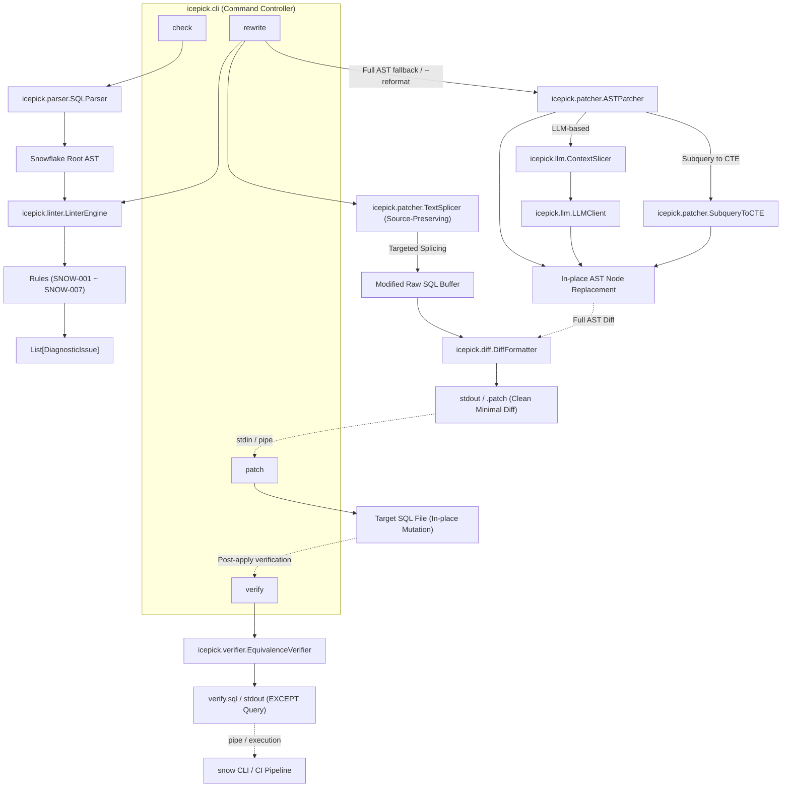
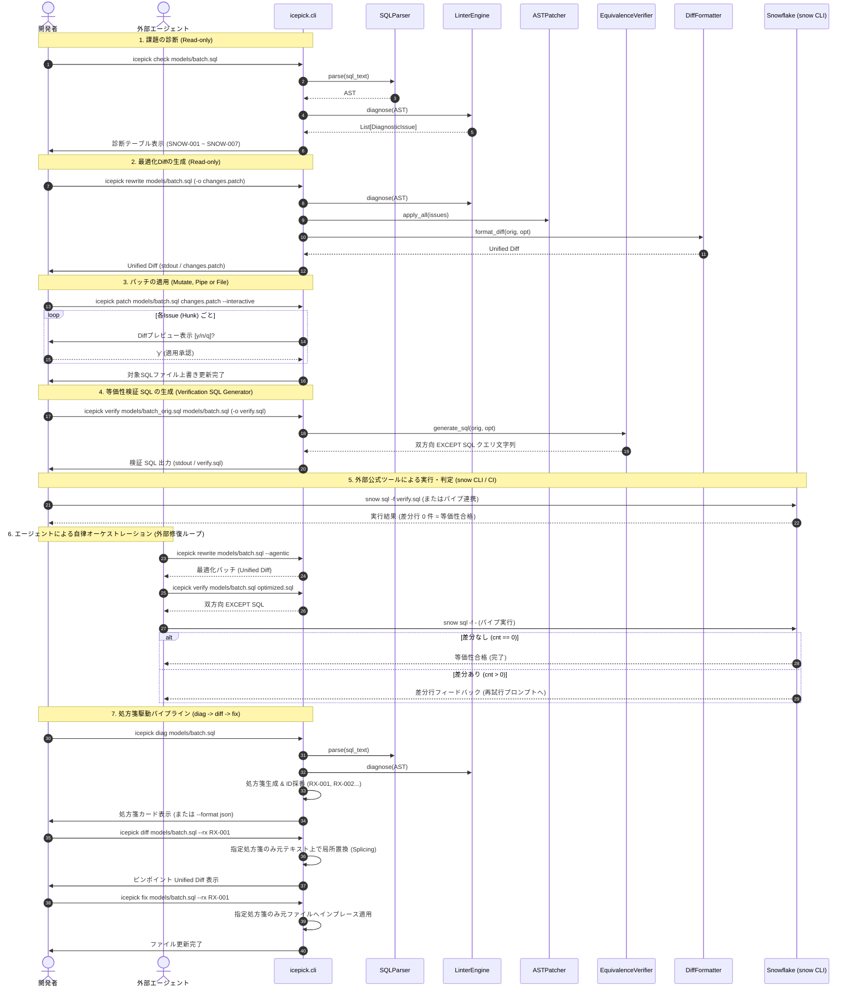

# 詳細設計書 (design.md)

## 目次
- [機能一覧](#機能一覧)
- [アーキテクチャ](#アーキテクチャ)
- [データモデル](#データモデル)
- [機能詳細](#機能詳細)
  - [LinterEngine (icepick/linter/)](#linterengine-icepicklinter)
  - [ASTPatcher & SubqueryToCTE (icepick/patcher/)](#astpatcher--subquerytocte-icepickpatcher)
  - [ContextSlicer, LLMClient & プラガブルプロバイダ基盤 (icepick/llm/)](#contextslicer-llmclient--プラガブルプロバイダ基盤-icepickllm)
  - [DiffFormatter & TextSplicer (icepick/diff/, icepick/patcher/)](#diffformatter--textsplicer-icepickdiff-icepickpatcher)
  - [EquivalenceVerifier / 検証 SQL 生成器 (icepick/verifier/)](#equivalenceverifier--検証-sql-生成器-icepickverifier)
  - [FeedbackRecorder (icepick/feedback.py)](#feedbackrecorder-icepickfeedbackpy)
  - [エージェント親和性アーキテクチャ (Agent-Native CLI Interface)](#エージェント親和性アーキテクチャ-agent-native-cli-interface)
  - [セキュア認証情報プロバイダ (Secure Credential Management)](#セキュア認証情報プロバイダ-secure-credential-management)
  - [エージェント準備状況テスト (Agent Readiness Test)](#エージェント準備状況テスト-agent-readiness-test)
  - [ConfigResolver & 実行時コンフィグ・フィードバック (icepick/config.py)](#configresolver--実行時コンフィグフィードバック-icepickconfigpy)
  - [LLM 接続診断エンジン (ConnectionTester / icepick config test)](#llm-接続診断エンジン-connectiontester--icepick-config-test)
  - [処方箋駆動最適化エンジン (PrescriptionEngine / icepick diag / diff / fix)](#処方箋駆動最適化エンジン-prescriptionengine--icepick-diag--diff--fix)
- [シーケンス図（対話型リファクタリングフロー）](#シーケンス図対話型リファクタリングフロー)
- [エラーハンドリング](#エラーハンドリング)


## 機能一覧

| 機能カテゴリ | 機能ID | 機能名 | 概要 | 対応要件ID |
|:------------|:-------|:------|:-----|:----------|
| 構文解析・静的診断 | F-A1 | Snowflake SQL構文解析 | sqlglotを用いたSnowflake方言AST構築と構文エラーハンドリング | A-1 |
| 構文解析・静的診断 | F-A2 | プルーニング阻害述語診断 | WHERE句の関数ラップによるフルスキャン要因（SNOW-001）検出 | A-2 |
| 構文解析・静的診断 | F-A3 | 相関副クエリ診断 | 外側スコープ参照を含む相関副クエリ（SNOW-002, LLM連携要）検出 | A-3 |
| 構文解析・静的診断 | F-A4 | 不要ソート診断 | サブクエリ/CTE内の無意味なORDER BY（SNOW-003）検出 | A-4 |
| 構文解析・静的診断 | F-A5 | ネストサブクエリ診断 | FROM/JOIN句に直接ネストしたDerived Table（SNOW-007）検出 | A-5 |
| 構文解析・静的診断 | F-A6 | UNION最適化診断 | 重複排除不要なUNIONからUNION ALLへの置換候補（SNOW-006）検出 | A-6 |
| 構文解析・静的診断 | F-A7 | 暗黙クロス結合診断 | カンマ区切りFROMによる直積リスク（SNOW-004）検出 | A-7 |
| 構文解析・静的診断 | F-A8 | 重複テーブルスキャン診断 | 複数CTE間での同一テーブル反復スキャン（SNOW-005）検出 | A-8 |
| AST置換・最適化 | F-B1 | 決定論的ノード置換 | AST In-place置換による健全ノード維持と局所手術 | B-1 |
| AST置換・最適化 | F-B2 | Derived Table平坦化 | ネストサブクエリのトップレベルCTE外出し・平坦化 | B-2 |
| AST置換・最適化 | F-B3 | 局所スライスリライト | ContextSlicerとLLMClientによる局所リライト適用 | B-3 |
| AST置換・最適化 | F-B4 | UNION ALL置換 | UNIONからUNION ALLへの決定論的ルール置換 | B-4 |
| AST置換・最適化 | F-B5 | 明示的JOIN置換 | 暗黙クロス結合からINNER JOIN等への決定論的置換 | B-5 |
| パイプライン・差分適用 | F-C1 | 最適化Diff生成 | icepick rewriteによるGit互換Unified Diff出力 | C-1 |
| パイプライン・差分適用 | F-C2 | パッチ適用 | icepick patchによるファイル更新・パイプライン入力適用 | C-2 |
| パイプライン・差分適用 | F-C3 | 対話型Hunk適用 | icepick patch --interactiveによる個別承認とシミュレーション | C-3 |
| パイプライン・差分適用 | F-C4 | LLM Agenticリライト | icepick rewrite --agenticによる高度な最適化と外部連携 | C-4 |
| パイプライン・差分適用 | F-C5 | 書式保持スプライシング | TextSplicerによるコメント・インデント完全保持最小Diff生成 | C-5 |
| 等価性検証 | F-D1 | 双方向EXCEPT検証SQL生成 | icepick verifyによる決定論的等価性検証SQL出力（snow CLI委譲） | D-1 |
| エージェント親和性・運用 | F-E1 | フリクション記録 | icepick feedbackによる課題・バグのローカル追記記録 | E-1 |
| エージェント親和性・運用 | F-E2 | 構造化JSON出力 | 全コマンドでの機械判読可能な--json出力 | E-2 |
| エージェント親和性・運用 | F-E3 | 非対話環境ハング防止 | 非TTY環境でのプロンプト待機防止とActionable Advice | E-3 |
| エージェント親和性・運用 | F-E4 | セキュア認証管理 | WCMネイティブ連携と優先順位解決ピラミッド（ゼロDB認証） | E-4 |
| エージェント親和性・運用 | F-E5 | Layer 2 イントロスペクション | 全機能・ルール仕様を一括出力するicepick agent-context | E-5 |
| エージェント親和性・運用 | F-E6 | 破壊的操作防止ガード | --dry-runおよび非対話環境での--force必須化 | E-6 |
| エージェント親和性・運用 | F-E7 | カスケード設定解決 | CLI > 環境変数 > 設定ファイル > デフォルト値のカスケード統合 | E-7 |
| エージェント親和性・運用 | F-E8 | 実行時コンフィグ表示 | 有効な設定項目と解決元ソースを明示するバナー・show出力 | E-8 |
| エージェント親和性・運用 | F-E9 | 機密情報漏洩防止 | 設定ファイルからの秘密情報除外と表示時マスク | E-9 |
| エージェント親和性・運用 | F-E10 | LLM接続診断 | icepick config testによるLLMバックエンドの疎通・認証検証 | E-10 |
| プラガブルプロバイダ | F-F1 | プロバイダ分離・設定汎化 | BaseLLMProvider基盤と辞書形式optionsによる拡張基盤 | F-1 |
| プラガブルプロバイダ | F-F2 | Vertex AI堅牢化・明示案内 | role: "user"準拠、マルチパート集約、--provider案内 | F-2 |
| 処方箋駆動最適化 | F-G1 | 構造化処方箋診断 | icepick diagによる処方箋ID採番とRichカード/JSON出力 | G-1 |
| 処方箋駆動最適化 | F-G2 | 処方箋ID選択型差分生成 | icepick diffによる特定処方箋（--rx）に絞り込んだ局所Diff生成 | G-2 |
| 処方箋駆動最適化 | F-G3 | 処方箋ID選択型ファイル適用 | icepick fixによる特定処方箋（--rx）の元ファイル直接適用 | G-3 |

## アーキテクチャ


本システムは、CLI経由でSnowflake SQLを受け取り、AST解析・診断・局所置換・差分提示・等価性検証のパイプラインを実行する。



## データモデル

```python
from dataclasses import dataclass
from enum import Enum
from typing import Optional, List, Dict, Any
import sqlglot
from sqlglot import exp

class Severity(str, Enum):
    INFO = "INFO"
    LOW = "LOW"
    MEDIUM = "MEDIUM"
    HIGH = "HIGH"
    CRITICAL = "CRITICAL"

@dataclass
class DiagnosticIssue:
    rule_id: str                      # 例: "SNOW-001"
    rule_name: str                    # 例: "Non-Sargable Predicate"
    severity: Severity                # 重要度
    description: str                  # 診断理由・影響説明
    target_node: exp.Expression       # AST上の対象ノード
    line_number: Optional[int]        # 発生行番号
    snippet: str                      # 元のSQLコード断片
    suggested_replacement: Optional[exp.Expression] = None  # 置換案ノード
    requires_llm: bool = False        # LLMリライトが必要かどうか

@dataclass
class OptimizationResult:
    original_sql: str                 # 入力元SQL
    base_formatted_sql: str           # 正規化後SQL (Diff基準)
    optimized_sql: str                # 最適化後SQL
    issues: List[DiagnosticIssue]     # 検出された問題リスト
    unified_diff: str                 # 生成されたUnified Diffテキスト
    is_verified: Optional[bool] = None# 等価性検証の合否

class PrescriptionAction(str, Enum):
    DELETE = "DELETE"
    REPLACE = "REPLACE"
    INSERT = "INSERT"

@dataclass
class PrescriptionTarget:
    cte: Optional[str]                # 所属するCTE名（トップレベルクエリはNone）
    node_type: str                    # ASTノード名（例: "Join", "Where", "Select"）
    line_range: Optional[tuple[int, int]] = None  # 該当箇所の開始・終了行番号

@dataclass
class Prescription:
    id: str                           # 一意な処方箋ID（例: "RX-001"）
    rule_id: str                      # 検出ルールID（例: "SNOW-001"）
    severity: Severity                # 重要度
    target: PrescriptionTarget        # 患部の位置情報
    action: PrescriptionAction        # 操作種別 (DELETE, REPLACE, INSERT)
    original_sql: str                 # 置換・削除対象の既存SQL断片
    suggested_sql: Optional[str]      # 推奨される置換後SQL断片（DELETE時はNone）
    rationale: str                    # 修正すべき理由・根拠（Why）
    expected_impact: str              # 期待される改善効果（スキャン量削減等）

@dataclass
class PrescriptionPlan:
    schema_version: str               # "1.0"
    file: str                         # 対象SQLファイルパス
    issues_count: int                 # 検出件数
    prescriptions: List[Prescription] # 処方箋リスト
```


## 機能詳細

### 4.1 `LinterEngine` (`icepick/linter/`)
- 対応要件: A-1, A-2, A-3, A-4, A-5, A-6, A-7, A-8
- `BaseRule` を継承した個別ルールクラスを動的にロードして実行する。
- 各ルールは `check(ast: exp.Expression) -> List[DiagnosticIssue]` を実装する。
- 個別ルール一覧:
  - `NonSargableRule` (`SNOW-001`): `exp.EQ` 等の比較述語で、カラムへの関数適用を検出し、リテラル側変換の範囲条件ノードを `suggested_replacement` にセット。
  - `CorrelatedSubqueryRule` (`SNOW-002`): 外側スコープのテーブル/エイリアスを参照する相関副クエリを検出し、`severity=Severity.CRITICAL`, `requires_llm=True` をセット。
    - **入力 (Input)**: AST (`exp.Expression`)
    - **処理 (Processing)**:
      1. 各 `exp.Select` ノードを外側コンテキストとして走査し、自身が持つ FROM / JOIN のテーブル名およびエイリアス集合（`outer_tables`）を収集。
      2. 当該クエリの WHERE / HAVING / SELECT 句内に含まれるサブクエリノード（`exp.Subquery`, `exp.Exists`, `exp.In` 等）を走査。
      3. サブクエリ内部の FROM / JOIN テーブル名およびエイリアス集合（`inner_tables`）を収集。
      4. サブクエリ内の全 `exp.Column` を走査し、`col.table` が指定されている場合において `col.table.lower()` が `inner_tables` に存在せず、`outer_tables` に一致する外部参照を検出。
      5. 相関参照を持つサブクエリノードを対象に `DiagnosticIssue(rule_id="SNOW-002", severity=Severity.CRITICAL, requires_llm=True)` を生成。
    - **出力 (Output)**: `list[DiagnosticIssue]` (重要度: CRITICAL, 自動置換: なし / LLM推奨)
  - `RedundantSortRule` (`SNOW-003`): `exp.Subquery` / `exp.CTE` 内の `exp.Order` かつ LIMITなしを検出し、`target_node=order_node`, `suggested_replacement=None` (pop削除) をセット。
  - `NestedSubqueryRule` (`SNOW-007`): `exp.From` や `exp.Join` 内の `exp.Subquery` を検出し、CTE外出し対象としてフラグ付け。
  - `UnionToUnionAllRule` (`SNOW-006`): 重複排除不要な結合における `exp.Union`（`distinct=True`）を検出し、`distinct=False`（UNION ALL）の置換ノードを `suggested_replacement` にセット。
  - `ImplicitCrossJoinRule` (`SNOW-004`): `exp.From` 内のカンマ区切り複数テーブル参照を検出し、明示的な `CROSS JOIN` ノードを `suggested_replacement` にセット。
  - `DuplicateTableScanRule` (`SNOW-005`): 同一クエリ内の複数 CTE 間で同一テーブルの重複スキャンを検出し、共通 CTE 集約の警告を発行。

### 4.2 `ASTPatcher` & `SubqueryToCTE` (`icepick/patcher/`)
- 対応要件: B-1, B-2, B-4, B-5
- **In-place置換**:
  - `issue.suggested_replacement` が存在する場合: `issue.target_node.replace(issue.suggested_replacement)`（`SNOW-001`, `SNOW-006`, `SNOW-004`）
  - `suggested_replacement` が None の場合: `issue.target_node.pop()`（`SNOW-003`）
- **サブクエリのCTE平坦化 (`SubqueryToCTE`)**:
  1. 対象サブクエリの内部SELECT (`subquery.this`) を取得。
  2. 一意なCTE別名（例: `cte_<alias>_<index>`）を決定。
  3. `exp.CTE(this=inner_select, alias=exp.TableAlias(this=cte_alias))` を構築。
  4. トップレベルの `ast.args["with_"]`（存在しない場合は `ast.set("with_", exp.With(expressions=[...]))`）に追加。
  5. 元のサブクエリノードを `exp.Table(this=cte_alias, alias=original_alias)` で置換。

### 4.3 `ContextSlicer`, `LLMClient` & プラガブルプロバイダ基盤 (`icepick/llm/`)
- 対応要件: B-3, C-1, C-4, F-1, F-2
- **IPO 記述**:
  - **Input**:
    - `target_node`: 置換対象の AST ノード（相関サブクエリ、複雑な結合、共通スキャンノード等）
    - `ast`: クエリ全体のルート AST
    - `issue`: `DiagnosticIssue`（ルールID、説明、検出メッセージ）
    - `verification_feedback`: （再試行時）前回の EXCEPT 差分結果または構文エラーメッセージ
  - **Processing**:
    1. `ContextSlicer` が対象ノードと直属の親ノード（CTE / 主クエリ）、外部参照テーブル、参照カラム定義を抽出して最小限の Markdown コンテキストを生成。
    2. `LLMClient` がファサードとして機能し、指定されたプロバイダ（`gemini`, `vertex` 等）のインスタンス（`BaseLLMProvider` 実装）へプロンプト送信を委譲。
    3. 各プロバイダがそれぞれの REST API（AI Studio generativelanguage, Vertex AI aiplatform 等）を呼び出してテキストを生成。
    4. LLM レスポンスから SQL コードブロックを抽出。
    5. `sqlglot.parse_one(response_sql, read="snowflake")` で構文検証。構文エラー時は自動リトライまたは安全フォールバック。
    6. ADR-0004 に基づき、Snowflake 直接接続自己修復ループは行わず、構文検証済み置換ノードを安全に返却（等価性検証は生成パッチに対し `icepick verify` を行い、外部エージェントがオーケストレーション）。
  - **Output**:
    - 最適化された置換 AST ノード（構文検証済み）

- **プラガブル LLM プロバイダ・アーキテクチャ**:
  外部LLMライブラリ（LangChain等）に依存せず、軽量 `httpx` を基盤とした拡張性の高い疎結合設計を採用。

  ```mermaid
  classDiagram
      class LLMClient {
          +provider: BaseLLMProvider
          +model: str
          +generate_text(prompt: str) str
          +rewrite_fragment(slice_ctx: SliceContext, dialect: str) Expression
          +_extract_sql(text: str) str
      }

      class BaseLLMProvider {
          <<abstract>>
          +name: str
          +model: str
          +options: dict[str, Any]
          +timeout: float
          +generate_text(prompt: str)* str
          +health_check()* dict[str, Any]
      }

      class GeminiProvider {
          +api_key: str | None
          +generate_text(prompt: str) str
          +health_check() dict[str, Any]
      }

      class VertexAIProvider {
          +project: str | None
          +location: str
          +_get_token() str
          +generate_text(prompt: str) str
          +health_check() dict[str, Any]
      }

      class ProviderRegistry {
          +register(name: str, cls: type)
          +create(name: str, model: str, options: dict) BaseLLMProvider
      }

      LLMClient --> BaseLLMProvider : delegates
      BaseLLMProvider <|-- GeminiProvider : implements
      BaseLLMProvider <|-- VertexAIProvider : implements
      ProviderRegistry ..> BaseLLMProvider : instantiates
  ```

  - **`BaseLLMProvider` (抽象基底クラス `icepick.llm.providers.base`)**:
    - 責務: 全 LLM プロバイダの共通契約（インターフェース）の定義。
    - 共通属性: `name: str`, `model: str`, `options: dict[str, Any]`, `timeout: float`, `_http_client: httpx.Client | None`
    - 必須メソッド:
      - `generate_text(prompt: str) -> str`: テキスト生成の実行。
      - `health_check() -> dict[str, Any]`: 疎通・認証の健全性チェック（成否、レイテンシ、メタデータ、Actionable Advice）。
  - **`GeminiProvider` (`icepick.llm.providers.gemini`)**:
    - 責務: Google AI Studio Gemini API との通信および API キー認証。
    - 個別設定 (`options: dict[str, Any]`):
      - `api_key`: API キー（指定なし時は WCM `icepick:gemini_api_key` または `DEBUG_ICEPICK_GEMINI_API_KEY` から自動解決）。
    - エンドポイント: `https://generativelanguage.googleapis.com/v1beta/models/{model}:generateContent`
    - 認証: ヘッダー `x-goog-api-key: {api_key}`
  - **`VertexAIProvider` (`icepick.llm.providers.vertex`)**:
    - 責務: Google Cloud Vertex AI API との通信および OAuth2 / ADC 認証。
    - 個別設定 (`options: dict[str, Any]`):
      - `project`: GCP プロジェクト ID
      - `location`: リージョン（デフォルト: `"us-central1"`, `"global"` 指定可）
    - 認証フロー:
      - 第 1 候補: `google-auth` による ADC トークン取得
      - 第 2 候補 (フォールバック): `gcloud` CLI（`gcloud auth application-default print-access-token`）による直接トークン取得
      - 取得したトークンを `Authorization: Bearer {token}` として付与。
    - エンドポイント:
      - `location == "global"`: `https://aiplatform.googleapis.com/v1/projects/{project}/locations/global/publishers/google/models/{model}:generateContent`
      - その他リージョン: `https://{location}-aiplatform.googleapis.com/v1/projects/{project}/locations/{location}/publishers/google/models/{model}:generateContent`
    - リクエスト構造 (Smart Search 準拠):
      - `contents`: `[{"role": "user", "parts": [{"text": prompt}]}]`（Vertex AI REST 仕様に則り `role: "user"` を明示設定してスキーマエラーを防止）
    - レスポンス解析:
      - `candidates[0].content.parts` 内のすべてのパーツを走査し、`text` フィールドを連結抽出（思考モデルの thought パートと回答テキストパートの分離・集約に対応）
  - **エージェント向け明示的プロバイダ案内 (Actionable Provider Guidance)**:
    - 暗黙の自動判別・サイレントフォールバックは採用せず、挙動の決定論性とコンテキスト明快性を維持。
    - プロバイダがデフォルト（`gemini`）で認証情報が不足している場合、Vertex AI 利用希望者への具体的な切り替え手順（`--provider vertex`、環境変数 `ICEPICK_LLM_PROVIDER=vertex`、`.icepick.toml` の `llm_provider = "vertex"`）を Actionable Advice として明示提示。
  - **汎化設定辞書 (`provider_options: dict[str, Any]`)**:
    - プロバイダ固有の設定（APIキー、GCPプロジェクト、リージョン、将来のパラメータ等）は、すべて `dict[str, Any]` として汎化され、プロバイダファクトリおよび各プロバイダ初期化子に透過的に渡される。
    - `LLMClient(..., provider_options={"project": "my-p", "location": "asia-northeast1"})` 形式を標準化しつつ、既存のキーワード引数（`api_key`, `project`, `location`）も自動マージして完全な後方互換性を担保。
  - **プロバイダレジストリ (`ProviderRegistry` / `create_provider`)**:
    - サポート対象プロバイダ（`gemini`, `vertex`）を登録・解決するファクトリ機構。
    - 未知のプロバイダが渡された場合は、利用可能なプロバイダ一覧（`gemini`, `vertex`）を提示する Actionable な `ValueError` を送出。
    - `register_provider(name, cls)` により、将来の新規プロバイダ（OpenAI, Claude, ローカルLLM等）をプラグイン的に追加可能。

### 4.4 `DiffFormatter` & `TextSplicer` (`icepick/diff/`, `icepick/patcher/`)
- 対応要件: C-1, C-2, C-3, C-5
- **元ソース書式保持型局所置換 (`TextSplicer`)**:
  - **IPO 記述**:
    - **Input**:
      - `original_sql`: 元の生の SQL テキスト（ユーザー独自のインデント、コメント、改行、大文字小文字を保持）
      - `issues`: 診断された `DiagnosticIssue` のリスト（患部ノード `target_node`, 置換ノード `suggested_replacement` または LLM 置換ノード, `line_number`）
      - `dialect`: SQL 方言（デフォルト: `"snowflake"`）
    - **Processing**:
      1. 各 Issue の `target_node` の SQL 表現および行位置情報から、`original_sql` 内の対応する生テキスト断片（行・文字範囲）を特定。
      2. 元の行のインデント（先行空白・タブ）を検出し、置換先コード（`suggested_replacement.sql(...)` または LLM 生成コード）のインデントを元のコンテキストに合わせて整形。
      3. 患部以外の 95% 以上のテキスト（コメント、空行、インデント、キーワードの大文字小文字）を 1 文字も改変することなく、患部のみをピンポイント差し替えした一時バッファ `modified_raw_sql` を構築。
      4. `format_diff(original_sql, modified_raw_sql, normalize=False)` を実行し、元の生ファイルに対する完全一致 Unified Diff を生成。
    - **Output**:
      - `modified_raw_sql`: 患部のみが置換され、元コードの書式が 100% 維持された SQL 文字列
      - `diff_text`: 元ファイルにそのまま適用可能な、コンテキスト行が完全一致する最小限の Unified Diff
- **パッチ適用エンジン (`apply_unified_diff`) のインデント非依存マッチング**:
  - 外部で作成されたパッチや微細なインデント差が存在する場合でも確実に適用できるよう、`_find_matching_position` に `line.strip()` 一致およびインデント自動再調整（Indent Re-targeting）の二重安全フォールバックを実装。
- **全体再フォーマットフォールバック (`--reformat`)**:
  - インラインサブクエリの CTE 平坦化（`--flatten-subqueries`）など、クエリ全体の構文木組み換えを伴う操作や明示的な再フォーマット指示時は、AST 全体シリアライズによる Diff 生成（`normalize=True`）を許可。

### 4.5 `EquivalenceVerifier` / 検証 SQL 生成器 (`icepick/verifier/`)
- 対応要件: D-1
- **設計思想 (ADR-0004 準拠)**:
  - 最適化前後のクエリが等価であるかを判定するための双方向 `EXCEPT` クエリを決定論的に生成する単一責任に特化。
  - Snowflake への直接接続・実行は行わず、外部の公式ツール（`snow CLI` 等）や社内 CI/CD パイプラインに委ねる。
- **IPO 記述**:
  - **Input**:
    - `original_sql`: 変更前の SQL クエリ文字列
    - `optimized_sql`: 最適化後の SQL クエリ文字列
    - `dialect`: SQL 方言（デフォルト: `"snowflake"`）
    - `count_only`: 差分件数のみを集計するクエリを生成するか否か（デフォルト: `False`）
  - **Processing**:
    1. 元クエリおよび最適化後クエリを CTE（`orig` および `opt`）としてラッピング。
    2. 双方向 `EXCEPT` クエリを自動構築：
       - **通常モード (`count_only=False`)**:
         ```sql
         -- Icepick Equivalence Verification Query
         -- Returns 0 rows if both queries are semantically equivalent.
         WITH orig AS (
           <ORIGINAL_SQL>
         ),
         opt AS (
           <OPTIMIZED_SQL>
         )
         SELECT 'orig_not_in_opt' AS diff_type, * FROM (
           SELECT * FROM orig EXCEPT SELECT * FROM opt
         )
         UNION ALL
         SELECT 'opt_not_in_orig' AS diff_type, * FROM (
           SELECT * FROM opt EXCEPT SELECT * FROM orig
         );
         ```
       - **件数集約モード (`count_only=True`)**:
         ```sql
         -- Icepick Equivalence Verification Count Query
         WITH orig AS (
           <ORIGINAL_SQL>
         ),
         opt AS (
           <OPTIMIZED_SQL>
         )
         SELECT 'orig_not_in_opt' AS diff_type, COUNT(*) AS cnt FROM (SELECT * FROM orig EXCEPT SELECT * FROM opt)
         UNION ALL
         SELECT 'opt_not_in_orig' AS diff_type, COUNT(*) AS cnt FROM (SELECT * FROM opt EXCEPT SELECT * FROM orig);
         ```
  - **Output**:
    - `verification_sql`: 外部ツール（`snow sql -f -` 等）で即座に実行可能な検証用 SQL 文字列
  - **CLI コマンド体系**:
    - `icepick verify orig.sql opt.sql`: 検証 SQL を標準出力（stdout）に出力。
    - `icepick verify orig.sql opt.sql -o verify.sql`: 検証 SQL をファイルへ出力。
    - `icepick verify orig.sql opt.sql --count-only`: 件数集約クエリを出力。
    - パイプ連携例: `icepick verify orig.sql opt.sql | snow sql -f -`

### 4.6 `FeedbackRecorder` (`icepick/feedback.py` または `cli.py`)
- 対応要件: E-1
- テスト中・運用中にエージェントや開発者が直面した摩擦（フリクション）、バグ、改善アイデアをローカルログファイルにアペンド記録。
- データ構造:
  ```python
  @dataclass
  class FeedbackEntry:
      timestamp: str  # ISO 8601
      version: str    # icepick version
      category: str   # friction, bug, doc, idea
      message: str    # フィードバック本文
      cwd: str        # 実行ディレクトリ
      git_commit: str | None = None
  ```
- 保存形式: `.icepick_feedback.jsonl`（JSON Lines形式、1行1レコード、UTF-8追記）。
- `--category` のバリデーションを行い、不正値の場合は有効なenum一覧（`friction`, `bug`, `doc`, `idea`）を提示する Actionable Error を送出。

### 4.7 エージェント親和性アーキテクチャ (Agent-Native CLI Interface)
- 対応要件: E-2, E-3, E-5, E-6, E-7
- **機械可読イントロスペクション (`icepick agent-context`)**:
  - Layer 2 イントロスペクションとして、CLI の全コマンド、引数・オプション仕様、対応する最適化ルール一覧（`rule-001`〜`007`等）、環境変数スキーマ（`DEBUG_ICEPICK_*`）を単一の構造化 JSON として出力。
  - エージェントが初手で実行することで、ヘルプ探索によるトークン消費を最小化する。
- **構造化出力 (`--json`)**:
  - `check`: 検出された Issue の JSON 配列を出力。
  - `rewrite`: 最適化ステータス、検出された Issue 一覧、Unified Diff テキストを JSON で出力。
  - `patch`: 適用ステータス、適用された Hunk 数、対象ファイルパスを JSON で出力。
  - `feedback`: 記録された `FeedbackEntry` を JSON で出力。
  - `agent-context`: ツール仕様メタデータを JSON で出力。
- **非対話モードと変更境界 (`--dry-run` & `--force`)**:
  - `sys.stdin.isatty()` により対話型ターミナルかパイプ/サブプロセスかを自動判定。
  - 非 TTY 環境ではプロンプト表示による永久ハングを防止。
  - `--dry-run`: `patch` コマンドにおいてファイルへの書き込みを一切行わず、適用シミュレーション結果のみを出力。
  - 非TTY環境における `patch` 実行時は、確認バイパスフラグ `--force`（または `-f`）を必須とし、未指定時は安全のため処理を中止してエラーを案内。
- **自己修正エラー (Actionable & Enumerated Errors)**:
  - 引数やオプションのバリデーションエラー時、可能な値の列挙（enumリスト）と、コピペして実行可能な修正コマンド例を出力。

### 4.8 セキュア認証情報プロバイダ (Secure Credential Management)
- 対応要件: E-4
- **厳格な優先順位ピラミッド (The Strict Priority Pyramid)**:
  1. 一時デバッグ/CI用環境変数（`DEBUG_ICEPICK_` プレフィックス必須。例: `DEBUG_ICEPICK_GEMINI_API_KEY`）
  2. Windows 資格情報マネージャー（Target: `icepick:gemini_api_key`）
  ※意図しないグローバル環境変数（`GEMINI_API_KEY` 等）や設定ファイルへの平文記載は、混入・漏洩・混乱防止のため探索対象から完全に除外する。
- **WCM 管理の純化 (ADR-0004)**:
  - ADR-0004 により Snowflake 接続責任を外部公式ツール（`snow CLI` 等）に委ねたため、データベース認証情報の管理は全廃。
  - Icepick が管理する機密情報は、Google AI Studio の **`icepick:gemini_api_key`** のみとなる。
- **UTF-16LE / Null Byte トラップ対策**:
  - Windows `cmdkey` 登録時に混入する UTF-16LE（null バイト `0x00`）を自動検知し、安全にデコードして HTTP リクエストヘッダーの破壊を防ぐ。
- **Actionable な認証エラーとセキュア登録案内**:
  - 認証情報が取得できない場合、シェル履歴に残さない安全な登録コマンドを含む具体的な自己修正手順を提示して exit code 1 で終了：
    - **Gemini API キー未設定時**:
      ```text
      [Authentication Error] Gemini API Key is missing.
      To fix this, please register your key using Windows Credential Manager:
        # Recommended (safe, masked input without leaving secrets in history):
        $cred = Get-Credential -UserName "any" -Message "Enter Gemini API Key"
        cmdkey /generic:icepick:gemini_api_key /user:any /pass:$($cred.GetNetworkCredential().Password)

        # Direct command:
        cmdkey /generic:icepick:gemini_api_key /user:any /pass:<your_key>

      Or set the debug environment variable:
        $env:DEBUG_ICEPICK_GEMINI_API_KEY="<your_key>"
      ```

### 4.9 エージェント準備状況テスト (Agent Readiness Test)
- 対応要件: E-8
- **テスト設計 (`tests/test_agent_readiness.py`)**:
  1. **非TTYハング防止テスト**: `stdin` を `io.StringIO` やパイプ模倣オブジェクトに差し替え、プロンプト待ちでブロックせずに終了することを確認。
  2. **構造化出力テスト**: 全サブコマンド（`check`, `rewrite`, `patch`, `feedback`, `agent-context`, `verify`）に `--json` を渡した際、有効な JSON が標準出力から取得でき、エラー情報が標準エラー出力に分離されていることを検証。
  3. **Actionable Error検証**: 認証未設定時および不正引数指定時に、有効な enum 一覧および復旧コマンド例が出力に含まれていることを検証。

### 4.10 `ConfigResolver` & 実行時コンフィグ・フィードバック (`icepick/config.py` または `cli.py`)
- 対応要件: E-9, C-4, E-4
- **優先順位ピラミッド (Configuration Precedence)**:
  1. **CLI オプション**: `--provider` (`-p`), `--model` (`-m`), `--timeout` (`-t`), `--dialect` (`-d`) 等
  2. **環境変数**: `ICEPICK_LLM_PROVIDER`, `ICEPICK_LLM_MODEL`, `GOOGLE_CLOUD_PROJECT`, `GOOGLE_CLOUD_LOCATION` 等（※機密項目を除く）
  3. **設定ファイル**: `--config` 指定ファイル、または暗黙の `.icepick.toml` / `icepick.json`（インフラ構成のみ。認証情報は記載不可・無視）
  4. **セキュア認証情報**: Windows 資格情報マネージャー（WCM: `icepick:gemini_api_key`）
  5. **組み込みデフォルト値**: `llm_provider="gemini"`, `llm_model="gemini-3.8-flash"`, `location="us-central1"` 等
- **機密項目（`SECRET_KEYS`）の特別解決ルール**:
  - `SECRET_KEYS = {"gemini_api_key"}`
  - 設定ファイルや汎用環境変数（`GEMINI_API_KEY` 等）にはシークレットを配置させず、混在による混乱を防止する。
  - 機密項目の解決経路は「1. デバッグ環境変数（`DEBUG_ICEPICK_GEMINI_API_KEY`）」または「2. WCM（`icepick:gemini_api_key`）」のみに限定する。
- **IPO 記述**:
  - **Input**: CLI 引数、明示的/暗黙の設定ファイルパス、環境変数辞書、WCM
  - **Processing**:
    1. 各設定項目について、優先順位に従い上書きマージを実行。
    2. 各項目の値とともに、解決されたソース（`cli_option`, `environment_variable`, `config_file`, `credential_manager`, `default`）を記録した `RuntimeConfigSummary` を構築。
    3. `--agentic` 実行時に、アクティブな設定とソースをターミナルに表示。
    4. `--json` 指定時は出力 JSON のルート要素に `runtime_config` オブジェクトを含めてシリアライズ。
  - **Output**:
    - マージ済み `Config` インスタンス
    - `RuntimeConfigSummary`（キー、値、ソース、マスク済み機密情報）
- **確認コマンド (`icepick config show`)**:
  - 現在解決されている全設定項目（LLM設定、Dialect設定、Linterルール設定）とその解決元ソースを Rich テーブル形式で一覧表示。機密項目は `display_value` でマスクされる。

### 4.11 LLM 接続診断エンジン (`ConnectionTester` / `icepick config test`)
- 対応要件: E-10, F-2
- **設計思想**:
  - 最適化（`rewrite`）を実行する前に、LLM バックエンド（Gemini / Vertex AI）の設定が正常かつ通信可能であるかを事前検証し、初期導入時のトラブルシューティングコストを最小化する。
- **データ構造**:
  - `ServiceTestResult`:
    - `service: str`: サービス識別子（`"llm"`）
    - `success: bool`: 接続・疎通成否
    - `duration_ms: float`: 往復応答時間（ミリ秒）
    - `message: str`: 成功サマリーまたはエラーメッセージ
    - `details: dict[str, Any]`: 接続先メタデータ（プロバイダ/モデル名、プロジェクト/ロケーション等）
    - `actionable_advice: str | None`: 失敗時の自己修正コマンド・ガイダンス
  - `ConnectionHealthReport`:
    - `results: dict[str, ServiceTestResult]`: 診断結果
    - `all_passed: bool`: 実行された全チェックが成功したか否か
    - `to_dict() -> dict[str, Any]`: 機械可読シリアライズ辞書
- **IPO 記述**:
  - **Input**: `Config` インスタンス、タイムアウト秒数、プロバイダ上書き（`provider`）、モデル上書き（`model`）
  - **Processing**:
    - アクティブなプロバイダ（Gemini または Vertex AI、CLI 引数による上書き可）に応じて認証トークン/APIキーを解決。
    - プロバイダの `health_check()` または最小限の Ping リクエストを送信し、HTTP 200 かつ有効なレスポンスが返るか検証。所要時間を計測。
    - 認証欠損時や通信エラー時は `actionable_advice`（`gcloud auth application-default login` や `cmdkey /generic:icepick:gemini_api_key ...`、および Vertex AI 指定方法案内）を付与。
  - **Output**:
    - `ConnectionHealthReport` インスタンス
    - Rich ターミナル表示（ステータステーブル、応答時間、接続先情報、Actionable Advice）
    - `--json` 指定時は構造化 JSON 出力
    - 終了コード（成功: 0, 失敗: 1）
- **CLI コマンド体系**:
  - `icepick config test`: LLM 接続診断を実行
  - `icepick config test --provider vertex`: プロバイダを明示指定してテスト（設定ファイル不要）
  - `icepick config test --model gemini-2.5-flash`: モデルを明示指定してテスト
  - `icepick config test --json`: 構造化 JSON 出力

### 4.12 処方箋駆動最適化エンジン (`PrescriptionEngine` / `icepick diag` / `diff` / `fix`)
- 対応要件: G-1, G-2, G-3
- **設計思想**:
  - 長大なSnowflake SQLにおいて、クエリ全体の再生成を避け、意味論的に抽出された改善点と修正指示（処方箋）を独立した単位として扱う。
  - 診断（`diag`）、差分生成（`diff`）、ファイル適用（`fix`）の3段階パイプラインに責務を分離し、ユーザーやエージェントが任意の処方箋（`--rx`）を選択的に適用できるようにする。
- **IPO 記述**:
  1. `PrescriptionEngine.diagnose(sql_text: str, file_path: str = "") -> PrescriptionPlan`:
     - **Input**: `sql_text: str`, `file_path: str`
     - **Processing**:
       1. `sqlglot` を用いて Snowflake AST を構築。
       2. Linter ルール群（`SNOW-001`〜`SNOW-007`等）を実行し、問題ノード・改善提案を抽出。
       3. 各検出問題に対して一意な処方箋ID（`RX-001`, `RX-002`...）を採番し、所属CTE、ノード種別、操作種別（DELETE/REPLACE/INSERT）、元のSQL断片、推奨修正SQL断片、Why（理由）、期待効果をカプセル化した `Prescription` リストを構築。
     - **Output**: `PrescriptionPlan` インスタンス
  2. `PrescriptionEngine.generate_diff(sql_text: str, plan: PrescriptionPlan, selected_ids: list[str] | None = None) -> str`:
     - **Input**: `sql_text: str`, `plan: PrescriptionPlan`, `selected_ids: list[str] | None`
     - **Processing**:
       1. `selected_ids` が指定されている場合、該当する処方箋IDのみをフィルタ（無効ID指定時は例外送出）。
       2. 対象処方箋の `original_sql` を元テキストから特定し、`suggested_sql`（または削除）で局所置換（TextSplicer / Splicing）。未変更部分は1文字も触らない。
       3. 元テキストと置換後テキストから Git 互換 Unified Diff を生成。
     - **Output**: `str` (Unified Diff)
  3. `PrescriptionEngine.apply_fixes(sql_text: str, plan: PrescriptionPlan, selected_ids: list[str] | None = None) -> str`:
     - **Input**: `sql_text: str`, `plan: PrescriptionPlan`, `selected_ids: list[str] | None`
     - **Processing**:
       1. 指定された処方箋IDに絞り込み、元テキストに対して局所置換を適用した新しい SQL 文字列を生成。
     - **Output**: `str` (更新後 SQL 文字列)
- **CLI コマンド体系**:
  - `icepick diag <file>`: 処方箋をターミナル上にカード形式で表示。
  - `icepick diag <file> --format json`: エージェント/外部ツール向け構造化 JSON 出力。
  - `icepick diff <file>`: 全処方箋を反映した最小 Unified Diff を生成。
  - `icepick diff <file> --rx RX-001,RX-003`: 指定した処方箋のみを選択して局所 Diff を生成。
  - `icepick fix <file>`: 全処方箋を元ファイルへインプレース適用。
  - `icepick fix <file> --rx RX-001`: 指定した処方箋のみを元ファイルへインプレース適用。
  - `icepick fix <file> --dry-run`: 適用シミュレーションのみ実行（ファイル変更なし）。

## シーケンス図（対話型リファクタリングフロー）





## 6. エラーハンドリング

本システムは、人間だけでなく自律型 AI エージェントがパイプライン内で安定稼働できるよう、決定論的な終了コード体系と Fail-Safe 設計、自己修正可能な Actionable Advice を徹底する。

### 6.1 終了コード体系 (Exit Codes)
| 終了コード | 分類 | 発生条件・対象コマンド | エージェント推奨アクション |
|:---:|:---|:---|:---|
| **0** | 正常終了 (Success) | ・`check`: 課題 0 件（クリーン）<br>・`rewrite`: Diff 生成成功<br>・`patch`: パッチ適用成功<br>・`verify`: 検証 SQL 出力成功<br>・`config test`: LLM 接続検証成功 | 次のパイプラインステップへ進行。 |
| **1** | 課題検出 / 検証不一致 / 設定・認証エラー | ・`check`: 1 件以上の DiagnosticIssue 検出<br>・`config test`: LLM 認証・通信失敗<br>・`rewrite --agentic`: LLM 認証キー未設定<br>・不正な CLI オプション / カテゴリ引数 | stderr の Actionable Advice に従い設定・認証を修復、または `rewrite` を実行。 |
| **2** | 致命的構文パースエラー / ファイル入出力エラー | ・入力 SQL の Snowflake 構文パース失敗 (`ParseError`)<br>・対象ファイル不存在 / 読み込み・書き込み権限不足 | SQL の構文修正、またはファイルパスの存在確認。 |

### 6.2 Fail-Safe 設計 & 自動フォールバック
1. **AST 破壊の完全防止**:
   - LLM が生成した SQL スニペットは、構文木への結合前に必ず `sqlglot.parse_one(snippet, dialect=dialect)` で事前検証される。
   - パース失敗や構文エラーが発生した場合は該当箇所の置換を中断し、元の AST ノードを 100% 維持してフェイルセーフに処理を継続する。
2. **TextSplicer の安全フォールバック**:
   - コメントやインデントを保持するソーススプライシングにおいて、行・列オフセットの一致が曖昧な場合は、安全にクエリ全体の再フォーマット出力（`ast.to_sql()`）へとフォールバックする。

### 6.3 Actionable Advice UX (自己修復ループ)
- エラー発生時は単なるスタックトレースを出力せず、問題の根本原因と**即座に実行可能な修正コマンド**を Rich パネルまたは黄色文字（stderr）で提示する：
  - Gemini API キー未設定時: `cmdkey /generic:icepick:gemini_api_key ...` および `--provider vertex` への切り替え案内を出力。
  - Vertex AI 認証未設定時: `gcloud auth application-default login` および `gcp_project` 設定案内を出力。
  - 不正引数時: サポートされている選択肢の一覧（例: `['CRITICAL', 'HIGH', 'MEDIUM', 'LOW']`）を出力。

### 6.4 非対話環境（CI / Agent）でのハングアップ防止
- `patch --interactive` 等のプロンプト入力が必要な機能は、非 TTY 環境（パイプ入力やエージェント実行環境）で呼び出された場合、永久に入力待ちハングアップすることなく、`--force` フラグの指定を促すエラーを出力して直ちに終了コード 1 でフェイルする。

