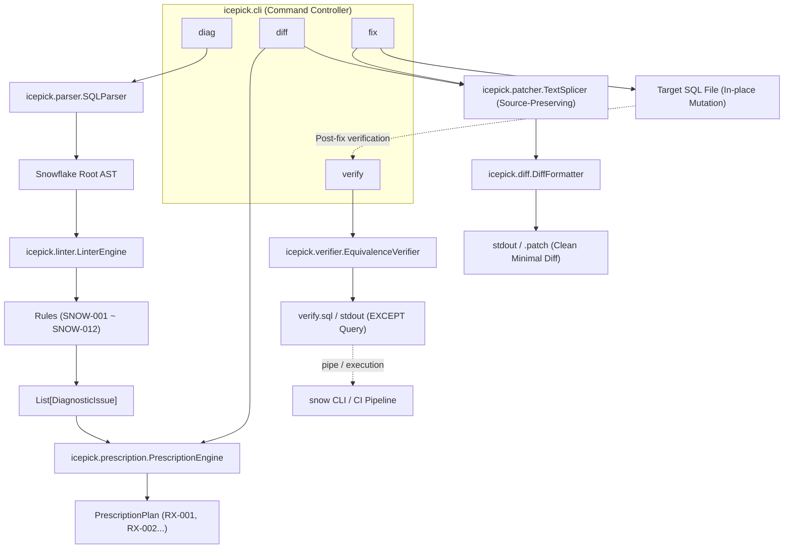
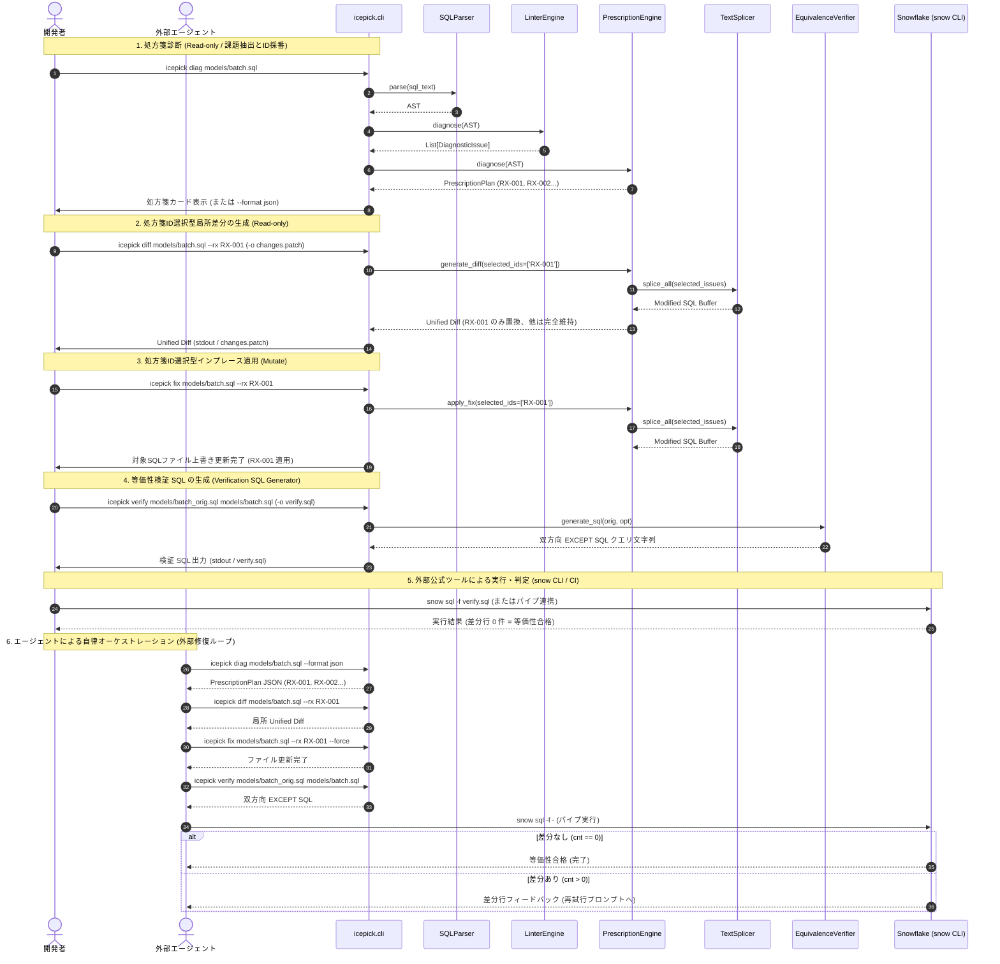

# 詳細設計書 (design.md)

## 目次
- [機能一覧](#機能一覧)
- [アーキテクチャ](#アーキテクチャ)
- [データモデル](#データモデル)
- [機能詳細](#機能詳細)
  - [LinterEngine (icepick/linter/)](#linterengine-icepicklinter)
  - [ASTPatcher & SubqueryToCTE (icepick/patcher/)](#astpatcher--subquerytocte-icepickpatcher)
  - [ContextSlicer, LLMClient & プラガブルプロバイダ基盤 (icepick/llm/)](#contextslicer-llmclient--プラガブルプロバイダ基盤-icepickllm)
  - [DiffFormatter & TextSplicer (icepick/diff/, icepick/patcher/)](#44-diffformatter--textsplicer-icepickdiff-icepickpatcher)
  - [EquivalenceVerifier / 検証 SQL 生成器 (icepick/verifier/)](#45-equivalenceverifier--検証-sql-生成器-icepickverifier)
  - [FeedbackRecorder (icepick/feedback.py)](#46-feedbackrecorder-icepickfeedbackpy)
  - [エージェント親和性アーキテクチャ (Agent-Native CLI Interface)](#47-エージェント親和性アーキテクチャ-agent-native-cli-interface)
  - [完全ゼロ・クレデンシャル & オフライン保証](#48-完全ゼロクレデンシャル--オフライン保証)
  - [エージェント準備状況テスト (Agent Readiness Test)](#49-エージェント準備状況テスト-agent-readiness-test)
  - [ConfigResolver & 実行時コンフィグ・フィードバック (icepick/config.py)](#410-configresolver--実行時コンフィグフィードバック-icepickconfigpy)
  - [処方箋駆動最適化エンジン (PrescriptionEngine / icepick diag / diff / fix)](#412-処方箋駆動最適化エンジン-prescriptionengine--icepick-diag--diff--fix)
- [シーケンス図（処方箋駆動リファクタリングフロー）](#シーケンス図処方箋駆動リファクタリングフロー)
- [エラーハンドリング](#6-エラーハンドリング)


## 機能一覧

| 機能カテゴリ | 機能ID | 機能名 | 概要 | 対応要件ID |
|:------------|:-------|:------|:-----|:----------|
| 構文解析・静的診断 | F-A1 | Snowflake SQL構文解析 | sqlglotを用いたSnowflake方言AST構築と構文エラーハンドリング | A-1 |
| 構文解析・静的診断 | F-A2 | プルーニング阻害述語診断 | WHERE句の関数ラップによるフルスキャン要因（SNOW-001）検出 | A-2 |
| 構文解析・静的診断 | F-A3 | 相関副クエリ診断 | 外側スコープ参照を含む相関副クエリ（SNOW-002）検出 | A-3 |
| 構文解析・静的診断 | F-A4 | 不要ソート診断 | サブクエリ/CTE内の無意味なORDER BY（SNOW-003）検出 | A-4 |
| 構文解析・静的診断 | F-A5 | ネストサブクエリ診断 | FROM/JOIN句に直接ネストしたDerived Table（SNOW-007）検出 | A-5 |
| 構文解析・静的診断 | F-A6 | UNION最適化診断 | 重複排除不要なUNIONからUNION ALLへの置換候補（SNOW-006）検出 | A-6 |
| 構文解析・静的診断 | F-A7 | 暗黙クロス結合診断 | カンマ区切りFROMによる直積リスク（SNOW-004）検出 | A-7 |
| 構文解析・静的診断 | F-A8 | 重複テーブルスキャン診断 | 複数CTE間での同一テーブル反復スキャン（SNOW-005）検出 | A-8 |
| 構文解析・静的診断 | F-A9 | 冗長DISTINCT診断 | GROUP BY・集計関数存在下での無駄なDISTINCT（SNOW-008）検出 | A-9 |
| 構文解析・静的診断 | F-A10 | QUALIFY平坦化診断 | ウィンドウ関数サブクエリのQUALIFY統合候補（SNOW-009）検出 | A-10 |
| 構文解析・静的診断 | F-A11 | CTE多重参照診断 | 同一CTEの3回以上参照によるインライン再計算リスク（SNOW-010）検出 | A-11 |
| 構文解析・静的診断 | F-A12 | 巨大INリスト診断 | 500要素超の巨大INリストによるコンパイル過負荷（SNOW-011）検出 | A-12 |
| AST置換・最適化 | F-B1 | 決定論的ノード置換 | AST In-place置換による健全ノード維持と局所手術 | B-1 |
| AST置換・最適化 | F-B2 | Derived Table平坦化 | ネストサブクエリのトップレベルCTE外出し・平坦化 | B-2 |
| AST置換・最適化 | F-B3 | エージェント連携リライト支援 | ast-digger構文特定情報を含む処方箋とAST構文検証 | B-3 |
| AST置換・最適化 | F-B4 | UNION ALL置換 | UNIONからUNION ALLへの決定論的ルール置換 | B-4 |
| AST置換・最適化 | F-B5 | 明示的JOIN置換 | 暗黙クロス結合からINNER JOIN等への決定論的置換 | B-5 |
| AST置換・最適化 | F-B6 | DISTINCTノード削除 | GROUP BY存在下でのDISTINCT安全pop削除 | B-6 |
| AST置換・最適化 | F-B7 | QUALIFY句注入平坦化 | サブクエリ解消とQUALIFY句への条件統合置換 | B-7 |
| 処方箋駆動最適化 | F-C1 | 構造化処方箋診断 | icepick diagによる処方箋ID採番とRichカード/JSON出力 | C-1 |
| 処方箋駆動最適化 | F-C2 | 処方箋ID選択型差分生成 | icepick diffによる特定処方箋（--rx）に絞り込んだ局所Diff生成 | C-2 |
| 処方箋駆動最適化 | F-C3 | 処方箋ID選択型ファイル適用 | icepick fixによる特定処方箋（--rx）の元ファイル直接適用 | C-3 |
| 処方箋駆動最適化 | F-C4 | エージェント自律連携IF | 完全ローカル処方箋プランと理由・期待効果のエージェント提供 | C-4 |
| 処方箋駆動最適化 | F-C5 | 書式保持スプライシング | TextSplicerによるコメント・インデント完全保持最小Diff生成 | C-5 |
| 等価性検証 | F-D1 | 双方向EXCEPT検証SQL生成 | icepick verifyによる決定論的等価性検証SQL出力（snow CLI委譲） | D-1 |
| エージェント親和性・運用 | F-E1 | フリクション記録 | icepick feedbackによる課題・バグのローカル追記記録 | E-1 |
| エージェント親和性・運用 | F-E2 | 構造化JSON出力 | 全コマンドでの機械判読可能な--json出力 | E-2 |
| エージェント親和性・運用 | F-E3 | 非対話環境ハング防止 | 非TTY環境でのプロンプト待機防止とActionable Advice | E-3 |
| エージェント親和性・運用 | F-E4 | 完全ゼロ・クレデンシャル保証 | 外部通信・APIキー要求の完全排除とオフライン動作保証 | E-4 |
| エージェント親和性・運用 | F-E5 | Layer 2 イントロスペクション | 全機能・ルール仕様を一括出力するicepick agent-context | E-5 |
| エージェント親和性・運用 | F-E6 | 破壊的操作防止ガード | --dry-runおよび非対話環境での--force必須化 | E-6 |
| エージェント親和性・運用 | F-E7 | 自己修正引数エラー | 不正引数時の許容値一覧（enum）および正しいコマンド例提示 | E-7 |
| エージェント親和性・運用 | F-E8 | エージェント準備状況テスト | 非TTY・ハング防止・完全オフライン動作の自動テスト保証 | E-8 |
| エージェント親和性・運用 | F-E9 | マルチソース設定解決 | 方言・Linter設定の優先順位解決とicepick config show表示 | E-9 |

## アーキテクチャ


本システムは、CLI経由でSnowflake SQLを受け取り、AST解析・診断・局所置換・差分提示・等価性検証のパイプラインを実行する。



## データモデル

```python
from dataclasses import dataclass
from enum import Enum
from typing import Optional, List, Dict, Any
import sqlglot
from sqlglot import exp

class Severity(str, Enum):
    INFO = "INFO"
    LOW = "LOW"
    MEDIUM = "MEDIUM"
    HIGH = "HIGH"
    CRITICAL = "CRITICAL"

@dataclass
class DiagnosticIssue:
    rule_id: str                      # 例: "SNOW-001"
    rule_name: str                    # 例: "Non-Sargable Predicate"
    severity: Severity                # 重要度
    description: str                  # 診断理由・影響説明
    target_node: exp.Expression       # AST上の対象ノード
    line_number: Optional[int]        # 発生行番号
    snippet: str                      # 元のSQLコード断片
    suggested_replacement: Optional[exp.Expression] = None  # 置換案ノード
    requires_llm: bool = False        # LLMリライトが必要かどうか

@dataclass
class OptimizationResult:
    original_sql: str                 # 入力元SQL
    base_formatted_sql: str           # 正規化後SQL (Diff基準)
    optimized_sql: str                # 最適化後SQL
    issues: List[DiagnosticIssue]     # 検出された問題リスト
    unified_diff: str                 # 生成されたUnified Diffテキスト
    is_verified: Optional[bool] = None# 等価性検証の合否

class PrescriptionAction(str, Enum):
    DELETE = "DELETE"
    REPLACE = "REPLACE"
    INSERT = "INSERT"

@dataclass
class PrescriptionTarget:
    cte: Optional[str]                # 所属するCTE名（トップレベルクエリはNone）
    node_type: str                    # ASTノード名（例: "Join", "Where", "Select"）
    line_range: Optional[tuple[int, int]] = None  # 該当箇所の開始・終了行番号

@dataclass
class Prescription:
    id: str                           # 一意な処方箋ID（例: "RX-001"）
    rule_id: str                      # 検出ルールID（例: "SNOW-001"）
    severity: Severity                # 重要度
    target: PrescriptionTarget        # 患部の位置情報
    action: PrescriptionAction        # 操作種別 (DELETE, REPLACE, INSERT)
    original_sql: str                 # 置換・削除対象の既存SQL断片
    suggested_sql: Optional[str]      # 推奨される置換後SQL断片（DELETE時はNone）
    rationale: str                    # 修正すべき理由・根拠（Why）
    expected_impact: str              # 期待される改善効果（スキャン量削減等）

@dataclass
class PrescriptionPlan:
    schema_version: str               # "1.0"
    file: str                         # 対象SQLファイルパス
    issues_count: int                 # 検出件数
    prescriptions: List[Prescription] # 処方箋リスト
```


## 機能詳細

### 4.1 `LinterEngine` (`icepick/linter/`)
- 対応要件: A-1, A-2, A-3, A-4, A-5, A-6, A-7, A-8, A-9, A-10, A-11, A-12, A-13
- `BaseRule` を継承した個別ルールクラスを動的にロードして実行する。
- 各ルールは `check(ast: exp.Expression) -> List[DiagnosticIssue]` を実装する。
- 個別ルール一覧:
  - `NonSargableRule` (`SNOW-001`): `exp.EQ` 等の比較述語で、カラムへの関数適用を検出し、リテラル側変換の範囲条件ノードを `suggested_replacement` にセット。
  - `CorrelatedSubqueryRule` (`SNOW-002`): 外側スコープのテーブル/エイリアスを参照する相関副クエリを検出し、`severity=Severity.CRITICAL`, `requires_llm=True` をセット。
    - **入力 (Input)**: AST (`exp.Expression`)
    - **処理 (Processing)**:
      1. 各 `exp.Select` ノードを外側コンテキストとして走査し、自身が持つ FROM / JOIN のテーブル名およびエイリアス集合（`outer_tables`）を収集。
      2. 当該クエリの WHERE / HAVING / SELECT 句内に含まれるサブクエリノード（`exp.Subquery`, `exp.Exists`, `exp.In` 等）を走査。
      3. サブクエリ内部の FROM / JOIN テーブル名およびエイリアス集合（`inner_tables`）を収集。
      4. サブクエリ内の全 `exp.Column` を走査し、`col.table` が指定されている場合において `col.table.lower()` が `inner_tables` に存在せず、`outer_tables` に一致する外部参照を検出。
      5. 相関参照を持つサブクエリノードを対象に `DiagnosticIssue(rule_id="SNOW-002", severity=Severity.CRITICAL, requires_llm=True)` を生成。
    - **出力 (Output)**: `list[DiagnosticIssue]` (重要度: CRITICAL, 自動置換: なし / LLM推奨)
  - `RedundantSortRule` (`SNOW-003`): `exp.Subquery` / `exp.CTE` 内の `exp.Order` かつ LIMITなしを検出し、`target_node=order_node`, `suggested_replacement=None` (pop削除) をセット。
  - `NestedSubqueryRule` (`SNOW-007`): `exp.From` や `exp.Join` 内の `exp.Subquery` を検出し、CTE外出し対象としてフラグ付け。
  - `UnionToUnionAllRule` (`SNOW-006`): 重複排除不要な結合における `exp.Union`（`distinct=True`）を検出し、`distinct=False`（UNION ALL）の置換ノードを `suggested_replacement` にセット。
  - `ImplicitCrossJoinRule` (`SNOW-004`): `exp.From` 内のカンマ区切り複数テーブル参照を検出し、明示的な `CROSS JOIN` ノードを `suggested_replacement` にセット。
  - `DuplicateTableScanRule` (`SNOW-005`): 同一クエリ内の複数 CTE 間で同一テーブルの重複スキャンを検出し、共通 CTE 集約の警告を発行。
  - `RedundantDistinctRule` (`SNOW-008`): `exp.Select` 内で `group` 句が存在する、または集計関数を含むブロックでの `distinct` を検知し、`target_node=select_node.args.get("distinct")`, `suggested_replacement=None`（pop削除）をセット。
  - `QualifyFlatteningRule` (`SNOW-009`): ウィンドウ関数を持つサブクエリを外側 `WHERE` 句（`rn = 1` 等）で囲んでいる構造を検出し、サブクエリを解消して内側クエリに `QUALIFY` 条件を注入した置換ノードをセット。
  - `CteMultiReferenceRule` (`SNOW-010`): 同一 CTE が 3 回以上参照されている箇所を検知し、一時テーブル（TEMPORARY TABLE）マテリアライズ検討を促す警告（重要度 `LOW`、手動対応）を発行。
  - `HugeInListRule` (`SNOW-011`): IN 句の引数リストが 500 要素を超えるリテラル集合を検知し、`ARRAY_CONSTRUCT` や一時テーブル JOIN を促す警告（重要度 `MEDIUM`、手動対応）を発行。
  - `SelectStarRule` (`SNOW-012`): 中間 CTE、JOIN 句を伴う SELECT、または DISTINCT を伴う SELECT での `exp.Star` 射影を検知し、必要カラム指定を促す警告（重要度 `LOW`、手動/エージェント対応）を発行。
    - **入力 (Input)**: AST (`exp.Expression`)
    - **処理 (Processing)**:
      1. 全 `exp.Select` ノードを走査。
      2. 各 `Select` の射影式リスト（`select.expressions`）内に `exp.Star`（または `exp.Column` の this が `exp.Star`）が存在するか判定。
      3. 集計関数（`exp.Count` や `exp.AggFunc`）内部の `Star` は行数カウント用途として除外。
      4. 以下のいずれかの高リスク条件を満たす場合に `DiagnosticIssue` を発行:
         a. 当該 `Select` が CTE 定義内部（`select.find_ancestor(exp.CTE)`）にある（中間 CTE による全列パイプライン引き回し）。
         b. 当該 `Select` が `JOIN` 句（`select.args.get("joins")`）を持っている（複数テーブル全列展開によるメモリ膨張）。
         c. 当該 `Select` が `DISTINCT` 属性を持っている（全列ハッシュ/ソートによる Spill リスク）。
      5. `target_node = star_node`, `suggested_replacement = None`（手動/エージェントによるリライト推奨）。
    - **出力 (Output)**: `list[DiagnosticIssue]` (重要度: LOW, 自動置換: なし / 手動・Agent推奨)

### 4.2 `ASTPatcher` & `SubqueryToCTE` (`icepick/patcher/`)
- 対応要件: B-1, B-2, B-4, B-5, B-6, B-7
- **In-place置換**:
  - `issue.suggested_replacement` が存在する場合: `issue.target_node.replace(issue.suggested_replacement)`（`SNOW-001`, `SNOW-006`, `SNOW-004`, `SNOW-009`）
  - `suggested_replacement` が None の場合: `issue.target_node.pop()` または `select_node.set("distinct", None)`（`SNOW-003`, `SNOW-008`）
- **サブクエリのCTE平坦化 (`SubqueryToCTE`)**:
  1. 対象サブクエリの内部SELECT (`subquery.this`) を取得。
  2. 一意なCTE別名（例: `cte_<alias>_<index>`）を決定。
  3. `exp.CTE(this=inner_select, alias=exp.TableAlias(this=cte_alias))` を構築。
  4. トップレベルの `ast.args["with_"]`（存在しない場合は `ast.set("with_", exp.With(expressions=[...]))`）に追加。
  5. 元のサブクエリノードを `exp.Table(this=cte_alias, alias=original_alias)` で置換。

### 4.3 `ast-digger` & AIエージェント連携型リライト支援
- 対応要件: B-3, C-4
- **設計思想 (3層アーキテクチャの役割分担)**:
  - ADR-0007 に基づき、`icepick` 内部での LLM 直接呼び出し・HTTP通信・認証管理を完全撤廃。
  - 呼び出し元の AI エージェント（Claude Code, Antigravity, Roo Code 等）自身が最先端の LLM であり、`ast-digger` と `icepick` を道具として組み合わせて自律的にリファクタリングを完遂する 3 層アーキテクチャを採用する。

  ```mermaid
  flowchart LR
      subgraph Layer1 ["1. 構文探索 & スライシング"]
          AD["ast-digger"]
      end

      subgraph Layer2 ["2. 診断・処方・決定論的パッチ"]
          IP["icepick (Pure AST Engine)"]
      end

      subgraph Layer3 ["3. 自律推論 & リライト"]
          Agent["AI Coding Agent (LLM)"]
      end

      Agent -->|1. 構文木・CTE俯瞰| AD
      Agent -->|2. icepick diag --format json| IP
      IP -->|PrescriptionPlan (RX-xxx, 所属CTE, ノード種別)| Agent
      Agent -->|3. ast-digger symbol で患部切り出し| AD
      Agent -->|4. 高度推論・局所リライト| Agent
      Agent -->|5. icepick diff / fix で安全適用| IP
      IP -->|Unified Diff / ファイル更新| Agent
  ```

- **IPO 記述**:
  - **Input**:
    - `PrescriptionPlan`（`icepick diag --format json` の構造化処方箋）
    - 所属 CTE、AST ノード種別、行番号範囲情報
  - **Processing**:
    1. `icepick diag` は各指摘事項に一意な処方箋ID（`RX-001` 等）を採番し、所属 CTE、ノード種別、置換前後の SQL 断片、修正理由（`rationale`）、期待効果（`expected_impact`）を完全ローカルで生成。
    2. 外部エージェントは `ast-digger symbol <file> <cte_name>` 等を用いて、必要な患部 CTE のみをピンポイントにスライシング・探索。
    3. ルールベース置換（DELETE / REPLACE）可能な処方箋は `icepick diff --rx <id>` または `icepick fix --rx <id>` で決定論的に適用。
    4. 高度な推論が必要な課題（相関副クエリの非相関化や共通CTE集約）は、エージェント自身の強力なコンテキスト・最新モデルでリライトを実行。
    5. エージェントが生成した置換 SQL は、`sqlglot.parse_one()` による構文検証を経て、`TextSplicer` により元のコメント・インデントを 100% 維持したまま局所適用。
  - **Output**:
    - 外部ネットワーク通信 0、秘密情報漏洩リスク 0 の安全かつ決定論的なリファクタリング差分。

### 4.4 `DiffFormatter` & `TextSplicer` (`icepick/diff/`, `icepick/patcher/`)
- 対応要件: C-1, C-2, C-3, C-5
- **元ソース書式保持型局所置換 (`TextSplicer`)**:
  - **IPO 記述**:
    - **Input**:
      - `original_sql`: 元の生の SQL テキスト（ユーザー独自のインデント、コメント、改行、大文字小文字を保持）
      - `issues`: 診断された `DiagnosticIssue` のリスト（患部ノード `target_node`, 置換ノード `suggested_replacement` または LLM 置換ノード, `line_number`）
      - `dialect`: SQL 方言（デフォルト: `"snowflake"`）
    - **Processing**:
      1. 各 Issue の `target_node` の SQL 表現および行位置情報から、`original_sql` 内の対応する生テキスト断片（行・文字範囲）を特定。
      2. **コメント誤爆防止**: 単一行コメント（`--`）およびブロックコメント（`/* ... */`）の文字スパンを事前に走査・特定し、コメント内部に含まれるキーワード（例: `-- SNOW-008: DISTINCT`）を置換対象マッチングから除外。
      3. **オプショナル AS 対応**: sqlglot と元コード間での `AS` キーワード有無の差異を許容するため、`(?:\bAS\s+)?` を用いた柔軟な正規表現パターンマッチングを実施（例: `) AS sub` と `) sub` の相互マッチ）。
      4. 元の行のインデント（先行空白・タブ）を検出し、置換先コード（`suggested_replacement.sql(...)` または外部リライトコード）のインデントを元のコンテキストに合わせて整形。
      5. 患部以外の 95% 以上のテキスト（コメント、空行、インデント、キーワードの大文字小文字）を 1 文字も改変することなく、患部のみをピンポイント差し替えした一時バッファ `modified_raw_sql` を構築。
      6. `format_diff(original_sql, modified_raw_sql, normalize=False)` を実行し、元の生ファイルに対する完全一致 Unified Diff を生成。
    - **Output**:
      - `modified_raw_sql`: 患部のみが置換され、元コードの書式が 100% 維持された SQL 文字列
      - `diff_text`: 元ファイルにそのまま適用可能な、コンテキスト行が完全一致する最小限の Unified Diff
- **パッチ適用エンジン (`apply_unified_diff`) のインデント非依存マッチング**:
  - 外部で作成されたパッチや微細なインデント差が存在する場合でも確実に適用できるよう、`_find_matching_position` に `line.strip()` 一致およびインデント自動再調整（Indent Re-targeting）の二重安全フォールバックを実装。
- **全体再フォーマットフォールバック (`--reformat`)**:
  - インラインサブクエリの CTE 平坦化（`--flatten-subqueries`）など、クエリ全体の構文木組み換えを伴う操作や明示的な再フォーマット指示時は、AST 全体シリアライズによる Diff 生成（`normalize=True`）を許可。

### 4.5 `EquivalenceVerifier` / 検証 SQL 生成器 (`icepick/verifier/`)
- 対応要件: D-1
- **設計思想 (ADR-0004 準拠)**:
  - 最適化前後のクエリが等価であるかを判定するための双方向 `EXCEPT` クエリを決定論的に生成する単一責任に特化。
  - Snowflake への直接接続・実行は行わず、外部の公式ツール（`snow CLI` 等）や社内 CI/CD パイプラインに委ねる。
- **IPO 記述**:
  - **Input**:
    - `original_sql`: 変更前の SQL クエリ文字列
    - `optimized_sql`: 最適化後の SQL クエリ文字列
    - `dialect`: SQL 方言（デフォルト: `"snowflake"`）
    - `count_only`: 差分件数のみを集計するクエリを生成するか否か（デフォルト: `False`）
  - **Processing**:
    1. 元クエリおよび最適化後クエリを CTE（`orig` および `opt`）としてラッピング。
    2. 双方向 `EXCEPT` クエリを自動構築：
       - **通常モード (`count_only=False`)**:
         ```sql
         -- Icepick Equivalence Verification Query
         -- Returns 0 rows if both queries are semantically equivalent.
         WITH orig AS (
           <ORIGINAL_SQL>
         ),
         opt AS (
           <OPTIMIZED_SQL>
         )
         SELECT 'orig_not_in_opt' AS diff_type, * FROM (
           SELECT * FROM orig EXCEPT SELECT * FROM opt
         )
         UNION ALL
         SELECT 'opt_not_in_orig' AS diff_type, * FROM (
           SELECT * FROM opt EXCEPT SELECT * FROM orig
         );
         ```
       - **件数集約モード (`count_only=True`)**:
         ```sql
         -- Icepick Equivalence Verification Count Query
         WITH orig AS (
           <ORIGINAL_SQL>
         ),
         opt AS (
           <OPTIMIZED_SQL>
         )
         SELECT 'orig_not_in_opt' AS diff_type, COUNT(*) AS cnt FROM (SELECT * FROM orig EXCEPT SELECT * FROM opt)
         UNION ALL
         SELECT 'opt_not_in_orig' AS diff_type, COUNT(*) AS cnt FROM (SELECT * FROM opt EXCEPT SELECT * FROM orig);
         ```
  - **Output**:
    - `verification_sql`: 外部ツール（`snow sql -f -` 等）で即座に実行可能な検証用 SQL 文字列
  - **CLI コマンド体系**:
    - `icepick verify orig.sql opt.sql`: 検証 SQL を標準出力（stdout）に出力。
    - `icepick verify orig.sql opt.sql -o verify.sql`: 検証 SQL をファイルへ出力。
    - `icepick verify orig.sql opt.sql --count-only`: 件数集約クエリを出力。
    - パイプ連携例: `icepick verify orig.sql opt.sql | snow sql -f -`

### 4.6 `FeedbackRecorder` (`icepick/feedback.py` または `cli.py`)
- 対応要件: E-1
- テスト中・運用中にエージェントや開発者が直面した摩擦（フリクション）、バグ、改善アイデアをローカルログファイルにアペンド記録。
- データ構造:
  ```python
  @dataclass
  class FeedbackEntry:
      timestamp: str  # ISO 8601
      version: str    # icepick version
      category: str   # friction, bug, doc, idea
      message: str    # フィードバック本文
      cwd: str        # 実行ディレクトリ
      git_commit: str | None = None
  ```
- 保存形式: `.icepick_feedback.jsonl`（JSON Lines形式、1行1レコード、UTF-8追記）。
- `--category` のバリデーションを行い、不正値の場合は有効なenum一覧（`friction`, `bug`, `doc`, `idea`）を提示する Actionable Error を送出。

### 4.7 エージェント親和性アーキテクチャ (Agent-Native CLI Interface)
- 対応要件: E-2, E-3, E-5, E-6, E-7
- **機械可読イントロスペクション (`icepick agent-context`)**:
  - Layer 2 イントロスペクションとして、CLI の全コマンド、引数・オプション仕様、対応する最適化ルール一覧（`rule-001`〜`007`等）、環境変数スキーマ（`DEBUG_ICEPICK_*`）を単一の構造化 JSON として出力。
  - エージェントが初手で実行することで、ヘルプ探索によるトークン消費を最小化する。
- **構造化出力 (`--json`)**:
  - `diag`: 処方箋プラン（`PrescriptionPlan`）の完全な JSON を出力。
  - `diff`: 生成された Unified Diff テキストまたは処方箋適用メタデータを JSON で出力。
  - `fix`: 適用ステータス、適用された処方箋数、変更ファイルパスを JSON で出力。
  - `verify`: 生成された双方向 EXCEPT 検証 SQL クエリを JSON で出力。
  - `feedback`: 記録された `FeedbackEntry` を JSON で出力。
  - `agent-context`: ツール仕様メタデータを JSON で出力。
- **非対話モードと変更境界 (`--dry-run` & `--force`)**:
  - `sys.stdin.isatty()` により対話型ターミナルかパイプ/サブプロセスかを自動判定。
  - 非 TTY 環境ではプロンプト表示による永久ハングを防止。
  - `--dry-run`: `fix` コマンドにおいてファイルへの書き込みを一切行わず、適用シミュレーション結果のみを出力。
  - 非TTY環境における `fix` 実行時は、確認バイパスフラグ `--force`（または `-f`）を必須とし、未指定時は安全のため処理を中止してエラーを案内。
- **自己修正エラー (Actionable & Enumerated Errors)**:
  - 引数やオプションのバリデーションエラー時、可能な値の列挙（enumリスト）と、コピペして実行可能な修正コマンド例を出力。

### 4.8 完全ゼロ・クレデンシャル & オフライン保証
- 対応要件: E-4
- **完全ゼロ・クレデンシャル設計 (ADR-0004 & ADR-0007)**:
  - ADR-0004 により Snowflake データベースへの直接接続責任を外部公式ツール（`snow CLI` 等）に委ね、データベース認証情報を全廃。
  - ADR-0007 により 内部 LLM 連携（Gemini / Vertex AI）を完全撤廃したことで、Google AI Studio API キーや Google Cloud ADC 資格情報の管理も全廃。
  - `icepick` の全コマンド（`diag`, `diff`, `fix`, `verify`, `config`, `feedback`, `agent-context`）において、APIキー、トークン、パスワードなどの認証情報を一切要求・保存・探索しない。
- **完全ローカル・オフライン動作の保証**:
  - 外部エンドポイント（LLM API、クラウドREST API、外部DB）への直接ネットワーク通信を一切行わない。
  - 企業内の機密 SQL、テーブルスキーマ、ビジネスロジックが外部ネットワークへ送信・漏洩するリスクを恒久的にゼロにする。

### 4.9 エージェント準備状況テスト (Agent Readiness Test)
- 対応要件: E-8
- **テスト設計 (`tests/test_agent_readiness.py`)**:
  1. **非TTYハング防止テスト**: `stdin` を `io.StringIO` やパイプ模倣オブジェクトに差し替え、プロンプト待ちでブロックせずに終了することを確認。
  2. **構造化出力テスト**: 全サブコマンド（`diag`, `diff`, `fix`, `verify`, `feedback`, `agent-context`）に `--json` を渡した際、有効な JSON が標準出力から取得でき、エラー情報が標準エラー出力に分離されていることを検証。
  3. **完全オフライン動作検証**: 外部通信モジュール（`httpx` 等）への依存を排除し、ネットワーク切断環境下でも全コマンドが決定論的かつ高速に動作することを検証。
  4. **Actionable Error検証**: 不正引数指定時に、有効な enum 一覧および復旧コマンド例が出力に含まれていることを検証。

### 4.10 `ConfigResolver` & 実行時コンフィグ・フィードバック (`icepick/config.py` または `cli.py`)
- 対応要件: E-9
- **優先順位ピラミッド (Configuration Precedence)**:
  1. **CLI オプション**: `--dialect` (`-d`), `--config` (`-c`) 等
  2. **環境変数**: `ICEPICK_DIALECT` 等
  3. **設定ファイル**: `--config` 指定ファイル、または暗黙の `.icepick.toml` / `icepick.json`（Dialect、Linter ルール有効/無効設定）
  4. **組み込みデフォルト値**: `dialect="snowflake"`
- **IPO 記述**:
  - **Input**: CLI 引数、明示的/暗黙の設定ファイルパス、環境変数辞書
  - **Processing**:
    1. 各設定項目について、優先順位に従い上書きマージを実行。
    2. 各項目の値とともに、解決されたソース（`cli_option`, `environment_variable`, `config_file`, `default`）を記録した `RuntimeConfigSummary` を構築。
    3. `--json` 指定時は出力 JSON に適用された設定値と解決元ソースを含めてシリアライズ。
  - **Output**:
    - マージ済み `Config` インスタンス
    - `RuntimeConfigSummary`（キー、値、ソース）
- **確認コマンド (`icepick config show`)**:
  - 現在解決されている全設定項目（Dialect設定、Linterルール設定）とその解決元ソースを Rich テーブル形式で一覧表示。

### 4.12 処方箋駆動最適化エンジン (`PrescriptionEngine` / `icepick diag` / `diff` / `fix`)
- 対応要件: C-1, C-2, C-3, C-4, C-5
- **設計思想**:
  - 長大なSnowflake SQLにおいて、クエリ全体の再生成を避け、意味論的に抽出された改善点と修正指示（処方箋）を独立した単位として扱う。
  - 診断（`diag`）、差分生成（`diff`）、ファイル適用（`fix`）の3段階パイプラインに責務を分離し、ユーザーやエージェントが任意の処方箋（`--rx`）を選択的に適用できるようにする。
- **IPO 記述**:
  1. `PrescriptionEngine.diagnose(sql_text: str, file_path: str = "") -> PrescriptionPlan`:
     - **Input**: `sql_text: str`, `file_path: str`
     - **Processing**:
       1. `sqlglot` を用いて Snowflake AST を構築。
       2. Linter ルール群（`SNOW-001`〜`SNOW-012`等）を実行し、問題ノード・改善提案を抽出。
       3. 各検出問題に対して一意な処方箋ID（`RX-001`, `RX-002`...）を採番し、所属CTE、ノード種別、操作種別（DELETE/REPLACE/INSERT）、元のSQL断片、推奨修正SQL断片、Why（理由）、期待効果をカプセル化した `Prescription` リストを構築。
     - **Output**: `PrescriptionPlan` インスタンス
  2. `PrescriptionEngine.generate_diff(sql_text: str, plan: PrescriptionPlan, selected_ids: list[str] | None = None) -> str`:
     - **Input**: `sql_text: str`, `plan: PrescriptionPlan`, `selected_ids: list[str] | None`
     - **Processing**:
       1. `selected_ids` が指定されている場合、該当する処方箋IDのみをフィルタ（無効ID指定時は例外送出）。
       2. 対象処方箋の `original_sql` を元テキストから特定し、`suggested_sql`（または削除）で局所置換（TextSplicer / Splicing）。未変更部分は1文字も触らない。
       3. 元テキストと置換後テキストから Git 互換 Unified Diff を生成。
     - **Output**: `str` (Unified Diff)
  3. `PrescriptionEngine.apply_fixes(sql_text: str, plan: PrescriptionPlan, selected_ids: list[str] | None = None) -> str`:
     - **Input**: `sql_text: str`, `plan: PrescriptionPlan`, `selected_ids: list[str] | None`
     - **Processing**:
       1. 指定された処方箋IDに絞り込み、元テキストに対して局所置換を適用した新しい SQL 文字列を生成。
     - **Output**: `str` (更新後 SQL 文字列)
- **CLI コマンド体系**:
  - `icepick diag <file>`: 処方箋をターミナル上にカード形式で表示。
  - `icepick diag <file> --format json`: エージェント/外部ツール向け構造化 JSON 出力。
  - `icepick diff <file>`: 全処方箋を反映した最小 Unified Diff を生成。
  - `icepick diff <file> --rx RX-001,RX-003`: 指定した処方箋のみを選択して局所 Diff を生成。
  - `icepick fix <file>`: 全処方箋を元ファイルへインプレース適用。
  - `icepick fix <file> --rx RX-001`: 指定した処方箋のみを元ファイルへインプレース適用。
  - `icepick fix <file> --dry-run`: 適用シミュレーションのみ実行（ファイル変更なし）。

## シーケンス図（処方箋駆動リファクタリングフロー）





## 6. エラーハンドリング

本システムは、人間だけでなく自律型 AI エージェントがパイプライン内で安定稼働できるよう、決定論的な終了コード体系と Fail-Safe 設計、自己修正可能な Actionable Advice を徹底する。

### 6.1 終了コード体系 (Exit Codes)
| 終了コード | 分類 | 発生条件・対象コマンド | エージェント推奨アクション |
|:---:|:---|:---|:---|
| **0** | 正常終了 (Success) | ・`diag`: 課題 0 件（クリーン）<br>・`diff`: Diff 生成成功（変更なし含む）<br>・`fix`: 処方箋適用成功<br>・`verify`: 検証 SQL 出力成功<br>・`config show` / `feedback` / `agent-context`: 実行成功 | 次のパイプラインステップへ進行。 |
| **1** | 課題検出 / 引数・適用エラー | ・`diag`: 1 件以上の処方箋検出<br>・`diff` / `fix`: 無効な処方箋 ID 指定（`--rx`）<br>・`fix`: 非TTY環境での `--force` 未指定<br>・不正な CLI オプション / 不正な Severity / カテゴリ引数 | stderr の Actionable Advice に従い引数を修正、または `diff` / `fix` を実行。 |
| **2** | 致命的構文パースエラー / ファイル入出力エラー | ・入力 SQL の Snowflake 構文パース失敗 (`ParseError`)<br>・対象ファイル不存在 / 読み込み・書き込み権限不足 | SQL の構文修正、またはファイルパスの存在確認。 |

### 6.2 Fail-Safe 設計 & 自動フォールバック
1. **AST 破壊の完全防止**:
   - 外部エージェントや置換ルールによって生成された SQL 断片は、元テキストへの結合前に必ず `sqlglot.parse_one(snippet, dialect=dialect)` で事前検証される。
   - パース失敗や構文エラーが発生した場合は該当箇所の置換を中断し、元のコード断片を 100% 維持してフェイルセーフに処理を継続する。
2. **TextSplicer の安全フォールバック**:
   - コメントやインデントを保持するソーススプライシングにおいて、行・列オフセットの一致が曖昧な場合は、元ファイルを破壊せず安全にエラー終了または警告出力する。

### 6.3 Actionable Advice UX (自己修復ループ)
- エラー発生時は単なるスタックトレースを出力せず、問題の根本原因と**即座に実行可能な修正コマンド**を Rich パネルまたは黄色文字（stderr）で提示する：
  - 不正引数時: サポートされている選択肢の一覧（例: `['CRITICAL', 'HIGH', 'MEDIUM', 'LOW']`、`['text', 'json']`）を出力。
  - 無効な処方箋ID指定時: 利用可能な有効処方箋ID一覧（例: `Available IDs: RX-001, RX-002`）を出力。
  - 非TTY環境での `fix`: `--force` を付与したコマンド例を出力。

### 6.4 非対話環境（CI / Agent）でのハングアップ防止
- `fix` コマンド等において、非 TTY 環境（パイプ入力やエージェント実行環境）でファイル直接更新を行う場合、予期せぬ破壊を防ぐため `--force` フラグの指定を必須とし、未指定時は直ちに終了コード 1 で安全にフェイルする。

