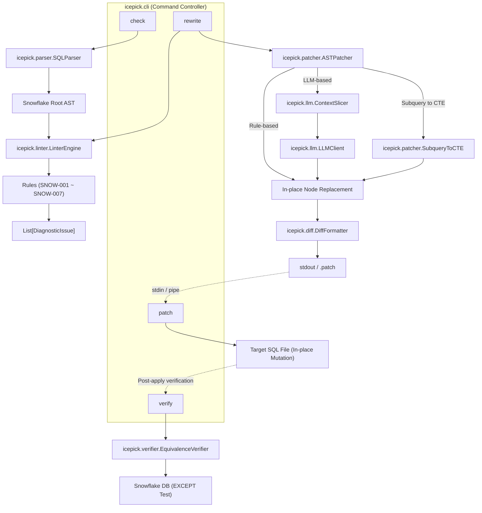
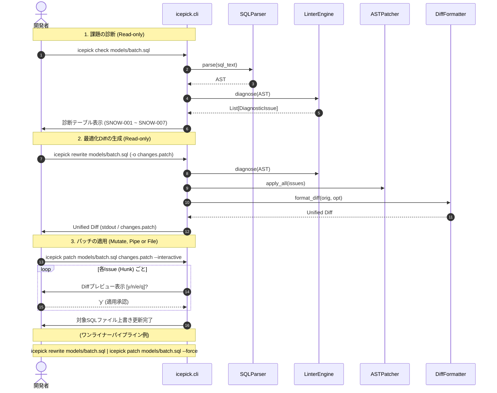

# 詳細設計書 (design.md)

## 1. システムアーキテクチャ概要

本システムは、CLI経由でSnowflake SQLを受け取り、AST解析・診断・局所置換・差分提示・等価性検証のパイプラインを実行する。



## 2. データモデル / 型定義

```python
from dataclasses import dataclass
from enum import Enum
from typing import Optional, List, Dict, Any
import sqlglot
from sqlglot import exp

class Severity(str, Enum):
    INFO = "INFO"
    LOW = "LOW"
    MEDIUM = "MEDIUM"
    HIGH = "HIGH"
    CRITICAL = "CRITICAL"

@dataclass
class DiagnosticIssue:
    rule_id: str                      # 例: "SNOW-001"
    rule_name: str                    # 例: "Non-Sargable Predicate"
    severity: Severity                # 重要度
    description: str                  # 診断理由・影響説明
    target_node: exp.Expression       # AST上の対象ノード
    line_number: Optional[int]        # 発生行番号
    snippet: str                      # 元のSQLコード断片
    suggested_replacement: Optional[exp.Expression] = None  # 置換案ノード
    requires_llm: bool = False        # LLMリライトが必要かどうか

@dataclass
class OptimizationResult:
    original_sql: str                 # 入力元SQL
    base_formatted_sql: str           # 正規化後SQL (Diff基準)
    optimized_sql: str                # 最適化後SQL
    issues: List[DiagnosticIssue]     # 検出された問題リスト
    unified_diff: str                 # 生成されたUnified Diffテキスト
    is_verified: Optional[bool] = None# 等価性検証の合否
```

## 3. コンポーネント詳細設計

### 3.1 `LinterEngine` (`icepick/linter/`)
- 対応要件: A-1, A-2, A-3, A-4, A-5, A-6, A-7, A-8
- `BaseRule` を継承した個別ルールクラスを動的にロードして実行する。
- 各ルールは `check(ast: exp.Expression) -> List[DiagnosticIssue]` を実装する。
- 個別ルール一覧:
  - `NonSargableRule` (`SNOW-001`): `exp.EQ` 等の比較述語で、カラムへの関数適用を検出し、リテラル側変換の範囲条件ノードを `suggested_replacement` にセット。
  - `CorrelatedSubqueryRule` (`SNOW-002`): 外側スコープのテーブル/エイリアスを参照する相関副クエリを検出し、`severity=Severity.CRITICAL`, `requires_llm=True` をセット。
    - **入力 (Input)**: AST (`exp.Expression`)
    - **処理 (Processing)**:
      1. 各 `exp.Select` ノードを外側コンテキストとして走査し、自身が持つ FROM / JOIN のテーブル名およびエイリアス集合（`outer_tables`）を収集。
      2. 当該クエリの WHERE / HAVING / SELECT 句内に含まれるサブクエリノード（`exp.Subquery`, `exp.Exists`, `exp.In` 等）を走査。
      3. サブクエリ内部の FROM / JOIN テーブル名およびエイリアス集合（`inner_tables`）を収集。
      4. サブクエリ内の全 `exp.Column` を走査し、`col.table` が指定されている場合において `col.table.lower()` が `inner_tables` に存在せず、`outer_tables` に一致する外部参照を検出。
      5. 相関参照を持つサブクエリノードを対象に `DiagnosticIssue(rule_id="SNOW-002", severity=Severity.CRITICAL, requires_llm=True)` を生成。
    - **出力 (Output)**: `list[DiagnosticIssue]` (重要度: CRITICAL, 自動置換: なし / LLM推奨)
  - `RedundantSortRule` (`SNOW-003`): `exp.Subquery` / `exp.CTE` 内の `exp.Order` かつ LIMITなしを検出し、`target_node=order_node`, `suggested_replacement=None` (pop削除) をセット。
  - `NestedSubqueryRule` (`SNOW-007`): `exp.From` や `exp.Join` 内の `exp.Subquery` を検出し、CTE外出し対象としてフラグ付け。
  - `UnionToUnionAllRule` (`SNOW-006`): 重複排除不要な結合における `exp.Union`（`distinct=True`）を検出し、`distinct=False`（UNION ALL）の置換ノードを `suggested_replacement` にセット。
  - `ImplicitCrossJoinRule` (`SNOW-004`): `exp.From` 内のカンマ区切り複数テーブル参照を検出し、明示的な `CROSS JOIN` ノードを `suggested_replacement` にセット。
  - `DuplicateTableScanRule` (`SNOW-005`): 同一クエリ内の複数 CTE 間で同一テーブルの重複スキャンを検出し、共通 CTE 集約の警告を発行。

### 3.2 `ASTPatcher` & `SubqueryToCTE` (`icepick/patcher/`)
- 対応要件: B-1, B-2, B-4, B-5
- **In-place置換**:
  - `issue.suggested_replacement` が存在する場合: `issue.target_node.replace(issue.suggested_replacement)`（`SNOW-001`, `SNOW-006`, `SNOW-004`）
  - `suggested_replacement` が None の場合: `issue.target_node.pop()`（`SNOW-003`）
- **サブクエリのCTE平坦化 (`SubqueryToCTE`)**:
  1. 対象サブクエリの内部SELECT (`subquery.this`) を取得。
  2. 一意なCTE別名（例: `cte_<alias>_<index>`）を決定。
  3. `exp.CTE(this=inner_select, alias=exp.TableAlias(this=cte_alias))` を構築。
  4. トップレベルの `ast.args["with_"]`（存在しない場合は `ast.set("with_", exp.With(expressions=[...]))`）に追加。
  5. 元のサブクエリノードを `exp.Table(this=cte_alias, alias=original_alias)` で置換。

### 3.3 `ContextSlicer` & `LLMClient` (`icepick/llm/`)
- 対応要件: B-3, C-1
- `ContextSlicer`:
  - ターゲットノード（相関サブクエリ等）と、親ノード（CTEやテーブル名）、参照されているカラムのスキーマ定義を抽出し、最小限のコンテキストMarkdownを生成。
- `LLMClient`:
  - 外部抽象化ライブラリを使わず、`httpx` による軽量REST APIクライアントとして実装。
  - **Gemini (AI Studio) モード**:
    - エンドポイント: `https://generativelanguage.googleapis.com/v1beta/models/{model}:generateContent`
    - 認証: リクエストヘッダー `x-goog-api-key: {GEMINI_API_KEY}`
  - **Vertex AI モード**:
    - エンドポイント: `https://{region}-aiplatform.googleapis.com/v1/projects/{project}/locations/{region}/publishers/google/models/{model}:generateContent`
    - 認証: `google-auth` から取得した OAuth2 Bearer トークンを `Authorization: Bearer {token}` に付与。
  - レスポンスから Markdown コードブロック（```sql ... ```）を抽出し、`sqlglot.parse_one(llm_sql, read="snowflake")` で即座に構文検証。構文OKなら新しいASTノードを返し、構文エラー時は元のASTノードを維持して安全にフォールバック。

### 3.4 `DiffFormatter` (`icepick/diff/`)
- 対応要件: C-2, C-3
- `difflib.unified_diff()` をラップし、入力SQLを `sqlglot` でフォーマットした基準テキストと、最適化後テキストの差分を計算。
- インデント差異による偽陽性Diffを排除し、純粋な意味変更のみをHunkとして抽出。
- `rich.syntax.Syntax(diff, "diff")` でターミナルカラー描画。

### 3.5 `EquivalenceVerifier` (`icepick/verifier/`)
- 対応要件: D-1
- 双方向 `EXCEPT` クエリを自動構築してSnowflakeで実行：
  ```sql
  WITH orig AS ( <ORIGINAL_SQL> ),
       opt AS ( <OPTIMIZED_SQL> )
  SELECT 'orig_not_in_opt' AS diff_type, COUNT(*) AS cnt FROM (SELECT * FROM orig EXCEPT SELECT * FROM opt)
  UNION ALL
  SELECT 'opt_not_in_orig' AS diff_type, COUNT(*) AS cnt FROM (SELECT * FROM opt EXCEPT SELECT * FROM orig);
  ```
- 両方の `cnt` が `0` の場合のみ `is_verified=True`。

### 3.6 `FeedbackRecorder` (`icepick/feedback.py` または `cli.py`)
- 対応要件: E-1
- テスト中・運用中にエージェントや開発者が直面した摩擦（フリクション）、バグ、改善アイデアをローカルログファイルにアペンド記録。
- データ構造:
  ```python
  @dataclass
  class FeedbackEntry:
      timestamp: str  # ISO 8601
      version: str    # icepick version
      category: str   # friction, bug, doc, idea
      message: str    # フィードバック本文
      cwd: str        # 実行ディレクトリ
      git_commit: str | None = None
  ```
- 保存形式: `.icepick_feedback.jsonl`（JSON Lines形式、1行1レコード、UTF-8追記）。
- `--category` のバリデーションを行い、不正値の場合は有効なenum一覧（`friction`, `bug`, `doc`, `idea`）を提示する Actionable Error を送出。

### 3.7 エージェント親和性アーキテクチャ (Agent-Native CLI Interface)
- 対応要件: E-2, E-3, E-5, E-6, E-7
- **機械可読イントロスペクション (`icepick agent-context`)**:
  - Layer 2 イントロスペクションとして、CLI の全コマンド、引数・オプション仕様、対応する最適化ルール一覧（`rule-001`〜`007`等）、環境変数スキーマ（`DEBUG_ICEPICK_*`）を単一の構造化 JSON として出力。
  - エージェントが初手で実行することで、ヘルプ探索によるトークン消費を最小化する。
- **構造化出力 (`--json`)**:
  - `check`: 検出された Issue の JSON 配列を出力。
  - `rewrite`: 最適化ステータス、検出された Issue 一覧、Unified Diff テキストを JSON で出力。
  - `patch`: 適用ステータス、適用された Hunk 数、対象ファイルパスを JSON で出力。
  - `feedback`: 記録された `FeedbackEntry` を JSON で出力。
  - `agent-context`: ツール仕様メタデータを JSON で出力。
- **非対話モードと変更境界 (`--dry-run` & `--force`)**:
  - `sys.stdin.isatty()` により対話型ターミナルかパイプ/サブプロセスかを自動判定。
  - 非 TTY 環境ではプロンプト表示による永久ハングを防止。
  - `--dry-run`: `patch` コマンドにおいてファイルへの書き込みを一切行わず、適用シミュレーション結果のみを出力。
  - 非TTY環境における `patch` 実行時は、確認バイパスフラグ `--force`（または `-f`）を必須とし、未指定時は安全のため処理を中止してエラーを案内。
- **自己修正エラー (Actionable & Enumerated Errors)**:
  - 引数やオプションのバリデーションエラー時、可能な値の列挙（enumリスト）と、コピペして実行可能な修正コマンド例を出力。

### 3.8 セキュア認証情報プロバイダ (Secure Credential Management)
- 対応要件: E-4
- **厳格な優先順位ピラミッド (The Strict Priority Pyramid)**:
  1. 一時デバッグ/CI用環境変数（`DEBUG_ICEPICK_` プレフィックス必須。例: `DEBUG_ICEPICK_GEMINI_API_KEY`, `DEBUG_ICEPICK_SNOWFLAKE_PASSWORD`）
  2. Windows 資格情報マネージャー（Target: `icepick:gemini_api_key`, `icepick:snowflake_password`）
  ※意図しないグローバル環境変数や他ツールの認証情報の誤読込み・混入を防ぐため、一般的な名前（`GEMINI_API_KEY` 等）は意図的に探索対象から除外する。
- **UTF-16LE / Null Byte トラップ対策**:
  - Windows `cmdkey` 登録時に混入する UTF-16LE（null バイト `0x00`）を自動検知し、安全にデコードして HTTP リクエストのヘッダー破壊を防ぐ。
- **Actionable な認証エラーとセキュア登録案内**:
  - 認証情報が取得できない場合、シェル履歴に残さない安全な登録コマンドを含む具体的な自己修正手順を提示して exit code 1 で終了：
    ```text
    [Authentication Error] Gemini API Key is missing.
    To fix this, please register your key using Windows Credential Manager:
      # Recommended (safe, masked input without leaving secrets in history):
      $cred = Get-Credential -UserName "any" -Message "Enter Gemini API Key"
      cmdkey /generic:icepick:gemini_api_key /user:any /pass:$($cred.GetNetworkCredential().Password)

      # Direct command:
      cmdkey /generic:icepick:gemini_api_key /user:any /pass:<your_key>

    Or set the debug environment variable:
      $env:DEBUG_ICEPICK_GEMINI_API_KEY="<your_key>"
    ```

### 3.9 エージェント準備状況テスト (Agent Readiness Test)
- 対応要件: E-8
- **テスト設計 (`tests/test_agent_readiness.py`)**:
  1. **非TTYハング防止テスト**: `stdin` を `io.StringIO` やパイプ模倣オブジェクトに差し替え、プロンプト待ちでブロックせずに終了することを確認。
  2. **構造化出力テスト**: 全サブコマンド（`check`, `rewrite`, `patch`, `feedback`, `agent-context`）に `--json` を渡した際、有効な JSON が標準出力から取得でき、エラー情報が標準エラー出力に分離されていることを検証。
  3. **Actionable Error検証**: 認証未設定時および不正引数指定時に、有効な enum 一覧および復旧コマンド例が出力に含まれていることを検証。

## 4. シーケンス図（対話型リファクタリングフロー）


