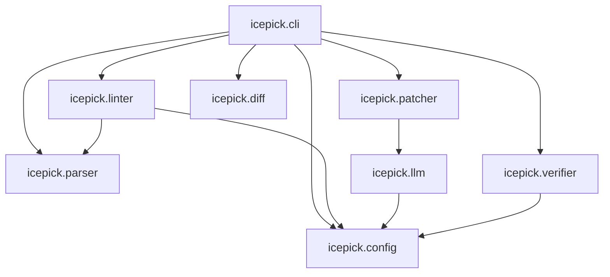

# icepick パッケージモジュール境界仕様 (L1 Intent)

## 1. パッケージの責務 (Responsibilities)
`icepick` は、Snowflake SQL を対象とした決定論的 AST（抽象構文木）解析、静的アンチパターン診断、局所 In-place 最適化、Unified Diff 生成、および等価性検証を統括するコアパッケージである。

本パッケージが担う主な責務：
- **CLI コントローラー (`cli.py`)**: ユーザー入力の受付、コマンドフラグの解釈、処理パイプラインのオーケストレーション。
- **設定管理 (`config.py`)**: ルール有効化・無効化、Snowflake 方言設定、実行モード（対話・バッチ）、LLM 接続情報の一元管理。
- **パーサー基盤 (`parser.py`)**: `sqlglot` を基盤とする Snowflake SQL の構文解析および構文エラーの詳細レポート。
- **静的診断エンジン (`linter/`)**: パーティションプルーニング阻害（Non-Sargable WHERE）、不要 ORDER BY、ネストされたインラインサブクエリ等のアンチパターン検出。
- **AST パッチャー (`patcher/`)**: AST ノードのインプレース置換（`replace()`）およびインラインサブクエリのトップレベル CTE 平坦化。
- **局所 LLM 連携 (`llm/`)**: 相関副クエリなどの複雑なリライト対象に対する最小文脈スライシングと軽量 REST API による補正。
- **Diff & 対話 UI (`diff/`)**: Git 互換 Unified Diff の生成、Rich による構文ハイライト、Hunk 単位の対話型承認 UI。
- **等価性検証 (`verifier/`)**: 双方向 `EXCEPT` によるクエリ実行結果の完全等価性検証。

## 2. モジュール境界と依存関係の意図 (Module Boundaries & Dependencies)

### 依存関係の設計方針
1. **コアライブラリの軽量性と安定性**:
   - 重厚な LLM オーケストレーションフレームワーク（LangChain や LlamaIndex 等）は採用せず、`httpx` による直接 REST 呼び出し（Gemini / Vertex AI）と `sqlglot.parse_one` による事前パース検証を行う。これにより、起動速度の向上と依存関係の競合を防止する。
2. **単方向依存の原則**:
   - `config.py` は他のサブモジュールに一切依存しない。
   - `linter`, `patcher`, `diff`, `verifier` などの各エンジンは互いに直接依存せず、データモデル（`DiagnosticIssue` や AST オブジェクト）を介して疎結合に連携する。
3. **副作用の局所化**:
   - `linter` および `patcher` のコアロジックは副作用を持たない決定論的関数として実装する。
   - ファイル I/O、ネットワーク通信（LLM, Snowflake）、ターミナル対話はアダプタ層（`cli`, `llm/client.py`, `verifier/equivalence.py`）に隔離する。

## 3. 設計判断 (Design Rationale)
- **Fail-Safe 保証**:
  - ルールや LLM による書き換え後コードは必ずパーサーによる構文検証を受け、不正な SQL が生成された場合は元の AST を破壊せずフォールバックする。
- **可逆性と透明性**:
  - すべての変更は Git diff 互換の Unified Diff として出力可能とし、開発者が変更内容を完全に把握・検証できる状態を担保する。
